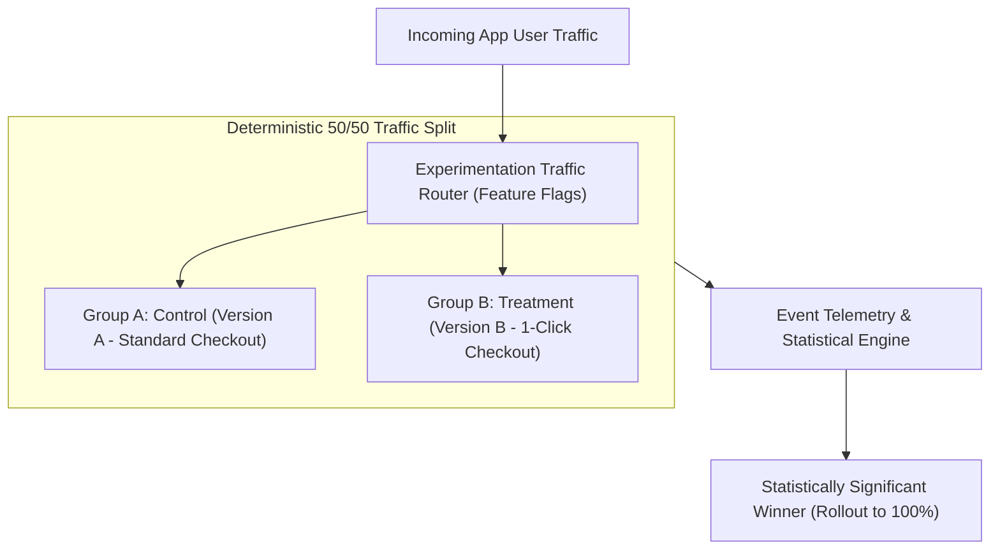

```ppt
# Slide 1: A/B Testing Infrastructure at Scale
- **The Core Goal:** Building feature flagging and experimentation pipelines to validate product changes with real statistically significant user data.
- **Executive Rule:** Stop debating opinions in boardroom meetings — let customer data pick the winning feature!
- **Author:** Pankaj Kumar | Associate Architect & Tech Leadership
<!-- slide -->
# Slide 2: The Store Window Display Analogy
- **Retail Experiment:** A boutique department store sets up Display Window A (Red Jackets) on the left entrance and Display Window B (Blue Jackets) on the right entrance.
- **The Result:** They count exactly how many shoppers walk in through each door and purchase items, revealing that Display B drives 35% higher sales!
<!-- slide -->
# Slide 3: What is A/B Testing Infrastructure?
- **Feature Flags / Toggles:** Dynamically turning features ON or OFF for specific user segments without deploying new code.
- **Traffic Router:** Splitting user traffic 50/50 between Control Group (Version A) and Treatment Group (Version B).
- **Statistical Engine:** Calculating confidence intervals, p-values, and conversion metrics in real time.
<!-- slide -->
# Slide 4: Architectural Components of A/B Testing
- **1. Feature Flag Evaluation (Client/Server SDK):** Sub-millisecond flag evaluation (LaunchDarkly, Split.io, Unleash).
- **2. Experiment Assignment Engine:** Hash-based deterministic user bucket assignment.
- **3. Analytics Ingestion:** Pipeline logging experiment exposures to ClickHouse/Snowflake.
<!-- slide -->
# Slide 5: Protecting Performance & Latency
- **Client-Side Flicker:** Avoiding visual UI flickering when rendering A/B variations.
- **Server-Side Evaluation:** Evaluating flags at the API Edge (Cloudflare Workers / Lambda@Edge) to maintain zero latency impact.
<!-- slide -->
# Slide 6: The Experimentation Lifecycle
- **Step 1:** Formulate Hypothesis (*"Changing checkout button from blue to green will increase conversions"*).
- **Step 2:** Allocate Traffic (90% Control, 10% Experiment).
- **Step 3:** Measure Statistical Significance (p < 0.05).
- **Step 4:** Roll out winner to 100% or kill failed experiment.
<!-- slide -->
# Slide 7: Common Misconception
- **Myth:** "A/B testing is just changing button colors on the frontend."
- **Fact:** A/B testing evaluates backend search algorithms, pricing models, checkout flows, and AI recommendation engines!
<!-- slide -->
# Slide 8: Summary for Beginners
- Build deterministic feature flagging infrastructure to test features safely, measure statistical impact, and ship winners!
```

# A/B Testing Infrastructure: Running Experiments at Scale

How do world-class tech companies like Netflix, Amazon, and Booking.com consistently build features that users love?

They don't rely on executive guesswork or HiPPO opinions (*Highest Paid Person's Opinion*). Instead, they run **hundreds of concurrent A/B experiments** using automated experimentation infrastructure!

Whether you are testing a new checkout flow, a revised search algorithm, or a redesigned pricing page, **A/B Testing Infrastructure allows you to measure real user behavior scientifically before rolling out changes to 100% of your audience.**

Let's understand A/B Testing Infrastructure using **The Store Window Display Analogy**!

---

## 🏬 The Store Window Display Analogy

Imagine managing a high-end fashion boutique:



- **The Traditional Store Owner:**  
  Spends $50,000 completely redesigning the storefront window display based on their personal taste. Six weeks later, sales drop by 20%, but nobody knows why!

- **The Data-Driven Store Owner (A/B Testing Leader):**  
  Sets up **Window Display A** on the left entrance door and **Window Display B** on the right entrance door. Over 7 days, automated sensors record that Display B brings in 35% more paying shoppers. They instantly update the entire storefront to Display B!

---

## 📊 A/B Testing Infrastructure Architecture Stack

| Layer | Recommended Technology | Primary Architectural Function |
| :--- | :--- | :--- |
| **1. Feature Flag SDK** | LaunchDarkly, Unleash, GrowthBook | Sub-millisecond flag evaluation without remote network calls |
| **2. Edge Evaluation** | Cloudflare Workers, AWS Lambda@Edge | Evaluates variations at the CDN edge to eliminate frontend flicker |
| **3. Telemetry Ingestion** | Kafka, Segment, Snowflake | Logs experiment exposure events linked to user conversion actions |
| **4. Statistical Engine** | Statsig, EPO, Custom Python/SQL | Computes p-values, sample size confidence, and guardrail metrics |

---

## 💡 Summary for Beginners

- **A/B Testing** = Comparing two versions of a feature (Control A vs Treatment B) to measure which performs better.
- **Feature Flags** = The underlying technical mechanism used to toggle features and split traffic dynamically.
- **CTO Golden Rule** = **"Never argue about product opinions in meetings — build feature flag infrastructure and let statistically verified customer data pick the winner!"**

---

*Written by **Pankaj Kumar** | Associate Architect & Tech Leadership.*
