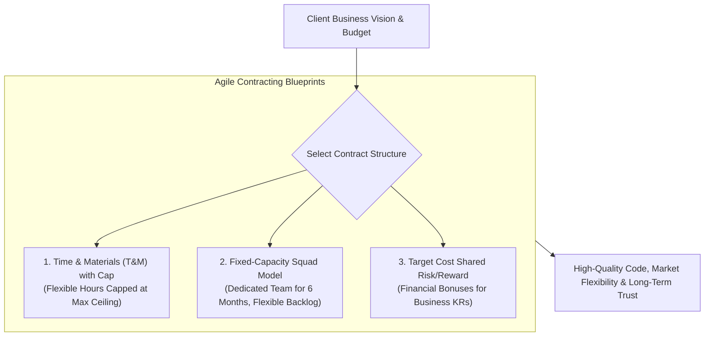
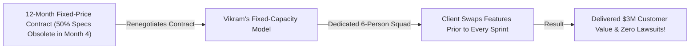

```ppt
# Slide 1: Agile Contracting & Scope Flexibility (Series 5 Capstone)
- **The Executive Capstone Strategy:** Structuring client & vendor software contracts that embrace flexible scope, fixed timeboxes, and shared risk management.
- **Series 5 Capstone:** Agile Execution, Scrum & Process Scaling.
- **Author:** Pankaj Kumar | Associate Architect & Tech Leadership
<!-- slide -->
# Slide 2: Fixed-Price Restaurant vs Flexible Master Chef Analogy
- **Fixed-Price Trap (Legacy Contracting):** Paying a restaurant upfront for a 5-course seafood meal 6 months in advance. The day of the dinner, the guest develops a severe allergy to shellfish! The rigid restaurant refuses to change the menu, forcing the customer to pay for food they cannot eat!
- **Flexible Master Chef (Agile Contracting):** Paying for a dedicated chef's time and premium ingredients (**Time & Materials with Cap / Target Cost**). The chef adjusts the menu course-by-course based on live guest feedback and dietary needs!
<!-- slide -->
# Slide 3: The 3 Core Agile Contract Models
- **1. Time & Materials (T&M) with Cap:** Paying for actual engineering hours worked, capped at a maximum budget ceiling.
- **2. Fixed-Capacity / Dedicated Squad Contract:** Contracting a dedicated 6-person engineering squad for 6 months with 100% flexible backlog prioritization.
- **3. Target Cost / Shared Risk-Reward Contract:** Aligning financial bonuses and penalties based on hitting joint business KRs.
<!-- slide -->
# Slide 4: Real-World Case Study: Vikram's Client Scope Pivot
- **The Challenge:** An enterprise client signed a traditional 12-month fixed-scope software contract managed by Lead Architect **Vikram Patel**.
- **The Pivot:** 4 months in, the client's market shifted dramatically, making 50% of the original specifications obsolete.
- **The Agile Contract Solution:** Vikram converted the contract into a **Fixed-Capacity Dedicated Squad Model**.
- **The Result:** Re-aligned sprint backlogs around new market needs, delivered $3M in business value, and built long-term client trust!
<!-- slide -->
# Slide 5: The "Fixed Capacity, Flexible Scope" Rule
- **Fixed Elements:** Sprint Duration (2 Weeks), Engineering Team Size, and Monthly Budget.
- **Flexible Element:** Product Backlog Features (Features can be swapped in/out freely prior to sprint planning!).
<!-- slide -->
# Slide 6: Legal Clauses for Agile Contracts
- **Early Termination Clause ("Termination for Convenience"):** Allowing either party to end the contract after any sprint with zero lawsuit penalties.
- **Sprint Acceptance Windows:** Client has 5 business days post-sprint demo to review and accept delivered user stories.
<!-- slide -->
# Slide 7: Common Misconception
- **Myth:** "Fixed-Price contracts protect clients from budget overruns and guarantee software delivery."
- **Fact:** Fixed-Price contracts incentivize vendors to cut code quality corners, trigger endless change-order lawsuits, and deliver obsolete software!
<!-- slide -->
# Slide 8: Summary for Beginners
- Master Agile contracting: adopt Fixed-Capacity Flexible-Scope models, align vendor incentives around business outcomes, enforce sprint acceptance windows, and build collaborative client partnerships!
```

# Agile Contracting: Negotiating Flexible Scope with Clients

Welcome to the **Series 5 Capstone Guide: Agile Execution, Scrum & Process Scaling!**

Across the past 16 articles, we have explored how Chief Technology Officers (CTOs) demystify Scrum vs. Kanban vs. XP, scale multi-team architectures (SAFe, LeSS, Spotify Model), master story point estimation, act as executive snowplows, run actionable retrospectives, eliminate backlog decay, prevent velocity metric gaming, enforce DoR/DoD quality gates, manage distributed global teams, deploy continuous delivery pipelines, time-box technical spikes, govern Agile for C-suite executives, align squads using OKRs, and fix broken "Dark Agile" process bloat.

Now comes the ultimate commercial leadership test:  
*"How does a CTO negotiate software contracts with external clients, enterprise vendors, and legal teams that embrace Agile flexibility?"*

In traditional business, enterprise legal teams insist on **Fixed-Price, Fixed-Scope Contracts:**
- *"Build these 200 exact feature specifications for $500,000 in 12 months."*

This traditional contracting model is a recipe for commercial disaster:
- 6 months into development, market conditions change and 50% of the specifications become useless.
- Vendors cut code quality corners and skip automated testing to stay under the fixed price.
- Every minor feature modification triggers hostile legal disputes and expensive "Change Orders."

To deliver true business value, **CTOs negotiate Agile Contracts based on Fixed Capacity and Flexible Scope!**

Let's understand Agile Contracting using **The Fixed-Price Restaurant vs. Flexible Master Chef Analogy**!

---

## 🍳 The Fixed-Price Restaurant vs. Flexible Master Chef Analogy

Imagine contracting a catering service for a major corporate gala:



- **The Fixed-Price Trap (Legacy Rigid Contract):**  
  Paying a restaurant $50,000 upfront for a 5-course shellfish menu 6 months in advance. On the day of the dinner, the host discovers that half the guests have severe seafood allergies! The rigid restaurant refuses to change the menu (**Fixed Scope Lawsuits**), serving food nobody can eat while keeping the cash.

- **The Flexible Master Chef (Agile Contract):**  
  Contracting a dedicated master chef and kitchen staff for the evening (**Fixed Capacity & Monthly Budget**). The chef inspects fresh morning market ingredients and adjusts the menu course-by-course based on live guest feedback (**Flexible Backlog Prioritization**)!

---

## 📊 Real-World Case Study: Vikram's Client Scope Pivot

Consider a software consulting organization led by Lead Architect **Vikram Patel**.



1. **The Challenge:** An enterprise client signed a traditional 12-month fixed-price contract to build a custom logistics suite. By Month 4, new government shipping regulations rendered half of the original contract specifications obsolete.
2. **The Agile Renegotiation:**  
   - Vikram met with the client's executive team and converted the contract into a **Fixed-Capacity Dedicated Squad Model**:
   - The monthly billing remained fixed (covering a dedicated 6-person engineering squad).
   - The client gained 100% freedom to swap user stories in or out of the product backlog prior to the start of any 2-week sprint.
3. **The Result:** The team pivoted seamlessly to meet the new government regulations, delivered **$3 Million in net business value**, and established a multi-year strategic partnership!

---

## 📊 Fixed-Price Legacy Contracts vs. Agile Flexible Contracts

| Contract Dimension | Fixed-Price Legacy Contract (Vulnerable) | Agile Flexible Contract (Resilient) |
| :--- | :--- | :--- |
| **Scope & Budget** | Fixed Scope, Fixed Price, Fixed Schedule | Fixed Capacity (Budget & Squad Size), Flexible Scope |
| **Handling Market Changes** | Hostile legal "Change Orders" and budget disputes | Free feature swapping prior to every 2-week sprint |
| **Code Quality Incentives** | Vendor incentivized to cut corners & skip tests to save cost | Vendor incentivized to maintain high DoD quality for repeat business |
| **Client Involvement** | Low (Client inspects software only at final delivery) | High (Client attends bi-weekly sprint demos & accepts stories) |
| **Risk Distribution** | 100% risk placed on vendor (leading to inflated safety bids) | Shared risk and collaborative partnership model |

---

## 💡 Summary for Beginners

- **Fixed-Capacity Contract** = A contract structure where a client pays for a dedicated engineering team's capacity for a set period, retaining full flexibility over feature prioritization.
- **Time & Materials (T&M) with Cap** = Billing based on actual hours worked up to a maximum guaranteed price ceiling.
- **Termination for Convenience** = A contract clause allowing either party to exit the agreement after any sprint with zero legal penalties.
- **CTO Golden Rule** = **"Never lock software specifications into rigid fixed-price contracts — negotiate Fixed-Capacity, Flexible-Scope agreements to align engineering delivery with real market needs!"**

---

*Written by **Pankaj Kumar** | Associate Architect & Tech Leadership.*
