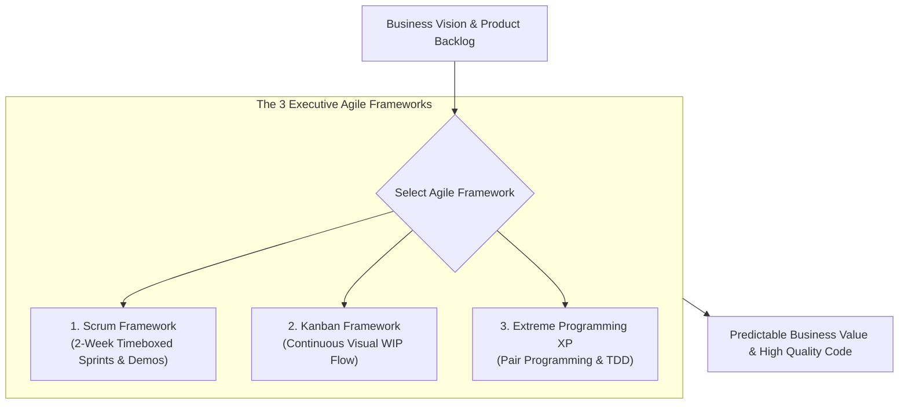
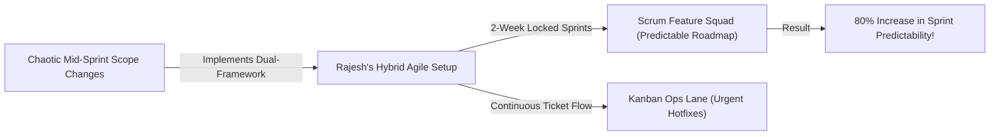

```ppt
# Slide 1: Agile Execution for Executives
- **The Core Leadership Strategy:** Understanding Agile frameworks (Scrum, Kanban, XP) to drive predictable software delivery and continuous value.
- **Series 5 Kickoff:** Agile Execution, Scrum & Process Scaling.
- **Author:** Pankaj Kumar | Associate Architect & Tech Leadership
<!-- slide -->
# Slide 2: Sprint Races vs Factory Assembly Lines Analogy
- **Waterfall Assembly (Rigid Legacy):** Building a car for 2 years behind closed doors without showing it to drivers. If drivers dislike the steering wheel, the entire car must be scrapped!
- **Scrum Framework (Interval Relay Sprint):** Running 2-week relay races (*Sprints*) where the team presents a working car feature after every lap to get real-world driver feedback!
- **Kanban Framework (Continuous Assembly Line):** A Toyota factory assembly line where cars move continuously one by one as parts become available!
<!-- slide -->
# Slide 3: The 3 Major Executive Agile Frameworks
- **1. Scrum:** Fixed-length 2-week sprints with defined team roles (Scrum Master, Product Owner, Dev Squad) and ceremonies.
- **2. Kanban:** Continuous visual workflow tracking (WIP limits) ideal for maintenance, SRE, and support teams.
- **3. Extreme Programming (XP):** Engineering-focused Agile emphasizing pair programming, TDD, and continuous integration.
<!-- slide -->
# Slide 4: Real-World Case Study: Rajesh's Squad Transformation
- **The Challenge:** An engineering team led by Lead Architect **Rajesh Sharma** was failing sprint commitments due to chaotic mid-sprint scope changes.
- **The Agile Solution:** Rajesh implemented strict 2-week Scrum sprints for new feature development, while creating a separate Kanban lane for urgent bug fixes.
- **The Result:** Sprint predictability increased by 80% and team burnout dropped to zero!
<!-- slide -->
# Slide 5: Comparing Scrum vs Kanban vs XP
- **Cadence:** Fixed 2-Week Sprints (Scrum) vs Continuous Flow (Kanban) vs 1-Week Iterations (XP).
- **Key Metric:** Velocity & Sprint Burndown (Scrum) vs Cycle Time & Lead Time (Kanban) vs Code Quality (XP).
- **Scope Change:** Locked during sprint (Scrum) vs Dynamic at any time (Kanban) vs Customer-driven daily (XP).
<!-- slide -->
# Slide 6: The Executive Agile Mindset
- **Outcomes over Outputs:** Measuring business value delivered to users rather than total Jira story points closed.
- **Continuous Improvement:** Using sprint retrospectives to eliminate engineering friction continuously.
<!-- slide -->
# Slide 7: Common Misconception
- **Myth:** "Agile means zero documentation, zero planning, and chaotic developer freedom."
- **Fact:** True Agile requires intense discipline, daily transparency, and rigorous engineering standards!
<!-- slide -->
# Slide 8: Summary for Beginners
- Match the framework to the mission: use Scrum for feature roadmaps, Kanban for operations/support, and XP for high-quality engineering!
```

# Agile for Executives: Scrum vs Kanban vs Extreme Programming

Welcome to **Series 5: Agile Execution, Scrum & Process Scaling!**

In traditional software development (**The Waterfall Model**), companies spent 18 months writing 500-page specification documents, building software in secret, and testing code right before launch.

When the product was finally released to customers, executives discovered a painful truth: **Customer needs had changed, the market had shifted, and the software was obsolete on Day 1!**

To solve this problem, modern software organizations adopted **Agile Development.**

However, many executives get confused by Agile buzzwords:  
*"Should our engineering team use Scrum, Kanban, or Extreme Programming (XP)?"*

Let's demystify Executive Agile Frameworks using **The Sprint Race vs. Factory Assembly Line Analogy**!

---

## 🏃 The Sprint Race vs. Factory Assembly Line Analogy

Imagine organizing a high-speed manufacturing operation:



- **The Rigid 2-Year Build (Waterfall Model):**  
  Designing a concept car in secret for 2 years without ever letting real drivers test it. If drivers hate the dashboard layout, the entire $10 Million project is wasted!

- **The 2-Week Relay Sprint (Scrum Framework):**  
  Running short 2-week relay races (**Sprints**). At the end of every 2-week lap, the team shows a working prototype to real drivers (**Sprint Demo**), gathers feedback, and adjusts steering for the next lap!

- **The Continuous Flow Line (Kanban Framework):**  
  A Toyota factory assembly line where work items move continuously one by one (**Work-In-Progress WIP Limits**). Ideal for support, DevOps, and maintenance teams handling unpredictable requests!

---

## 📊 Real-World Case Study: Rajesh's Squad Transformation

Consider a cloud engineering team led by Lead Architect **Rajesh Sharma**.



1. **The Problem:** Rajesh's engineering team was constantly missing sprint commitments because Product Managers kept dumping urgent bug fixes into the middle of active 2-week sprints.
2. **The Agile Transformation:**  
   - Rajesh separated planned feature work from unpredictable operational support.
   - The core feature squad adopted **Scrum with 2-Week Locked Sprints** (No mid-sprint scope changes allowed!).
   - A dedicated operational on-call rotation adopted **Kanban with strict WIP limits** to process hotfixes continuously.
3. **The Result:** Feature sprint completion predictability jumped by **80%**, customer bugs were resolved in hours, and developer burnout dropped to zero!

---

## 📊 Executive Comparison: Scrum vs. Kanban vs. Extreme Programming (XP)

| Dimension | Scrum Framework | Kanban Framework | Extreme Programming (XP) |
| :--- | :--- | :--- | :--- |
| **Primary Focus** | Predictable feature delivery & sprint commitments | Continuous workflow optimization & bottleneck reduction | Engineering code quality & rapid technical feedback |
| **Cadence / Timebox** | Fixed 2-Week Sprints | Continuous flow (No fixed timeboxes) | Short 1-Week Iterations |
| **Scope Flexibility** | Locked during active 2-week sprint | Dynamic (Tasks added anytime as capacity opens) | Highly flexible (Customer changes stories daily) |
| **Key Metric** | Sprint Velocity & Burndown Chart | Lead Time, Cycle Time & WIP Limits | Code Coverage, Test-Driven Development (TDD) |
| **Best Used For** | Core product feature development roadmaps | DevOps, SRE, IT Support, & Bug Fix teams | High-risk technical codebases requiring top code quality |

---

## 💡 Summary for Beginners

- **Scrum** = An Agile framework structuring work into fixed 2-week iterations (Sprints) with defined team roles and ceremonies.
- **Kanban** = A visual workflow management method limiting Work-in-Progress (WIP) to optimize continuous delivery.
- **Extreme Programming (XP)** = An Agile methodology focusing on engineering technical excellence (Pair Programming, TDD, CI/CD).
- **CTO Golden Rule** = **"Don't enforce rigid process dogma — use Scrum for feature roadmaps, Kanban for operational support, and XP practices to guarantee code quality!"**

---

*Written by **Pankaj Kumar** | Associate Architect & Tech Leadership.*
