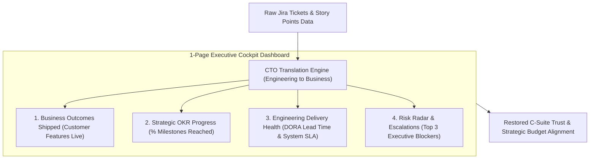
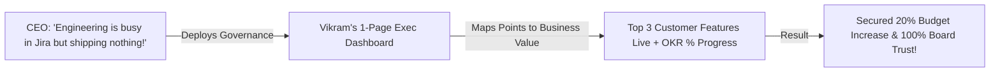

```ppt
# Slide 1: Agile Governance & C-Suite Reporting
- **The Core Leadership Strategy:** Translating sprint velocity, burndown charts, and technical debt metrics into executive business outcomes (ROI, customer value, and launch risks).
- **Executive Rule:** Never show the CEO a 200-item Jira backlog — present a 1-page Business Outcome Dashboard!
- **Author:** Pankaj Kumar | Associate Architect & Tech Leadership
<!-- slide -->
# Slide 2: The Flight Cockpit Dashboard Analogy
- **Confusing Flight Manual (Jira Raw Ticket Dump):** Handing an airline CEO a 500-page binder containing raw jet engine oil pressure readings and bolt torque specs during a board meeting. The CEO gets frustrated and has zero idea if the flight is on time!
- **Master Flight Cockpit (Executive Agile Dashboard):** Showing the CEO a sleek 1-page cockpit dashboard displaying altitude (**Quarterly OKR Progress**), airspeed (**DORA Lead Time & Velocity**), and fuel reserve (**Sprint Budget & Risk Radar**)!
<!-- slide -->
# Slide 3: What the C-Suite Cares About vs What Engineers Track
- **C-Suite Focus:** Business Value Shipped, Revenue Impact, Target Launch Dates, and Strategic Risks.
- **Engineering Squad Focus:** Story Points, Sprint Burndown, Jira Ticket Status, and Git Commits.
- **The CTO's Job:** Translating engineering velocity into business impact!
<!-- slide -->
# Slide 4: Real-World Case Study: Vikram's Executive Dashboard Reset
- **The Conflict:** The CEO complained that Lead Architect **Vikram Patel's** team was "always busy in Jira but shipping nothing."
- **The Governance Fix:** Vikram instituted a 1-page bi-weekly Executive Agile Dashboard summarizing top 3 customer outcomes shipped, current OKR progress %, and critical launch risks.
- **The Result:** Restored board trust, secured a 20% budget increase, and aligned engineering with business goals!
<!-- slide -->
# Slide 5: The 4 Quadrants of the Executive Agile Dashboard
- **Quadrant 1 (Business Outcomes Shipped):** Key customer features delivered live to production this sprint.
- **Quadrant 2 (Strategic OKR Progress):** % progress towards quarterly strategic goals.
- **Quadrant 3 (DORA Velocity & Health):** Lead time, deployment frequency, and system availability %.
- **Quadrant 4 (Top 3 Risk Blockers):** Executive escalation requests needing CEO/CFO assistance.
<!-- slide -->
# Slide 6: Managing Executive Scope Creep
- **The Trade-Off Rule:** When executives request a new feature mid-quarter, show them the impact on existing OKR timelines.
- **Fixed Capacity, Flexible Scope:** Educating executives that adding new work requires swapping out equal-sized backlog items!
<!-- slide -->
# Slide 7: Common Misconception
- **Myth:** "Agile governance means executives shouldn't interfere or ask for progress reports."
- **Fact:** C-suite executives require transparent financial and strategic governance — the CTO must bridge the gap!
<!-- slide -->
# Slide 8: Summary for Beginners
- Master Agile governance: translate Jira points into business outcomes, present 1-page executive dashboards, manage trade-offs transparently, and build board trust!
```

# Agile Governance: Reporting Sprint Progress to C-Suite

When Chief Technology Officers (CTOs) meet with CEOs, CFOs, and Board Directors, a dangerous communication gap often occurs:
- Engineers talk about **Story Points, Jira burndown charts, and refactoring API endpoints.**
- Business executives care about **Revenue growth, customer acquisition, release dates, and risk mitigation.**

When CTOs dump raw engineering metrics onto the CEO:
- The CEO feels confused and assumes the engineering team is moving slowly.
- Executives demand arbitrary launch deadlines, forcing developers to rush and cut corners.
- Trust between business leadership and engineering breaks down.

How do technology leaders govern Agile organizations while keeping C-suite executives aligned, confident, and supportive?

They build **Executive Agile Governance Dashboards!**

Let's understand Agile Governance using **The Flight Cockpit Dashboard Analogy**!

---

## ✈️ The Flight Cockpit Dashboard Analogy

Imagine presenting flight progress to an airline CEO:



- **The Confusing Flight Binder (Raw Jira Ticket Dump):**  
  Handing an airline CEO a 500-page binder filled with raw engine oil pressure readings, individual bolt torque specs, and mechanic shift logs during a board meeting. The CEO gets frustrated and has zero idea if the flight is arriving on time!

- **The Master Flight Cockpit (Executive Agile Dashboard):**  
  Showing the CEO a sleek 1-page cockpit dashboard displaying altitude (**Quarterly OKR Progress**), airspeed (**DORA Lead Time & Velocity**), fuel reserve (**Sprint Budget**), and weather radar (**Top 3 Strategic Risks**)!

---

## 📊 Real-World Case Study: Vikram's Executive Dashboard Reset

Consider a high-growth SaaS platform where **Vikram Patel** serves as Lead Architect.



1. **The Conflict:** During a quarterly review, the CEO complained that Vikram's engineering organization was "always busy in Jira closing story points, but customer feature delivery felt sluggish."
2. **The Governance Reset:**  
   - Vikram stopped bringing raw Jira velocity charts to executive meetings.
   - He implemented a **1-Page Bi-Weekly Executive Agile Dashboard**:
     - **Section 1:** Top 3 customer-facing features shipped live to production this sprint.
     - **Section 2:** Progress % toward quarterly OKRs (e.g. *"Payment Gateway Migration is 75% complete"*).
     - **Section 3:** Engineering System Health (99.95% uptime, 4-hour lead time).
     - **Section 4:** Top 2 executive blockers requiring CFO budget approval.
3. **The Result:** The CEO and Board gained total transparency into engineering delivery, trust was restored, and Vikram secured a **20% budget increase** to hire additional senior developers!

---

## 📊 Engineering Team Metrics vs. C-Suite Governance Metrics

| Perspective | Engineering Squad Level | C-Suite Executive Level |
| :--- | :--- | :--- |
| **Primary Metric** | Story Points, Sprint Burndown, PR Count | Business Outcomes, Revenue Impact, OKR Progress % |
| **Focus** | How features are built & daily task completion | What value was delivered to customers & when |
| **Time Horizon** | 2-Week Sprint Iteration | Quarterly (OKR) & Annual Strategic Roadmap |
| **Risk Focus** | Technical debt, API rate limits, broken CI/CD | Compliance violations, launch delays, budget overruns |
| **CTO Delivery Tool** | Jira Sprint Boards & Retrospectives | 1-Page Executive Cockpit Dashboard |

---

## 💡 Summary for Beginners

- **Agile Governance** = The process of aligning Agile engineering execution with high-level business strategy, risk management, and financial accountability.
- **DORA Lead Time** = The time it takes for a code commit to reach live production.
- **CTO Golden Rule** = **"Never show executives raw Jira story points — translate engineering velocity into 1-page business outcome dashboards to build C-suite trust!"**

---

*Written by **Pankaj Kumar** | Associate Architect & Tech Leadership.*
