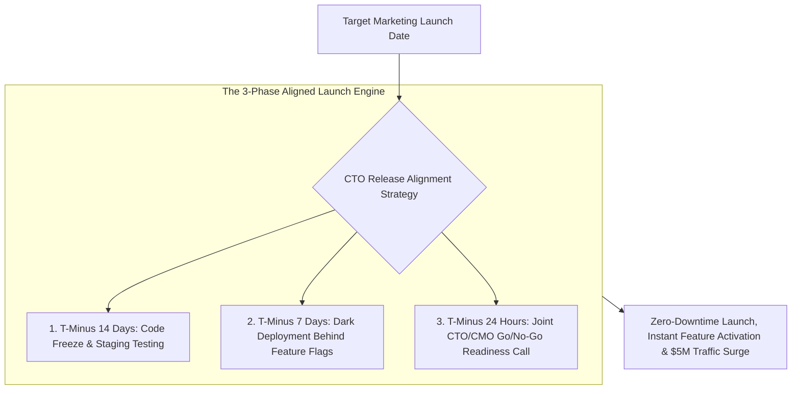
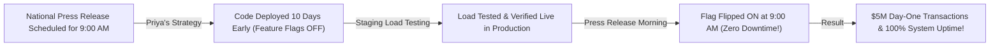

```ppt
# Slide 1: Aligning Engineering Releases with Marketing Launches
- **The Core Strategy:** Synchronizing software deployment readiness with marketing campaign schedules to maximize customer impact and avoid launch embarrassments.
- **Executive Reality:** A marketing launch campaign announced before code is deployment-ready leads to customer anger, 404 errors, and brand damage!
- **Author:** Pankaj Kumar | Associate Architect & Tech Leadership
<!-- slide -->
# Slide 2: The Concert Stadium Setup vs. Ticket Opening Analogy
- **Unsynchronized Chaos (Early Marketing Hype):** Opening stadium doors and inviting 50,000 concert fans inside while sound engineers are still soldering microphone cables on stage! The band arrives 2 hours late, sound cuts out, and angry fans demand refunds!
- **Synchronized Launch (Aligned Release Cadence):** Stage technicians, sound crew, and lighting engineers complete dry-run rehearsals 48 hours prior (**Staging Feature Flag Verification**). Doors open only when the stage is 100% ready!
<!-- slide -->
# Slide 3: The 4 Causes of Release Disconnects
- **1. Fixed-Date Marketing Commitments:** Marketing launching ad campaigns based on estimated dates without checking code status.
- **2. Unverified Staging Code:** Pushing un-tested code directly to production on launch day.
- **3. Absence of Feature Flags:** Inability to decouple code deployment from marketing feature visibility.
- **4. Communication Silos:** Engineering and Marketing teams operating in isolated Slack channels.
<!-- slide -->
# Slide 4: Real-World Case Study: Priya's Feature Flag Launch
- **The Challenge:** A fintech platform managed by Lead Architect **Priya Nair** faced a major press release launch for a new instant payout feature.
- **The Strategy:** Priya deployed the code 10 days early behind **Feature Flags** (Dark Launch) and ran staging load tests.
- **The Result:** On press release morning, Marketing flipped the feature flag to 100% on with zero downtime and $5M in day-one transactions!
<!-- slide -->
# Slide 5: The Dark Launch Pattern
- **Dark Deployment:** Deploying production code 7–14 days before marketing launch with feature flags turned **OFF**.
- **Live Verification:** Verifying database migrations, API performance, and load metrics silently under real production conditions.
- **Zero-Downtime Flip:** Turning feature flags ON instantly when marketing releases the press announcement!
<!-- slide -->
# Slide 6: Joint Engineering-Marketing Readiness Gate
- **T-Minus 14 Days:** Code freeze and staging regression testing.
- **T-Minus 7 Days:** Dark deployment to production behind feature flags.
- **T-Minus 24 Hours:** Go / No-Go executive alignment call between CTO and CMO.
<!-- slide -->
# Slide 7: Common Misconception
- **Myth:** "Code deployment and feature launch must happen at the exact same minute."
- **Fact:** Advanced engineering teams separate **Deployment** (technical) from **Release** (business/marketing) using feature flags!
<!-- slide -->
# Slide 8: Summary for Beginners
- Master launch alignment: decouple code deployment from feature release using feature flags, execute dark launches 7 days prior, and hold joint Go/No-Go readiness reviews!
```

# Aligning Release Timelines with Marketing Launch Campaigns

In enterprise software organizations, one of the most painful corporate disasters occurs when **Engineering and Marketing operate out of sync:**
- **Marketing** announces a revolutionary new platform feature in a national press release at 9:00 AM.
- **Engineering** is still fighting critical database migration bugs on staging at 9:15 AM!
- Excited customers log into the app, encounter broken 500 error screens, and vent their frustration on social media.

When software releases and marketing launch campaigns are disconnected, **companies suffer severe brand damage, lost customer trust, and wasted advertising dollars!**

How do visionary CTOs align software release cadences with marketing launch events?

They master **Feature Flag Decoupling & Dark Launch Strategy!**

Let's understand Release Alignment using **The Concert Stage Setup Analogy**!

---

## 🎵 The Concert Stage Setup Analogy


Imagine managing a major stadium rock concert:



- **Unsynchronized Chaos (Early Marketing Hype):**  
  Opening stadium doors and letting 50,000 excited fans inside while sound engineers are still soldering microphone cables on an empty stage! The band arrives 2 hours late, sound equipment cuts out, and angry fans demand refunds.

- **Synchronized Launch (Decoupled Release Cadence):**  
  Sound technicians, lighting engineers, and stage crews complete dry-run rehearsals 48 hours prior (**Staging Verification & Dark Deployment**). When stadium doors open, the stage lights flash on instantly in perfect harmony with the band stepping onto stage!

---

## 📊 Real-World Case Study: Priya's Feature Flag Launch

Consider a fintech platform where **Priya Nair** serves as Lead Architect.



1. **The Challenge:** Priya's company scheduled a major national press release to launch an instant payout feature. In previous launches, rushing code deployments on press release morning led to server crashes and customer outrage.
2. **The Alignment Strategy:**  
   - Priya implemented a **Dark Launch & Feature Flag Strategy**:
   - **T-Minus 10 Days:** The engineering team completed all code development and deployed the feature directly into production behind a **Feature Flag** set to `OFF`.
   - **T-Minus 5 Days:** Ran silent production smoke tests and load verification without exposing the feature to users.
   - **Launch Morning (9:00 AM):** As Marketing distributed the press release, Priya simply flipped the feature flag to `ON` in a single click.
3. **The Result:** The feature activated instantly with **zero downtime**, handled **$5 Million in day-one transactions**, and received glowing press coverage!

---

## 📊 Traditional Rushed Launch vs. Aligned Dark Launch

| Launch Dimension | Traditional Rushed Launch (Vulnerable) | Aligned Dark Launch (Resilient) |
| :--- | :--- | :--- |
| **Deployment Timing** | Code deployed to production minutes before marketing press release | Code deployed to production 7–10 days early (**Dark Launch**) |
| **Feature Visibility** | Code deployment immediately exposes feature to all users | Feature hidden behind **Feature Flags** until marketing launch |
| **Production Risk** | High risk of unhandled database bugs & server crashes | Zero risk — code tested silently under real production load |
| **Rollback Capability** | Requires multi-hour emergency code rollback & re-deployment | Instant 1-second feature flag toggle back to `OFF` |
| **Team Communication** | Isolated Slack channels with last-minute panic calls | Joint CTO/CMO T-Minus 24 Hour Go/No-Go readiness gate |

---

## 💡 Summary for Beginners

- **Deployment vs. Release** = *Deployment* is the technical act of pushing code to production servers. *Release* is the business act of making that feature visible to customers.
- **Feature Flag** = A software configuration toggle allowing engineering teams to enable or disable features instantly without re-deploying code.
- **Dark Launch** = Pushing code to production servers days before official release with feature flags turned off to verify stability.
- **CTO Golden Rule** = **"Decouple technical deployment from marketing release using feature flags — execute dark launches 7 days prior to guarantee zero-downtime marketing wins!"**

---

*Written by **Pankaj Kumar** | Associate Architect & Tech Leadership.*
