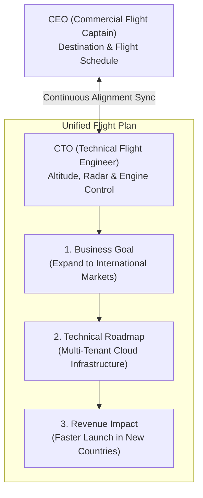

```ppt
# Slide 1: Aligning Tech Strategy with CEO Vision
- **The Core Challenge:** Bridging the gap between corporate revenue targets and technical engineering roadmaps.
- **Key Metric:** Translating code velocity into business growth and market expansion.
- **Author:** Pankaj Kumar | Associate Architect & Tech Leadership
<!-- slide -->
# Slide 2: The Co-Pilots in the Cockpit Analogy
- **The CEO (Captain Co-Pilot):** Decides the destination airport, passenger arrival time, and commercial flight schedule.
- **The CTO (Technical Co-Pilot):** Manages engine thrust, flight altitude, weather radar navigation, and fuel consumption!
<!-- slide -->
# Slide 3: Why Tech & Business Strategies Disconnect
- **Siloed Communication:** Engineers talk in framework versions; CEOs talk in revenue margins and customer acquisition.
- **Misaligned Incentives:** Product teams push commercial features fast; dev teams push for total refactoring.
<!-- slide -->
# Slide 4: The 4 Steps to Perfect Executive Alignment
- **1. Shared Vocabulary:** Translating technical debt into financial risk metrics.
- **2. Joint Roadmap Planning:** Mapping every sprint deliverable directly to a business KPI.
- **3. Pre-Flight Checks:** Alignment syncs before kicking off expensive technical initiatives.
- **4. Value-Driven Metrics:** Measuring engineering output by business impact rather than lines of code.
<!-- slide -->
# Slide 5: The Alignment Framework
- **Business Goal:** Expand to international markets ➔ **Tech Strategy:** Build multi-tenant cloud infrastructure.
- **Business Goal:** Reduce customer churn ➔ **Tech Strategy:** Reduce API latency and fix checkout bugs.
<!-- slide -->
# Slide 6: Managing Trade-offs (Speed vs Quality)
- **Fast & Dirty (High Risk):** Short-term revenue gain, heavy long-term technical debt.
- **Perfect Architecture (Over-engineered):** Flawless code, but competitor takes market share first!
- **The CTO Sweet Spot:** Pragmatic architecture that delivers value today while keeping future options open.
<!-- slide -->
# Slide 7: Common Misconceptions About Tech Strategy
- **Myth:** "Technology strategy is just a list of programming languages and AWS services."
- **Fact:** A true tech strategy explains *how* software capabilities unlock competitive business advantages!
<!-- slide -->
# Slide 8: Summary for Beginners
- Seamless co-pilot communication between the CEO and CTO ensures the company reaches its destination safely!
```

# Aligning Technology Strategy with the CEO's Business Vision

Why do so many software projects fail to deliver business results?

In many companies, the CEO complains: *"We spent $2 Million on software engineering this year, but revenue didn't grow!"*  
Simultaneously, the CTO complains: *"The CEO changes business priorities every month, leaving us with spaghetti code and technical debt!"*

This friction happens when **Technology Strategy is disconnected from the CEO's Commercial Vision**.

Let's demystify Strategic Alignment using **The Airplane Co-Pilots Analogy**!

---

## ✈️ The Airplane Co-Pilots Analogy

Imagine flying a commercial jet across the ocean:



- **The CEO (Commercial Captain):**  
  Owns the flight destination, arrival schedule, and ticket prices. They know *where* the aircraft needs to land to make the airline profitable.

- **The CTO (Technical Flight Engineer):**  
  Monitors engine thrust, fuel burn, altitude, and weather radar. They know *how* to navigate through storms safely without burning out the engines!

---

## 📊 Aligning Business Goals with Technical Roadmaps

| CEO Business Objective | CTO Technical Strategy | Measurable Business Outcome |
| :--- | :--- | :--- |
| **Increase customer retention by 15%** | Slashing API latency & optimizing mobile app UX | Faster checkout ➔ Reduced cart abandonment |
| **Expand to European Markets** | Implementing GDPR compliance & multi-region database | Instant compliance ➔ Unlocked EU sales |
| **Cut operating expenses by 20%** | Cloud FinOps audit & automated server auto-scaling | Lower infrastructure bill ➔ Higher profit margins |

---

## 💡 Summary for Beginners

- **Strategic Alignment** = Ensuring every line of code written supports a clear business goal.
- **Co-Pilot Rule** = *"The CEO sets the destination, but the CTO determines the flight altitude and engine parameters to get there safely!"*
- **CTO Golden Rule** = **"Never pitch a technical upgrade to the CEO without demonstrating its impact on customer value or company revenue!"**

---

*Written by **Pankaj Kumar** | Associate Architect & Tech Leadership.*
