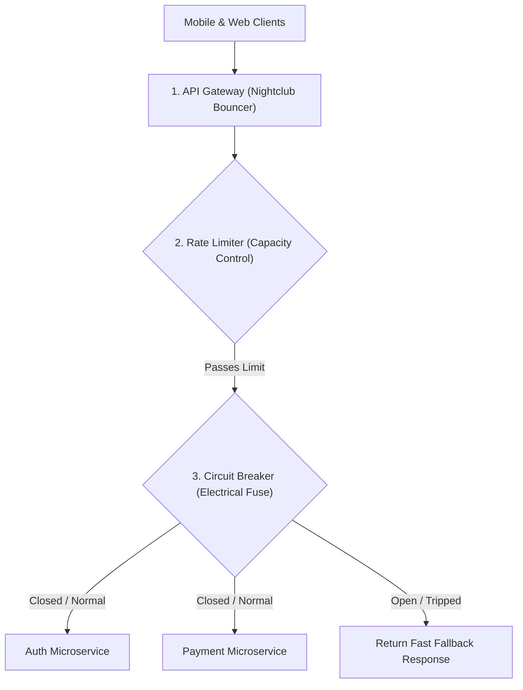

```ppt
# Slide 1: API Gateway Pattern & Resiliency
- **The Microservice Challenge:** Protecting hundreds of backend microservices from DDoS attacks, malicious bots, and cascading failures.
- **Key Concepts:** API Gateways, Rate Limiting, and Circuit Breakers.
- **Author:** Pankaj Kumar | Associate Architect & Tech Leadership
<!-- slide -->
# Slide 2: The Nightclub Bouncer & Fuse Box Analogy
- **API Gateway (Nightclub Bouncer):** Stands at the front door checking VIP tickets, verifying IDs, and controlling entry speed.
- **Rate Limiting (Bouncer Capacity Control):** Allowing maximum 50 guests per minute to prevent overcrowding inside the venue.
- **Circuit Breaker (Home Electrical Fuse Box):** Tripping the circuit breaker instantly when an electrical appliance short-circuits to prevent a house fire!
<!-- slide -->
# Slide 3: 1. The API Gateway Pattern
- **Central Front Door:** Single entry point for all mobile app and web clients (e.g. AWS API Gateway, Kong, Ambassador).
- **Core Functions:** SSL termination, authentication token validation, request routing, and central logging.
<!-- slide -->
# Slide 4: 2. Rate Limiting Strategies
- **Token Bucket Algorithm:** Giving each user IP 100 API tokens per minute. Once tokens are exhausted, return HTTP 429 "Too Many Requests".
- **Use Cases:** Preventing brute-force password guessing, scraping bots, and API abuse.
<!-- slide -->
# Slide 5: 3. Circuit Breaker Pattern (Netflix Hystrix / Resilience4j)
- **Closed State (Normal):** Requests pass freely to downstream microservices.
- **Open State (Tripped):** When error rates exceed 50%, stop sending traffic to the failing database and return a fast fallback response immediately!
- **Half-Open State (Testing):** Allowing 5% test traffic to verify if the failing service recovered.
<!-- slide -->
# Slide 6: Cascading Failures in Microservices
- **Without Circuit Breaker:** 1 slow recommendations database stalls API threads, causing the payment service, auth service, and entire website to crash!
- **With Circuit Breaker:** The failing recommendations widget is disabled automatically, allowing payments and search to work normally!
<!-- slide -->
# Slide 7: Common Beginner Misconception
- **Myth:** "Circuit breakers cause website errors for users."
- **Fact:** Circuit breakers prevent complete site-wide outages by gracefully isolating failing sub-services!
<!-- slide -->
# Slide 8: Summary for Beginners
- Secure microservice front doors with API Gateways, protect against bots with Rate Limiting, and prevent site crashes with Circuit Breakers!
```

# API Gateway Pattern, Rate Limiting, and Circuit Breakers

When a software architecture grows from a monolith into 50 decoupled microservices, how do mobile apps and web browsers talk to those services?

If a mobile app makes 50 separate network calls to 50 individual microservice IP addresses, mobile battery life drains in minutes, and network latency explodes!

Worse, if a malicious bot spams your login endpoint with 100,000 requests per second, or if a single recommendation database slows down, **the entire application crashes in a cascading failure!**

Modern technology architects solve these challenges using **API Gateways, Rate Limiting, and Circuit Breakers**.

Let's demystify these patterns using **The Nightclub Bouncer & Fuse Box Analogy**!

---

## 🚪 The Nightclub Bouncer & Fuse Box Analogy

Imagine managing security and electrical safety for a premier nightclub:



- **API Gateway (The Nightclub Bouncer):**  
  Stands at the single main entrance. Instead of letting guests wander through private kitchen hallways, the bouncer verifies VIP tickets (*Authentication Tokens*), checks age IDs, and directs guests to the correct room (*Service Routing*).

- **Rate Limiting (Bouncer Capacity Control):**  
  The bouncer allows a maximum of 50 guests per minute into the venue. If 500 people try to rush the door, the bouncer stops them at the entrance and says: *"HTTP 429: Too Many Requests — Wait in line for 60 seconds!"*

- **Circuit Breaker (The Electrical Fuse Box):**  
  If a microwave short-circuits in the kitchen, the electrical fuse **trips open immediately**. Power is cut to the kitchen stove, but the music, bar lighting, and dance floor keep operating normally!

---

## 🔄 The 3 States of a Circuit Breaker

```
   [ CLOSED State ]  ──(Error Rate > 50%)──>  [ OPEN State ]
        (Normal)                                 (Tripped / Fast Fail)
           ▲                                            │
           │                                            │ (Sleep Timeout 30s)
           │                                            ▼
   [ HALF-OPEN State ] <──(Test Traffic Success)────────┘
```

1. **Closed (Normal Operation):** Requests pass freely through to backend services.
2. **Open (Tripped State):** The error threshold (e.g. 50% timeout failure) is exceeded. Traffic to the failing service is cut off immediately, returning a instant fallback answer (*"Recommendations currently unavailable"*).
3. **Half-Open (Recovery Testing):** After 30 seconds, a small percentage of test requests are allowed through. If they succeed, the circuit resets to **Closed**!

---

## 💡 Summary for Beginners

- **API Gateway** = Single entry point handling authentication, routing, and rate limiting.
- **Rate Limiting** = Restricting the number of requests a user or bot can make in a given timeframe.
- **Circuit Breaker** = Automated safety switch preventing a single failing service from crashing the entire system.
- **CTO Golden Rule** = **"Never expose internal microservice endpoints directly to the internet without an API Gateway and Circuit Breakers!"**

---

*Written by **Pankaj Kumar** | Associate Architect & Tech Leadership.*
