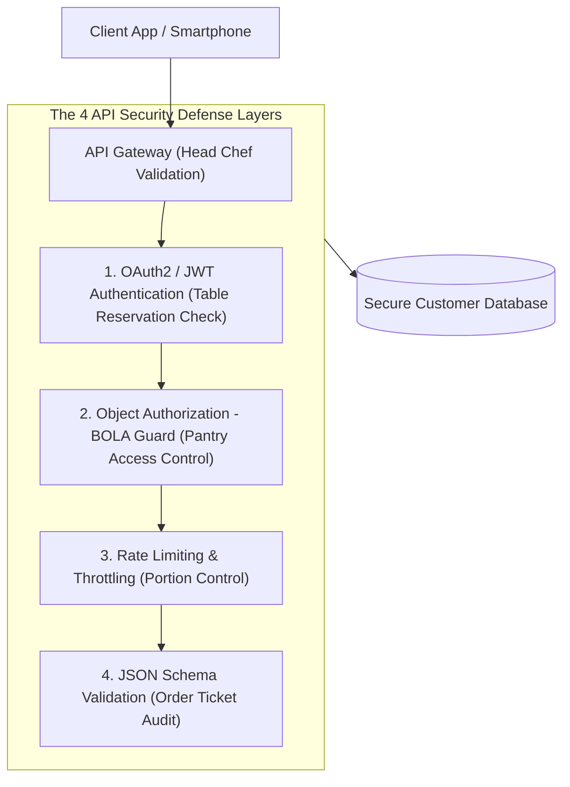
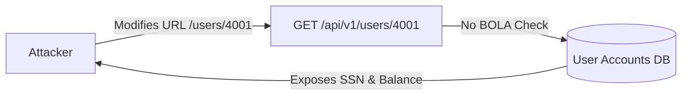

```ppt
# Slide 1: API Security & OWASP Top 10
- **The Core Engineering Challenge:** Securing Application Programming Interfaces (APIs) against automated bot attacks, data leaks, and authorization flaws.
- **Executive Reality:** Over 80% of modern web and mobile traffic flows through APIs — APIs are the primary target for cyber attackers!
- **Author:** Pankaj Kumar | Associate Architect & Tech Leadership
<!-- slide -->
# Slide 2: The Restaurant Kitchen Pass-Through Analogy
- **Careless Restaurant (Unsecured API):** A waiter leaves an open window between the dining room and kitchen pantry. A hungry customer reaches through the window, takes raw steaks, and alters the kitchen order tickets without paying!
- **Master Gourmet Kitchen (Secured API Architecture):** Every order ticket must be validated by the Head Chef (*API Gateway*), user identity checked (*OAuth2 / JWT*), food portions strictly controlled (*Rate Limiting*), and access to the pantry locked (*RBAC Authorization*)!
<!-- slide -->
# Slide 3: The OWASP API Security Top 10 (Core Threats)
- **API1 (BOLA):** Broken Object Level Authorization (Modifying ID in URL to view another user's data).
- **API2 (Broken Authentication):** Weak JWT tokens or missing MFA.
- **API3 (BOPLA):** Broken Object Property Level Authorization (Exposing sensitive hidden fields in JSON).
- **API4 (Unrestricted Resource Consumption):** Missing rate limits leading to DoS.
- **API5 (BFLA):** Broken Function Level Authorization (Normal user triggering admin API routes).
<!-- slide -->
# Slide 4: Real-World Case Study: Vikram's Fintech API Leak
- **The Vulnerability:** A fintech app led by Tech Lead **Vikram Patel** exposed a user profile API (`/api/v1/users/4002`).
- **The Exploit (BOLA + BOPLA):** Attackers changed the ID to `/4001` and received JSON containing the user's plain text social security number and account balance!
- **The Fix:** Enforcing UUIDs, JWT authorization tokens, and GraphQL / JSON field masking.
<!-- slide -->
# Slide 5: The 4 Pillars of API Security Defense
- **1. Centralized API Gateway:** Enforcing TLS encryption, rate limiting, and OAuth2 validation at the perimeter (Kong / AWS API Gateway).
- **2. Strict Schema Validation:** Rejecting malformed JSON payloads before reaching backend microservices.
- **3. Rate Limiting & Throttling:** Blocking IP addresses firing more than 100 requests per minute.
- **4. Automated Security Scanning:** Running DAST and SAST scanners in CI/CD build pipelines.
<!-- slide -->
# Slide 6: Best Practices for OAuth2 & JWT Tokens
- **Short-Lived Access Tokens:** Expiring JWT tokens after 15 minutes.
- **Encrypted Claims:** Storing only user ID and roles inside JWT payload (Never passwords or credit card numbers!).
<!-- slide -->
# Slide 7: Common Misconception
- **Myth:** "If an API requires HTTPS encryption, it is completely secure from hackers."
- **Fact:** HTTPS protects data in transit, but does NOT prevent authorization flaws (BOLA) or API rate limit abuse!
<!-- slide -->
# Slide 8: Summary for Beginners
- Lock down your APIs: validate user authorization at every endpoint, enforce rate limits at the gateway, and eliminate OWASP Top 10 flaws!
```

# API Security & OWASP Top 10 Vulnerabilities

In modern software development, **Application Programming Interfaces (APIs) are the engine of the digital economy.**

When you order food on a mobile app, check your bank balance, or book a flight online, your smartphone communicates with backend cloud servers via REST or GraphQL APIs.

However, because APIs expose direct connections to backend databases, **APIs have become the #1 target for cyber criminals!**

If an API lacks proper authorization checks, an attacker can steal millions of customer records using a single line of script.

To protect backend systems, **CTOs must master API Security and the OWASP API Security Top 10!**

Let's understand API Security using **The Restaurant Kitchen Pass-Through Analogy**!

---

## 🍽️ The Restaurant Kitchen Pass-Through Analogy


Imagine managing a busy fine-dining restaurant:



- **The Careless Restaurant (Unsecured API):**  
  Leaves an unguarded open window between the dining room and the kitchen pantry. A customer reaches through the window, takes raw steaks, alters the chef's order tickets, and views other diners' credit card receipts on the counter!

- **The Master Gourmet Kitchen (Secured API Architecture):**  
  Every order ticket must be validated by the Head Chef (**API Gateway**), diner identity verified (**OAuth2 / JWT**), food portions strictly controlled (**Rate Limiting**), and access to the pantry locked (**Role-Based Access Control**)!

---

## 📊 Real-World Case Study: Vikram's Fintech API Leak

Consider a fast-growing fintech startup led by Lead Architect **Vikram Patel**.



1. **The Vulnerability:** Vikram's team launched a user profile API endpoint: `GET /api/v1/users/4002`.
2. **The Exploit (BOLA + BOPLA):** An attacker logged into account `#4002`, opened their browser developer console, and changed the API request URL to `/users/4001`. Because the backend microservice only checked if the user was logged in—but failed to check if user `#4002` owned record `#4001`—the API returned user `#4001`'s full social security number and bank balance!
3. **The Fix:** Vikram's team implemented **Broken Object Level Authorization (BOLA)** checks on every API route, replaced integer IDs with UUIDs (`/users/a8f3-41bd`), and masked sensitive fields in JSON responses.

---

## 📊 The OWASP API Security Top 10 Reference Guide

| OWASP Vulnerability | Technical Name | Real-World Risk Scenario | Security Mitigation |
| :--- | :--- | :--- | :--- |
| **API1: BOLA** | Broken Object Level Authorization | User changing ID in URL to read another customer's data | Enforce object ownership checks (`req.user.id == resource.ownerId`) |
| **API2: Broken Auth** | Broken Authentication | Weak JWT signing algorithms allowing token forgery | Use RS256 JWT signatures & hardware MFA |
| **API3: BOPLA** | Broken Object Property Authorization | API exposing hidden fields like `isAdmin: true` or SSN | Filter JSON output DTOs; block mass assignment |
| **API4: Unrestricted Rate** | Unrestricted Resource Consumption | Botnet firing 50,000 requests/min to crash database | Enforce API Gateway rate limits (100 reqs/min per IP) |
| **API5: BFLA** | Broken Function Level Authorization | Normal user sending POST request to admin endpoint `/api/admin/delete` | Enforce strict Role-Based Access Control (RBAC) middleware |

---

## 💡 Summary for Beginners

- **API Security** = The practice of protecting API endpoints from unauthorized access, data exposure, and automated bot abuse.
- **BOLA (Broken Object Level Authorization)** = The #1 most common API vulnerability where an API fails to verify if a user has permission to access a specific data object ID.
- **CTO Golden Rule** = **"Validate user authorization at every single API endpoint — use API Gateways for rate limiting and never rely on frontend security alone!"**

---

*Written by **Pankaj Kumar** | Associate Architect & Tech Leadership.*
