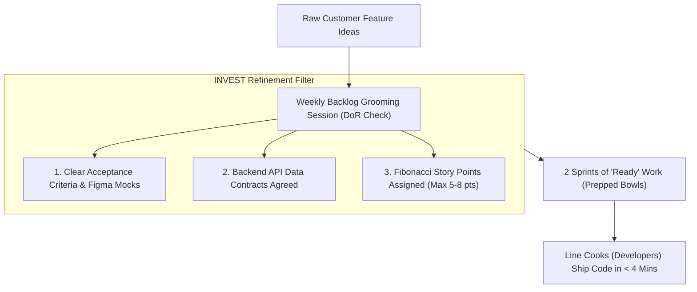
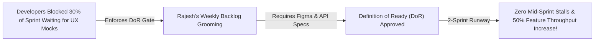

```ppt
# Slide 1: Backlog Grooming & Refinement
- **The Core Discipline:** Continuously refining, sizing, and clarifying user stories in the product backlog so developers always have 2 sprints of "Ready" work.
- **Executive Rule:** Garbage input into sprint planning leads to garbage output in sprint execution!
- **Author:** Pankaj Kumar | Associate Architect & Tech Leadership
<!-- slide -->
# Slide 2: The Master Chef Kitchen Prep Station Analogy
- **Chaotic Restaurant (Un-Groomed Backlog):** A chef orders whole unwashed vegetables and un-cut meat delivered directly to line cooks during peak 8:00 PM dinner rush. Cooks waste 45 minutes peeling potatoes while hungry customers walk out!
- **Michelin-Star Kitchen (Groomed Backlog):** A prep team washes, chops, and portions every ingredient into neat glass bowls (*Definition of Ready*) during morning prep. Line cooks grab ready bowls and assemble gourmet meals in **4 minutes**!
<!-- slide -->
# Slide 3: The 4 Criteria of a Refined User Story (INVEST)
- **I (Independent):** Story can be built without waiting for other un-started tickets.
- **N (Negotiable):** Scope can be adjusted during refinement discussions.
- **V (Valuable):** Delivers clear user or business value.
- **E (Estimable):** Squad can estimate complexity using Fibonacci Story Points.
- **S (Small):** Fits inside a single sprint (Max 5-8 points).
- **T (Testable):** Clear pass/fail Acceptance Criteria.
<!-- slide -->
# Slide 4: Real-World Case Study: Rajesh's Backlog Pre-Mise-En-Place
- **The Challenge:** A software team led by Lead Architect **Rajesh Sharma** wasted 30% of every sprint asking Product Managers for missing UI designs and API specs.
- **The Grooming Solution:** Rajesh enforced a strict **Definition of Ready (DoR)** gate: no ticket enters sprint planning without approved Figma mocks and API specs.
- **The Result:** Eliminated mid-sprint developer stalls and boosted feature throughput by 50%!
<!-- slide -->
# Slide 5: The Backlog Refinement Cadence
- **Frequency:** Weekly 60-minute refinement sessions with Product Manager, Tech Lead, and Squad.
- **Backlog Runway:** Maintaining **2 Sprints of Ready Work** ahead of active development.
<!-- slide -->
# Slide 6: Definition of Ready (DoR) vs Definition of Done (DoD)
- **Definition of Ready (DoR):** Entry criteria into Sprint Planning (Clear acceptance criteria, UX mocks, API contracts, Story Points assigned).
- **Definition of Done (DoD):** Exit criteria out of Sprint (Unit tests passed, code reviewed, security scanned, deployed to staging).
<!-- slide -->
# Slide 7: Common Misconception
- **Myth:** "Backlog refinement is the sole responsibility of the Product Manager."
- **Fact:** Refinement is a collaborative team sport — engineers must inspect architecture feasibility and estimate complexity!
<!-- slide -->
# Slide 8: Summary for Beginners
- Groom backlogs continuously: maintain 2 sprints of ready runway, enforce INVEST criteria, define clear DoR gates, and eliminate sprint prep friction!
```

# Backlog Grooming: Keeping User Stories Clear & Estimated

Why do software engineering squads get stuck mid-sprint waiting for answers, missing deadlines, and delivering buggy code?

In chaotic software organizations, **Sprint Planning begins with an un-refined, chaotic backlog:**
- User stories are 1-sentence placeholder notes: *"Build checkout page."*
- Tickets have no UX wireframes, no API data contracts, and zero acceptance criteria.
- Developers spend 3 days of an active sprint arguing with Product Managers over what the feature is actually supposed to do.

This operational friction is called **Backlog Decay.**

When you feed un-groomed tickets into a sprint, developers waste hours guessing requirements, creating architectural rework and sprint failure.

To maintain high engineering throughput, **CTOs enforce Continuous Backlog Grooming (Refinement)!**

Let's understand Backlog Grooming using **The Master Chef Kitchen Prep Station Analogy**!

---

## 🥗 The Master Chef Kitchen Prep Station Analogy

Imagine running a high-volume gourmet restaurant kitchen:



- **The Chaotic Restaurant (Un-Groomed Backlog):**  
  A restaurant orders whole unwashed potatoes, raw un-cut meat, and unpeeled onions delivered directly to line cooks during peak 8:00 PM dinner rush. Line cooks waste 45 minutes chopping vegetables while hungry customers walk out screaming!

- **The Michelin-Star Kitchen (Groomed Backlog / Mise-en-place):**  
  A dedicated prep team washes, chops, portions, and arranges every ingredient into neat glass bowls (**Definition of Ready**) during morning prep. When dinner rush starts, line cooks grab prepped bowls and assemble gourmet meals in **4 minutes**!

---

## 📊 Real-World Case Study: Rajesh's Backlog Pre-Mise-En-Place

Consider a cloud engineering squad led by Lead Architect **Rajesh Sharma**.



1. **The Problem:** Rajesh's developers were spending 30% of every 2-week sprint waiting for Product Managers to supply missing UI designs, copy text, and backend database schemas.
2. **The Transformation:**  
   - Rajesh established a strict **Definition of Ready (DoR) Gate**: A ticket was legally forbidden from entering Sprint Planning unless it contained approved Figma mocks, explicit pass/fail acceptance criteria, and an agreed API payload contract.
   - The team held weekly **60-minute Backlog Refinement sessions**, keeping a **2-Sprint Runway** of fully prepped work ahead of development.
3. **The Result:** Mid-sprint developer stalls dropped to zero, sprint planning duration was cut in half, and overall feature throughput increased by **50%**!

---

## 📊 Un-Groomed Backlog vs. Continuously Groomed Backlog

| Dimension | Un-Groomed Backlog (Chaotic) | Continuously Groomed Backlog (Resilient) |
| :--- | :--- | :--- |
| **Ticket Quality** | Vague 1-line titles (*"Fix checkout bug"*) | Detailed INVEST user stories with explicit Acceptance Criteria |
| **Sprint Planning** | Painful 6-hour meeting discovering requirements | Fast 45-minute confirmation meeting pulling pre-estimated tickets |
| **Mid-Sprint Stalls** | High (Developers blocked waiting for UX mocks / APIs) | Zero (All dependencies resolved before sprint starts) |
| **Backlog Runway** | 0 days (Scrambling for work on Monday morning) | 2 Sprints (4 weeks of fully prepped "Ready" tickets) |
| **Estimation Accuracy** | Wild guessing in hours during sprint planning | Relative Fibonacci story points refined collaboratively in advance |

---

## 💡 Summary for Beginners

- **Backlog Grooming (Refinement)** = A recurring meeting where Product Managers, Tech Leads, and engineers review, clarify, split, and estimate backlog user stories.
- **Definition of Ready (DoR)** = The explicit quality gate a user story must satisfy before it can be pulled into an active sprint.
- **INVEST Criteria** = An acronym (Independent, Negotiable, Valuable, Estimable, Small, Testable) describing high-quality user story standards.
- **CTO Golden Rule** = **"Never pull un-refined user stories into a sprint — maintain 2 sprints of ready runway with clear acceptance criteria and API specs!"**

---

*Written by **Pankaj Kumar** | Associate Architect & Tech Leadership.*
