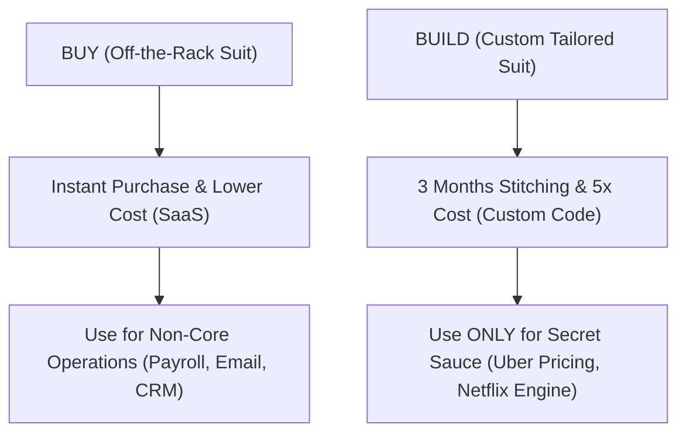

```ppt
# Slide 1: Build vs Buy Decision Framework
- **The Classic Executive Dilemma:** Should our engineering team write custom code from scratch, or buy an existing commercial software tool?
- **Rule of Thumb:** Build core competitive advantages; Buy non-differentiating operational utilities.
- **Author:** Pankaj Kumar | Associate Architect & Tech Leadership
<!-- slide -->
# Slide 2: Tailoring a Custom Suit vs Buying Off-the-Rack
- **Buying (Off-the-Rack Suit):** Instant fit, fraction of the price, but cannot change button designs.
- **Building (Custom Tailored Suit):** Takes 3 months to stitch, 5x expensive, but fits your unique body dimensions perfectly!
<!-- slide -->
# Slide 3: The 4 Strategic Evaluation Criteria
- **1. Strategic Differentiation:** Is this software feature your core business secret sauce?
- **2. Total Cost of Ownership (TCO):** Upfront build cost + ongoing developer maintenance vs annual SaaS fee.
- **3. Speed to Market:** Can you wait 9 months to launch custom code, or do you need it tomorrow?
- **4. In-House Capability:** Does your team have the specialized expertise to build and maintain it safely?
<!-- slide -->
# Slide 4: Real-World Business Example
- **Case A (BUY):** Stripe Payment Gateway — Why write custom credit card processing code and handle PCI compliance when Stripe charges 2.9%?
- **Case B (BUILD):** Uber Dynamic Pricing Algorithm — Uber's core secret sauce matching driver supply to rider demand must be built in-house!
<!-- slide -->
# Slide 5: The Hidden Costs of Building Custom Code
- **Maintenance Trap:** Building software is 20% of the cost; maintaining and upgrading code over 5 years is 80%!
- **Key-Person Dependency:** If the single developer who built the custom tool resigns, nobody knows how to fix bugs.
<!-- slide -->
# Slide 6: The Hybrid Approach (Buy & Customize)
- **Headless & APIs:** Buying core cloud infrastructure engines while building custom frontend customer interfaces.
- **Low-Code Automation:** Building internal admin workflows using tools like Retool or Zapier.
<!-- slide -->
# Slide 7: Common Beginner Misconception
- **Myth:** "Building custom software is always cheaper because we already pay developer salaries."
- **Fact:** Developer time spent building utility tools is opportunity cost stolen from building core revenue features!
<!-- slide -->
# Slide 8: Summary for Beginners
- Never build what you can buy, unless building it gives your company an unbreachable competitive moat!
```

# Build vs Buy Decision Framework: When to Code Custom Software vs Buying Off-the-Shelf

One of the most frequent strategic questions presented to a Chief Technology Officer is:

> *"Should we hire developers to build our own custom CRM software, or should we just pay $50/month for Salesforce?"*

Engineers naturally love to **build everything from scratch** — it's fun, custom, and gives them complete control over every pixel.

However, executives must evaluate software through the lens of **Total Cost of Ownership (TCO), Opportunity Cost, and Competitive Advantage**.

Let's break down the **Build vs Buy Framework** using the simple analogy of **Buying an Off-the-Rack Suit vs. Tailoring a Custom Suit**!

---

## 👔 Off-the-Rack Suit vs. Custom Tailored Suit

Imagine needing a formal suit for a major executive conference:



- **Buying (Off-the-Rack Suit):** You walk into a retail store, try on a suit, pay $300, and walk out 15 minutes later. The sleeves might be 1 inch too long, but it gets the job done instantly at a low price!
  - *Tech Equivalent:* Subscribing to Slack, Gmail, or Stripe. It takes 5 minutes to set up and handles millions of edge cases for you.

- **Building (Custom Tailored Suit):** You hire a master tailor. You pick rare fabrics, spend 3 months getting measured, and pay $2,500. It fits your body perfectly, but requires multiple fittings and time.
  - *Tech Equivalent:* Writing a custom proprietary AI recommendation engine. It takes 6 months of engineering, but gives you a secret competitive advantage that competitors cannot copy!

---

## 📊 The 4-Part Executive Build vs Buy Matrix

| Criterion | Choose BUILD when... | Choose BUY when... |
| :--- | :--- | :--- |
| **Strategic Advantage** | It is your company's core secret sauce (e.g. Netflix video algorithm) | It is a standard commodity function (e.g. Payroll, Email, Invoicing) |
| **Speed to Market** | You have 6 to 12 months to launch | You need to go live this week |
| **Total Cost (TCO)** | In-house maintenance is cheaper over 5 years | Building costs 10x more than annual SaaS fees |
| **Engineering Focus** | You have spare senior software architects | Developers should focus 100% on revenue features |

---

## 💡 Summary for Beginners

- **Build** = When custom software creates an unbreachable competitive moat.
- **Buy** = When existing software handles commodity business functions faster and cheaper.
- **The Golden CTO Rule** = *"Never build what you can buy, and never buy what makes you unique!"*

---

*Written by **Pankaj Kumar** | Associate Architect & Tech Leadership.*
