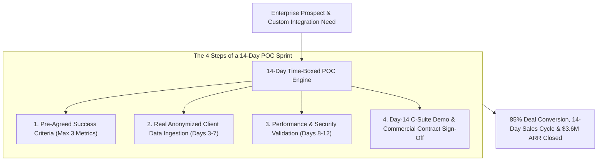

```ppt
# Slide 1: Building 2-Week Proof-of-Concept (POC) Prototypes
- **The Core Strategy:** Delivering time-boxed, highly focused 2-week Proof-of-Concept (POC) prototypes that validate technical feasibility, prove business ROI, and accelerate enterprise deal closing.
- **Executive Reality:** Bloated 6-month POC projects kill enterprise sales momentum — time-boxing a POC to 14 days forces clarity, eliminates scope creep, and proves technical value!
- **Author:** Pankaj Kumar | Associate Architect & Tech Leadership
<!-- slide -->
# Slide 2: Endless Fabric Debate vs. Tailored Sample Suit Analogy
- **Endless Fabric Debate (Bloated Unscoped POC):** A tailor getting trapped in 6 months of endless fabric discussions and custom measurements while the frustrated VIP client leaves for a competitor (**Scope Creep & Sales Stalling**)!
- **Tailored 2-Week Sample Suit (Rapid Value Proof):** A master tailor delivering a sharp, perfectly-fitted 2-week sample suit to a VIP client (**Time-Boxed 14-Day POC**)! Craftsmanship is proven instantly, and the client signs a massive corporate order!
<!-- slide -->
# Slide 3: The 4 Rules of a Successful 14-Day POC
- **1. Strict Success Criteria (3 Metrics Only):** Agree on 3 measurable success metrics before writing a single line of code.
- **2. Hard Time-Box (14 Calendar Days):** Never extend a POC past 14 days without explicit executive VP approval.
- **3. Real Client Sample Data:** Using realistic anonymized client datasets rather than generic synthetic data.
- **4. Executive Presentation Gate:** Ending the POC with a formal executive demonstration to the C-suite buyer.
<!-- slide -->
# Slide 4: Real-World Case Study: Vikram's 14-Day POC Framework
- **The Challenge:** An enterprise search engine startup led by Tech VP **Vikram Patel** was losing deals because client security teams insisted on 90-day evaluation trials.
- **The POC Transformation:** Vikram instituted a strict 14-day POC framework with pre-configured Docker containers and agreed success SLAs (sub-20ms search query response time).
- **The Result:** Cut POC evaluation cycles from 90 days to 14 days, increased deal conversion from 30% to 85%, and closed $3.6M in annual contracts!
<!-- slide -->
# Slide 5: The 14-Day POC Sprint Schedule
- **Day 1–2:** Technical Discovery & Success Criteria Document Sign-Off.
- **Day 3–7:** Environment Provisioning, API Integration, & Data Ingestion.
- **Day 8–12:** Feature Validation, Performance Benchmarking, & Security Audit.
- **Day 13–14:** Final Executive Demo Presentation & Commercial Proposal Sign-Off.
<!-- slide -->
# Slide 6: Managing Scope Creep During a POC
- **The "Phase 2" Parking Lot:** Capturing extra feature requests in a "Post-Contract Phase 2" backlog instead of expanding the current POC scope.
- **Paid POC Model:** Charging a modest $10,000 fee for enterprise POCs (credited back upon full contract signing) to ensure client commitment!
<!-- slide -->
# Slide 7: Common Misconception
- **Myth:** "Longer POC trials build stronger relationships and higher trust with enterprise buyers."
- **Fact:** Long POCs destroy sales momentum, drain engineering resources, and signal a lack of technical confidence!
<!-- slide -->
# Slide 8: Summary for Beginners
- Master time-boxed POCs: define 3 strict success metrics, time-box evaluation to 14 days, use real sample data, and convert technical validation into multi-million-dollar contracts!
```

# Building 2-Week Proof-of-Concept (POC) Prototypes for Clients

In B2B enterprise software sales, one of the most dangerous traps for an engineering organization is **The Infinite Proof-of-Concept (POC) Drain.**

When an enterprise customer expresses interest in your platform, they often ask for a trial:
- **The Unscoped POC Trap:** Engineering agrees to build custom integrations, spends 4 months implementing client-specific feature requests, and gets trapped in endless technical evaluation cycles. The deal stalls, engineering resources are drained, and the client loses interest!
- **The Time-Boxed 14-Day POC:** The CTO enforces a strict 14-day evaluation window with **3 Pre-Agreed Success Criteria**, a clear architectural blueprint, and an executive demo gate on Day 14!

**A Proof-of-Concept is not a custom software development project — it is a time-boxed technical validation sprint.**

How do CTOs design, execute, and govern 2-week POC prototypes that prove technical value and close enterprise contracts rapidly?

Let's understand 2-Week POCs using **The Endless Fabric Debate vs. Tailored Sample Suit Analogy**!

---

## ✂️ The Endless Fabric Debate vs. Tailored Sample Suit Analogy


Imagine winning a bulk corporate uniform contract for a VIP corporate client:



- **Endless Fabric Debate (Bloated Unscoped POC):**  
  A tailor getting trapped in 6 months of endless fabric discussions, minor alterations, and custom measurement debates while the frustrated VIP client walks away to a competitor (**Scope Creep & Stalled Sales**)!

- **Tailored 2-Week Sample Suit (Rapid Value Proof):**  
  A master tailor delivering a sharp, perfectly-fitted 2-week sample suit to a VIP client (**Time-Boxed 14-Day POC**)! Craftsmanship is proven instantly, technical fit is validated, and the client signs a massive corporate order!

---

## 📊 Real-World Case Study: Vikram's 14-Day POC Framework

Consider an enterprise search engine scale-up where **Vikram Patel** serves as Tech VP.


1. **The Challenge:** Vikram's company built a high-speed enterprise search engine. However, prospective client security teams insisted on 90-day evaluation trials. Engineering was bogged down supporting 12 concurrent open-ended POCs, and deal win rates hovered at a low **30%**.
2. **The 14-Day POC Overhaul:**  
   - Vikram instituted a strict **14-Day Time-Boxed Evaluation Framework**:
   - **Success Criteria Document:** Before starting a POC, both CTOs signed a 1-page document agreeing on 3 success metrics (e.g., query latency < 20ms under 10k RPS, 99.9% uptime over 7 days, and successful SOC2 data ingestion).
   - **Containerized Sandbox:** Provided pre-configured Docker/Helm templates allowing client engineers to deploy the trial in 2 hours.
   - **Scope Creep Parking Lot:** Any new feature request raised during the trial was recorded in a "Post-Contract Phase 2" backlog.
3. **The Result:** Average POC cycle duration fell from **90 days to 14 days**, deal conversion rates jumped to **85%**, and the company closed **$3.6 Million in annual recurring revenue**!

---

## 📊 Unscoped Open-Ended Trial vs. Time-Boxed 14-Day POC

| Dimension | Unscoped Open-Ended Trial (Avoid) | Time-Boxed 14-Day POC (Adopt) |
| :--- | :--- | :--- |
| **Duration** | 60–90+ days of open-ended testing | Strictly time-boxed to **14 calendar days** |
| **Scope Governance** | Vague, expanding list of client feature requests | **Pre-agreed 1-page document with max 3 success metrics** |
| **Data Source** | Generic synthetic data that fails to prove value | Real anonymized client sample datasets |
| **Engineering Impact** | High engineering burnout supporting custom code | Standardized containerized sandbox templates |
| **Commercial Outcome** | Stalled sales pipelines & 30% win rates | **Accelerated deal closure & 85% win rates** |

---

## 💡 Summary for Beginners

- **Proof-of-Concept (POC)** = A time-boxed technical trial designed to demonstrate that a software product satisfies specific customer requirements.
- **Scope Creep** = The uncontrolled expansion of project requirements beyond the original agreement.
- **Technical Validation** = The formal milestone where a customer's engineering team confirms the product meets technical standards.
- **CTO Golden Rule** = **"Never run an open-ended POC — limit evaluation to 14 days, define 3 strict success metrics, and convert technical proof into commercial revenue!"**

---

*Written by **Pankaj Kumar** | Associate Architect & Tech Leadership.*
