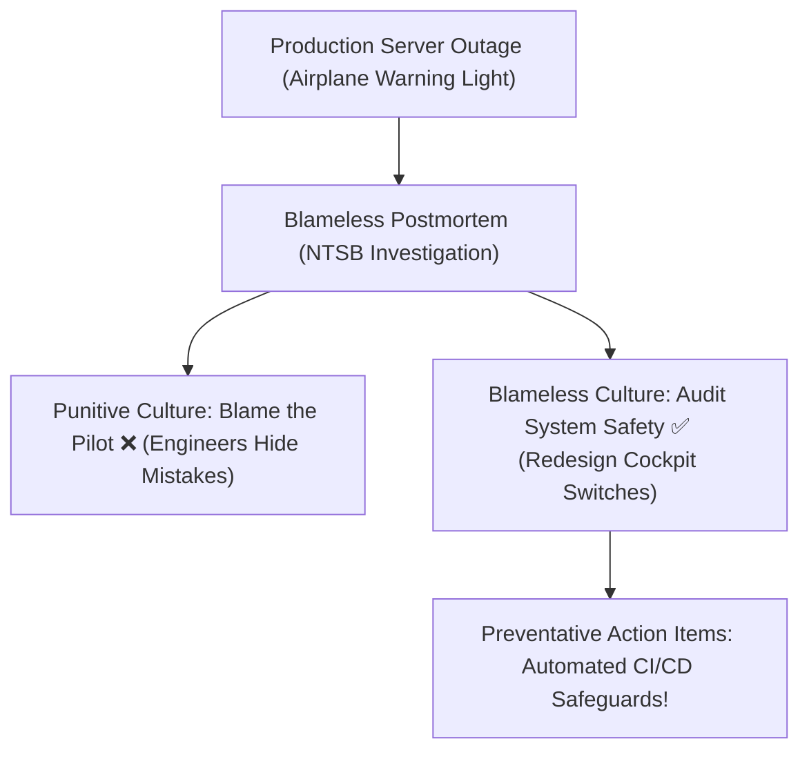

```ppt
# Slide 1: Building a Blameless Postmortem Culture
- **The Psychological Shift:** Moving from pointing fingers ("Who broke the system?") to system analysis ("Why did the system allow the failure?").
- **Goal:** Fostering psychological safety so engineers report mistakes instantly.
- **Author:** Pankaj Kumar | Associate Architect & Tech Leadership
<!-- slide -->
# Slide 2: The Aircraft NTSB Investigation Analogy
- **Punitive Culture (Pointing Fingers):** Firing a pilot after a minor instrument landing error -> Future pilots hide minor errors until planes crash!
- **Blameless Culture (NTSB Investigation):** Investigating control panel design, cockpit alarm noise, and dark lighting -> Redesigning cockpits worldwide!
<!-- slide -->
# Slide 3: The 5 Whys Root Cause Analysis Technique
- **Problem:** Database went down for 45 minutes on Black Friday.
- **Why 1?** The disk ran out of storage space.
- **Why 2?** Log files filled up the hard drive.
- **Why 3?** Automated log rotation script failed to run.
- **Why 4?** A configuration flag was omitted during last week's deploy.
- **Why 5 (Root Cause)?** We lacked automated deployment checklist validation!
<!-- slide -->
# Slide 4: Anatomy of a Great Postmortem Document
- **1. Incident Summary:** Exact start time, end time, and customer impact SLA.
- **2. Timeline of Events:** Chronological breakdown of alert detection to resolution.
- **3. Root Cause Analysis:** Detailed 5-Whys technical breakdown.
- **4. Actionable Preventative Tasks:** Jira tickets with assigned owners to prevent recurrence!
<!-- slide -->
# Slide 5: Psychological Safety & Psychological Danger
- **Psychological Danger:** Engineers hide system bugs, delay reporting outages, and live in constant fear.
- **Psychological Safety:** Engineers openly discuss mistakes, experiment safely, and build resilient infrastructure!
<!-- slide -->
# Slide 6: The Golden CTO Postmortem Rule
- **Rule:** If a single human mistake (like typing an incorrect command) crashes your production system, it is a **SYSTEM FAILURE**, not a human failure!
- **Fix:** Build safeguards so single typos cannot destroy production databases!
<!-- slide -->
# Slide 7: Common Beginner Misconception
- **Myth:** "Blameless postmortem means there is zero accountability for poor work."
- **Fact:** Blameless postmortem enforces high systemic accountability by requiring concrete preventative engineering fixes!
<!-- slide -->
# Slide 8: Summary for Beginners
- Treat software outages as free tuition lessons that strengthen your engineering architecture!
```

# Building a Blameless Postmortem Culture: Turning Outages into Team Learning

When a major cloud server crashes or a website goes down for 2 hours during peak shopping hours, panic spreads across the company. 

Executives ask: *"Who pushed the broken code? Who broke production?"*

In toxic tech cultures, leadership finds a single junior developer to blame, fires them, and assumes the problem is solved. But this creates a culture of fear: developers hide bugs, delay reporting outages, and refuse to take creative risks.

Modern engineering leaders implement a **Blameless Postmortem Culture**.

Let's understand **Blameless Postmortems** using **The Aircraft NTSB Crash Investigation Analogy**!

---

## ✈️ The Aircraft NTSB Crash Investigation Analogy

Imagine how aviation safety authorities (like the NTSB) handle airplane incidents:



- **Punitive Culture (Fire the Pilot):**  
  If a pilot flips the wrong switch during turbulence, the airline fires the pilot. What happens? Other pilots hide minor instrument errors in flight logs out of fear, leading to catastrophic airplane crashes later!

- **Blameless Culture (NTSB Investigation):**  
  The investigators ask: *"Why are the fuel cutoff switch and the cabin light switch right next to each other in the dark?"* They redesign the cockpit controls so it is physically impossible to flip the wrong switch by accident!

---

## 📊 The "5 Whys" Root Cause Analysis Technique

Instead of stopping at human error (*"Developer Bob typed the wrong command"*), ask "Why" 5 times:

1. **Why did the website crash?** The primary database ran out of disk space.
2. **Why did it run out of disk space?** Debug log files filled up the server hard drive.
3. **Why did log files fill up the drive?** The automated log deletion script failed to execute.
4. **Why did the script fail to execute?** A required environment variable was missing.
5. **Why was the variable missing?** We lacked automated deployment checklist validation! *(Root Cause Found ✅)*

---

## 💡 Summary for Beginners

- **Blameless Postmortem** = Analyzing systemic root causes of failure without punishing individuals.
- **Psychological Safety** = An environment where engineers feel safe taking risks and admitting mistakes.
- **The CTO's Golden Rule** = *"Never blame a human for a failure that a computer system should have prevented!"*

---

*Written by **Pankaj Kumar** | Associate Architect & Tech Leadership.*
