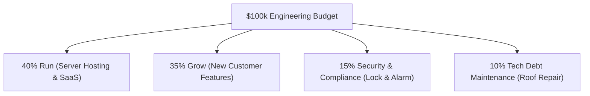

```ppt
# Slide 1: Building a Board-Ready Engineering Budget
- **Executive Challenge:** Translating complex engineering needs into a clear, financially justified annual budget.
- **Goal:** Winning unanimous approval from the Board of Directors & CFO.
- **Author:** Pankaj Kumar | Associate Architect & Tech Leadership
<!-- slide -->
# Slide 2: The House Renovation Budget Analogy
- **Bad Budget Pitch:** Asking for $100,000 for "cool new gadgets and plumbing parts."
- **Board-Ready Pitch:** Splitting costs into: Structural Foundation (40%), New Room Additions (40%), and Emergency Repairs (20%).
<!-- slide -->
# Slide 3: The 4 Buckets of an Engineering Budget
- **1. Run the Business (RLE):** Server hosting, database licenses, software SaaS subscriptions (40%).
- **2. Grow the Business (Strategic Features):** New product features that generate new revenue (35%).
- **3. Security & Compliance:** Firewalls, penetration tests, SOC2 audits (15%).
- **4. Tech Debt & Refactoring:** Code maintenance and database cleanup (10%).
<!-- slide -->
# Slide 4: Real-World Boardroom Strategy
- **The Board's Perspective:** Directors care about Risk, Return on Capital, and Speed to Market.
- **The CTO Strategy:** Linking every dollar spent to a specific business Milestone or Revenue KPI!
<!-- slide -->
# Slide 5: Scenario Planning (Best Case, Base Case, Bear Case)
- **Base Budget:** Standard operational growth plan.
- **Bull Budget (+20%):** Accelerated expansion if Series B funding lands early.
- **Bear Budget (-15%):** Contingency cost cuts if macroeconomic revenue drops.
<!-- slide -->
# Slide 6: Key Metrics Board Directors Ask About
- **CAC vs LTV Ratio:** Customer Acquisition Cost vs Lifetime Value.
- **R&D as % of Revenue:** Benchmark spending against industry peers (typically 15% to 25%).
- **Cloud Unit Economics:** Cloud cost per active user trending downwards over time.
<!-- slide -->
# Slide 7: Common Beginner Misconception
- **Myth:** "The engineering budget is just salaries + AWS bills."
- **Fact:** A board-ready budget accounts for developer tools, security audits, training, and emergency contingency buffers!
<!-- slide -->
# Slide 8: Summary for Beginners
- Speak the board's language of risk, growth, and ROI to secure your engineering budget!
```

# Building a Board-Ready Engineering Budget: How CTOs Win Board Approval

Presenting an annual technology budget to the Board of Directors is one of the most critical responsibilities of a Chief Technology Officer.

If your budget presentation is filled with technical jargon like *"Kubernetes clusters, microservice refactoring, and Kafka queues,"* board members will tune out — or worse, slash your budget by 30%!

Board directors don't evaluate technology based on how modern the code is. They evaluate budgets based on **Business Risk, Revenue Growth, and Return on Investment (ROI)**.

Let's break down how to build a **Board-Ready Engineering Budget** using the simple **House Renovation Analogy**!

---

## 🏡 The House Renovation Budget Analogy

Imagine presenting a $100,000 renovation budget to a property owner:



- **Bad Pitch (Rejected ❌):** Asking for $100,000 for "new electrical wiring and smart gadgets" without explaining why.
- **Board-Ready Pitch (Approved ✅):** Categorizing the $100,000 into 4 clear investment buckets:
  1. **Run the Business (40% - $40k):** Electric bills, routine plumbing maintenance, and water services (Keep the lights on).
  2. **Grow the Business (35% - $35k):** Building a brand new sunroom that increases house resale value by $75k.
  3. **Security & Alarm Systems (15% - $15k):** Installing biometric door locks to prevent burglaries.
  4. **Roof & Foundation Repair (10% - $10k):** Fixing minor leaks before they cause $50,000 structural water damage!

---

## 📊 The 4 Essential Buckets of Executive Tech Budgets

| Budget Bucket | What It Includes | Board Metric / Rationale |
| :--- | :--- | :--- |
| **1. Run (RLE)** | AWS Cloud hosting, SaaS tools, employee laptops | Uptime SLA (99.99%) & Operational Reliability |
| **2. Grow** | New feature engineering, mobile app redesign | Projected New Revenue / ARR Growth |
| **3. Protect** | Security firewalls, SOC2 compliance audits | Risk Reduction & Data Breach Prevention |
| **4. Maintain (Debt)** | Code refactoring, database upgrades | Engineering Velocity & Preventing System Crashes |

---

## 💡 Summary for Beginners

- **Board Language** = Risk mitigation, revenue growth, and R&D percentage of revenue.
- **Scenario Planning** = Presenting Base, Bull, and Bear budget cases.
- **The CTO's Job** = Proving that every engineering dollar directly fuels business valuation!

---

*Written by **Pankaj Kumar** | Associate Architect & Tech Leadership.*
