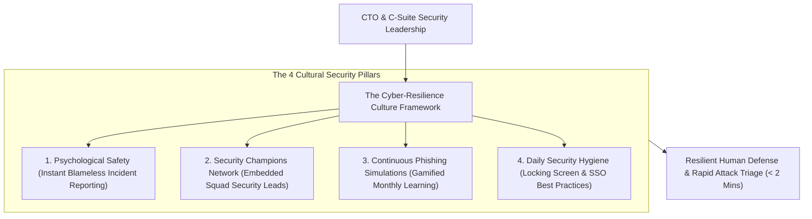
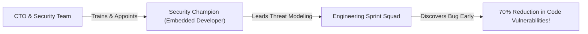

```ppt
# Slide 1: Cyber-Resilient Company Culture
- **The Core Leadership Objective:** Building an organizational culture where security awareness, vigilance, and psychological safety are practiced naturally by every employee.
- **Executive Reality:** Cyber resilience is a cultural mindset, not a security compliance checkbox!
- **Author:** Pankaj Kumar | Associate Architect & Tech Leadership
<!-- slide -->
# Slide 2: Locking Desk Drawers Before Leaving Analogy
- **Careless Office (Low Security Culture):** Employees leave physical cash, customer files, and master keys laying open on their desks at 5:00 PM. When a burglar enters at night, they steal everything without breaking a single lock!
- **High-Security Corporate Tower (Cyber-Resilient Culture):** Every employee naturally locks their desk drawers (*Clean Desk Policy*), locks their laptop screen (`Win+L`) when stepping away for coffee, and reports suspicious strangers without hesitation!
<!-- slide -->
# Slide 3: The 4 Pillars of Cyber Resilience
- **1. Psychological Safety & Blameless Reporting:** Rewarding employees who report clicked phishing links immediately.
- **2. Security Champions Network:** Embedding security-minded developers inside every engineering squad.
- **3. Continuous Phishing Drills:** Monthly real-world simulations with instant interactive training.
- **4. Executive Security Leadership:** C-suite executives modeling security behaviors (No admin exemptions!).
<!-- slide -->
# Slide 4: Real-World Case Study: Priya's Security Champions Network
- **The Initiative:** HR & Operations Lead **Priya Nair** partnered with the CTO to launch a company-wide "Security Champions" program.
- **The Execution:** Appointed 1 developer per squad as a Security Champion to lead threat modeling and code security reviews.
- **The Result:** Reduced security vulnerabilities by 70% and cut incident triage time in half!
<!-- slide -->
# Slide 5: The Cost of Fear vs Psychological Safety
- **Fear-Based Culture:** Employees hide security mistakes, delay incident reporting, and panic when clicked links infect laptops.
- **Resilient Culture:** Employees report suspicious emails within 2 minutes, allowing the SOC to block attacks before damage spreads!
<!-- slide -->
# Slide 6: Gamification & Positive Reinforcement
- **Security Leaderboards:** Celebrating squads that achieve 100% phishing drill pass rates.
- **Cyber Defender Badges:** Public recognition for employees who catch novel spear-phishing attacks.
<!-- slide -->
# Slide 7: Common Misconception
- **Myth:** "Cybersecurity is strictly the responsibility of the CISO and IT Security team."
- **Fact:** Every single employee with a laptop and email account is an active defender on the company's security front line!
<!-- slide -->
# Slide 8: Summary for Beginners
- Build a cyber-resilient culture: empower security champions, reward fast incident reporting, eliminate executive exemptions, and celebrate security vigilance!
```

# Building a Cyber-Resilient Company Culture

Why do companies spend millions of dollars on state-of-the-art Web Application Firewalls, Zero Trust proxies, and endpoint encryption, **only to get breached by a basic phishing email or social engineering phone call?**

The reason is simple: **Cybersecurity is not just a technology problem — Cybersecurity is a Human Culture Discipline!**

If your employees view security as an annoying bureaucratic hurdle:
- They write passwords on sticky notes under their keyboards.
- They click suspicious links and hide their mistakes out of fear of getting fired.
- They bypass security controls to "get work done faster."

In high-performing technology organizations, **CTOs build a Cyber-Resilient Company Culture!**

Let's understand Cyber Resilience using **The Locking Desk Drawers Before Leaving Analogy**!

---

## 🏢 The Locking Desk Drawers Before Leaving Analogy


Imagine managing security at a corporate headquarters:



- **The Careless Office (Low Security Culture):**  
  Employees leave physical cash, customer folders, and server keys laying open on top of their desks when they go home at 5:00 PM. When an intruder sneaks in at night, they steal millions of dollars without breaking a single door lock!

- **The High-Security Corporate Tower (Cyber-Resilient Culture):**  
  Every employee naturally locks their desk drawers (**Clean Desk & Data Policy**), locks their computer screen when stepping away for coffee (`Win+L`), and politely challenges suspicious strangers without hesitation!

---

## 📊 Real-World Case Study: Priya's Security Champions Network

Consider a fast-scaling tech company where HR & Operations Lead **Priya Nair** partnered with the CTO to transform engineering culture.



1. **The Challenge:** The centralized IT security team was overwhelmed, taking 3 weeks to audit pull requests and slowing down sprint deployments.
2. **The Cultural Solution:** Priya and the CTO created a company-wide **Security Champions Program**:
   - Appointed 1 software engineer in every sprint squad as a designated *Security Champion*.
   - Provided Security Champions with advanced threat modeling training and 4 hours of dedicated security time per week.
   - Security Champions led code security reviews inside their own squads.
3. **The Result:** Code vulnerabilities dropped by **70%**, security audit bottlenecks were eliminated, and developers took personal pride in shipping bulletproof code!

---

## 📊 Fear-Based Culture vs. Cyber-Resilient Culture

| Cultural Dimension | Fear-Based Culture (Vulnerable) | Cyber-Resilient Culture (Adopt) |
| :--- | :--- | :--- |
| **Outage / Incident Reaction** | Scapegoating, public humiliation, firing employees | Blameless post-mortems & rewarding fast incident reporting |
| **Phishing Response** | Employees hide clicked links due to fear of punishment | Employees report suspicious emails in < 2 mins via 1-click Slack bot |
| **Executive Policies** | Executives demand exemptions from MFA & security policies | C-suite leaders model strict security compliance (Leading by example) |
| **Security Training** | Boring annual 20-minute compliance video | Monthly gamified phishing simulations & Security Champion awards |

---

## 💡 Summary for Beginners

- **Cyber Resilience** = An organization's ability to continuously deliver outcomes despite adverse cyber events, breaches, or system failures.
- **Security Champions** = Developers embedded within engineering teams who act as local security advocates and code reviewers.
- **CTO Golden Rule** = **"Security is a cultural mindset — eliminate fear, empower Security Champions in every squad, and reward employees who report threats fast!"**

---

*Written by **Pankaj Kumar** | Associate Architect & Tech Leadership.*
