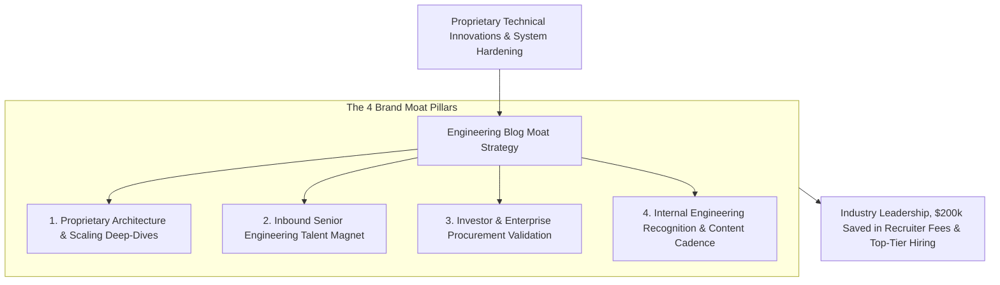
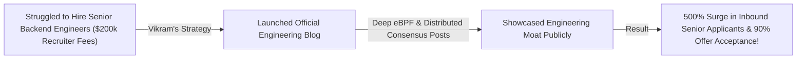

```ppt
# Slide 1: Building an Engineering Blog: Showcasing Tech Moats
- **The Executive Strategy:** Transforming your engineering blog into a powerful technical magnet that showcases deep proprietary innovations, attracts world-class engineering talent, and reassures enterprise investors.
- **Executive Reality:** Top software engineers do not apply through generic job boards — they join companies whose engineering blogs inspire them!
- **Author:** Pankaj Kumar | Associate Architect & Tech Leadership
<!-- slide -->
# Slide 2: The Secret Foggy Castle vs. Glowing Technological Lighthouse Analogy
- **Secretive Foggy Building (Invisible Tech Brand):** A software company hiding its engineering accomplishments behind locked corporate doors (**Zero Public Engineering Presence**). Ships of top developers and investors sail right past in the dark fog without ever knowing the company exists!
- **Glowing Technological Lighthouse (Public Engineering Moat):** A magnificent lighthouse casting a powerful beam across the ocean (**Public Engineering Blog & Deep Architecture Posts**)! The light guides top-tier software engineers and venture investors safely into your harbor!
<!-- slide -->
# Slide 3: The 4 Strategic Functions of an Engineering Blog
- **1. Talent Magnet:** Recruiting Staff & Principal Engineers without paying 25% recruiter placement fees.
- **2. Investor Validation:** Demonstrating hard technical moats and proprietary IP to VCs & board members.
- **3. Technical Credibility:** Proving system reliability to enterprise procurement and security teams.
- **4. Internal Engineering Pride:** Giving software developers a public platform to showcase their hard work.
<!-- slide -->
# Slide 4: Real-World Case Study: Vikram's Hiring Moat Transformation
- **The Challenge:** A cloud infrastructure scale-up led by Lead Architect **Vikram Patel** struggled to recruit senior backend engineers against big tech offers.
- **The Blog Strategy:** Vikram launched an official Engineering Blog, requiring tech leads to write deep articles on distributed consensus, custom eBPF kernel tuning, and memory optimization.
- **The Result:** Inbound senior developer applications surged by 500%, recruiter referral spend dropped by $200,000, and candidate interview acceptance hit 90%!
<!-- slide -->
# Slide 5: Anatomy of a High-Impact Engineering Moat Post
- **Phase 1: The Complex Challenge:** Detailing a hard engineering bottleneck (e.g., GC pause spikes killing latency).
- **Phase 2: Failed Alternatives:** Explaining why standard off-the-shelf solutions failed under load.
- **Phase 3: The Proprietary Solution:** Breaking down your team's custom architecture solution with code & diagrams.
<!-- slide -->
# Slide 6: Instituting an Engineering Content Culture
- **Sprint Reward Allocation:** Allocating 10% of sprint capacity for engineers to write technical articles.
- **Peer Editorial Review:** Establishing an internal engineering editorial board for code review & clarity.
<!-- slide -->
# Slide 7: Common Misconception
- **Myth:** "Writing engineering blog posts distracts developers from shipping product features."
- **Fact:** An active engineering blog speeds up hiring, reduces recruitment overhead, and forces engineers to write cleaner, better-documented architecture!
<!-- slide -->
# Slide 8: Summary for Beginners
- Build an engineering blog moat: shine a technical lighthouse to attract top talent, showcase deep proprietary innovations, cut recruiter fees, and build internal team pride!
```

# Building an Engineering Blog: Showcasing Tech Moats

In the global technology ecosystem, **The Best Engineers Want to Work with the Best Engineers.**

When a Principal Software Engineer, Staff Architect, or DevOps Specialist considers joining a new company, they do not read corporate mission statements or HR benefits pages.
- They visit your **Company Engineering Blog**.
- If your blog is non-existent or contains superficial press releases, top developers assume your tech stack is outdated and move on.
- If your blog features deep technical articles like **"How We Reduced P99 Garbage Collection Latency by 80% Using eBPF"** (similar to Netflix, Uber, or Cloudflare Tech Blogs), world-class engineers line up to apply!

**An Engineering Blog is your company's public Technical Lighthouse and Defensible Brand Moat.**

How do CTOs build a world-class engineering blog that showcases technical moats, slashes recruitment costs, and inspires engineering pride?

Let's understand Building an Engineering Blog using **The Secret Foggy Castle vs. Glowing Lighthouse Analogy**!

---

## 🚨 The Secret Foggy Castle vs. Glowing Lighthouse Analogy


Imagine guiding ships into a coastal harbor during a stormy night:



- **The Secret Foggy Building (Invisible Tech Brand):**  
  A software company hiding its engineering accomplishments behind locked corporate doors (**Zero Public Technical Presence**). Ships of top developers, architects, and venture investors sail right past in the dark fog without ever knowing the company exists.

- **The Glowing Technological Lighthouse (Public Engineering Moat):**  
  A magnificent lighthouse casting a powerful beam across the dark ocean (**Public Engineering Blog & Deep Architecture Breakdowns**)! The light guides top-tier software engineers and enterprise investors safely into your harbor.

---

## 📊 Real-World Case Study: Vikram's Hiring Moat Transformation

Consider a cloud infrastructure scale-up where **Vikram Patel** serves as Lead Architect.



1. **The Challenge:** Vikram's company was spending over **$200,000 per year** in third-party recruiter placement fees to hire senior backend engineers. Candidates routinely turned down offers in favor of big tech companies.
2. **The Engineering Blog Strategy:**  
   - Vikram instituted a company-wide **Engineering Content Culture**:
   - **Sprint Capacity Allocation:** Allocated 10% of sprint capacity for engineers to write technical deep-dives.
   - **Deep Technical Moats:** Published articles detailing how the team built a custom lock-free memory allocator and optimized distributed Raft consensus.
   - **Recruitment Integration:** Every job posting included links to the engineering articles written by the candidate's future team members.
3. **The Result:** Inbound senior developer applications surged by **500%**, third-party recruiter placement spend dropped to **$0**, and candidate interview offer acceptance hit an all-time high of **90%**!

---

## 📊 Invisible Corporate Tech vs. Public Engineering Moat Blog

| Dimension | Invisible Corporate Tech (Weak Brand) | Public Engineering Moat Blog (Strong Brand) |
| :--- | :--- | :--- |
| **Recruitment Channel** | 100% dependent on paid recruiters & outbound cold emails | Inbound organic applications from passionate senior developers |
| **Candidate Quality** | Candidates ask basic questions (*"What tech stack do you use?"*) | Candidates ask advanced questions (*"I loved your article on eBPF memory tuning!"*) |
| **Investor Perception** | Must hire external auditors to verify software differentiation | VCs & board members read public engineering blogs to validate IP moats |
| **Engineering Culture** | Developers feel unrecognized and isolated inside company | Developers gain industry recognition, speaking invites, & public pride |
| **Content Focus** | Product features and promotional marketing announcements | Deep technical problem-solving, failed attempts, & code solutions |

---

## 💡 Summary for Beginners

- **Engineering Moat** = A defensible technical advantage (such as proprietary architecture or unique system optimization) that makes it difficult for competitors to copy your platform.
- **Tech Brand Lighthouse** = Using public technical content to signal engineering excellence to developers, customers, and investors.
- **Inbound Developer Magnet** = Attracting top-tier engineering candidates organically through authoritative technical writing rather than paid recruiting ads.
- **CTO Golden Rule** = **"Shine a public technical lighthouse — build an engineering blog that showcases your hard architectural moats, slashes recruitment costs, and builds immense team pride!"**

---

*Written by **Pankaj Kumar** | Associate Architect & Tech Leadership.*
