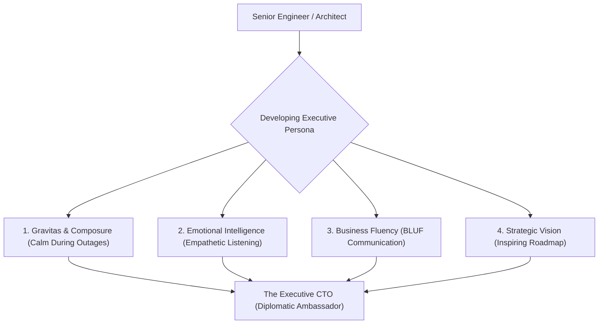

```ppt
# Slide 1: Building an Executive Persona
- **The Core Challenge:** Developing C-suite authority, emotional intelligence (EQ), and persuasive leadership without relying on raw technical authority.
- **Key Leadership Skill:** Leading with influence across engineering, product, sales, and the board.
- **Author:** Pankaj Kumar | Associate Architect & Tech Leadership
<!-- slide -->
# Slide 2: The Diplomatic Ambassador Analogy
- **The Junior Coder (Local Guard):** Enforces rigid rules, blocks changes, and uses technical authority to say "No".
- **The Executive CTO (Diplomatic Ambassador):** Speaks fluent business, remains composed under high-pressure outages, and wins executive alignment through clear logic and empathy!
<!-- slide -->
# Slide 3: The 4 Pillars of Executive Presence
- **1. Gravitas & Composure:** Remaining calm and decisive during critical outages or board challenges.
- **2. Clear Business Communication:** Translating complex architecture into financial outcomes.
- **3. Emotional Intelligence (EQ):** Reading boardroom dynamics and listening actively to non-tech peers.
- **4. Strategic Vision:** Painting a compelling 3-year technology picture that excites investors.
<!-- slide -->
# Slide 4: Communication Shift (Engineer to Executive)
- **Engineer Level:** Focuses on *how* code is built, framework choices, and micro-details.
- **Manager Level:** Focuses on *when* features will ship and squad sprint velocity.
- **Executive Level:** Focuses on *why* this technology investment creates competitive advantage and revenue!
<!-- slide -->
# Slide 5: Developing Emotional Intelligence in Tech
- **Active Listening:** Hearing the business anxiety behind a CEO's feature request before reacting.
- **Empathy for Sales & Product:** Understanding the pressure commercial teams face to meet quarterly revenue targets.
<!-- slide -->
# Slide 6: Boardroom Presence & Body Language
- **Concise & Direct:** Lead with the bottom line (BLUF - Bottom Line Up Front).
- **Poise Under Interrogation:** Handling tough board questions about cloud spend without becoming defensive.
<!-- slide -->
# Slide 7: Common Misconception
- **Myth:** "Executive presence means wearing an expensive suit and talking loudly."
- **Fact:** True executive presence is quiet confidence, strategic clarity, active listening, and emotional composure!
<!-- slide -->
# Slide 8: Summary for Beginners
- Speak fluent business language, remain composed under pressure, and lead with empathy and strategic clarity!
```

# Building an Executive Persona: Leading with Influence

Great software engineers are promoted because they solve complex technical problems with brilliant code.

However, when a technical leader steps into the C-suite as **Chief Technology Officer (CTO)**, their primary tool is no longer the code editor — **it is the power of Executive Influence!**

If an engineering leader relies solely on technical dominance or defensive arguments during executive meetings, non-technical peers quickly tune them out.

To drive real organizational change, a CTO must build an **Executive Persona**.

Let's understand Executive Persona using **The Diplomatic Ambassador Analogy**!

---

## 🏛️ The Diplomatic Ambassador Analogy

Imagine representing a nation at an international summit:



- **The Border Guard (Junior Coder Mindset):**  
  Stands rigid at the gate, blows a whistle, and shouts *"NO!"* to every new feature request because it breaks a minor technical guideline.

- **The Diplomatic Ambassador (Executive CTO Persona):**  
  Sits at the negotiation table with composure, listens to foreign delegates (*Sales, Marketing, Finance*), speaks with clear logic, and negotiates treaties that protect national interests (*system architecture*) while expanding international trade (*business revenue*)!

---

## 📊 The 3-Tier Leadership Communication Shift

| Leadership Level | Primary Audience | Core Focus of Communication | Example Statement |
| :--- | :--- | :--- | :--- |
| **Tier 1: Senior Engineer** | Developers & Squads | *HOW* code is constructed | *"We should migrate from REST to gRPC for microservice RPCs."* |
| **Tier 2: Engineering Manager** | Product Managers | *WHEN* tasks will ship | *"Squad Alpha will finish the checkout API in Sprint 14."* |
| **Tier 3: Executive CTO** | CEO, CFO & Board | *WHY* technology drives revenue | *"Our latency reduction initiative will decrease mobile cart abandonment by 12%, unlocking $1.5M in annual sales."* |

---

## 💡 Summary for Beginners

- **Executive Persona** = The combination of emotional composure, strategic vision, active listening, and business fluency.
- **BLUF Technique** = **Bottom Line Up Front** — deliver the main recommendation first, then provide supporting data.
- **CTO Golden Rule** = **"Leading with authority enforces compliance, but leading with executive influence builds lasting trust and alignment across the C-suite!"**

---

*Written by **Pankaj Kumar** | Associate Architect & Tech Leadership.*
