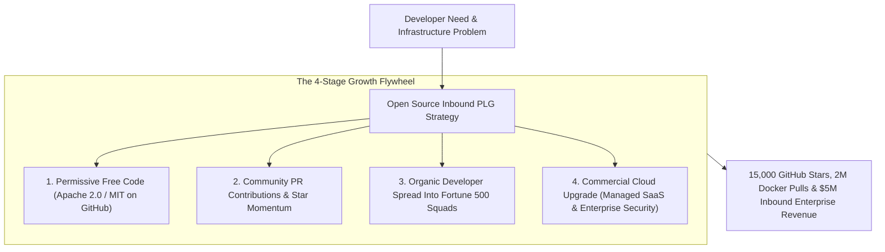
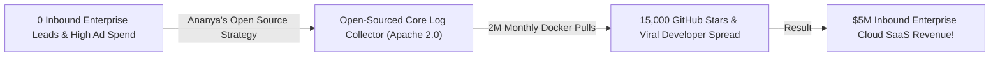

```ppt
# Slide 1: Building Open Source Tools for Inbound Growth
- **The Core Strategy:** Releasing core developer utilities, CLI tools, or lightweight SDKs as open-source projects on GitHub to build global developer adoption, brand trust, and inbound lead pipelines.
- **Executive Reality:** Open source is the ultimate product-led growth engine — developers adopt free open-source tools over a weekend and introduce them to their enterprise procurement teams on Monday!
- **Author:** Pankaj Kumar | Associate Architect & Tech Leadership
<!-- slide -->
# Slide 2: The Paywall Tollbooth vs. Public Community Park Bench Analogy
- **Paywall Tollbooth (Legacy Gated Software):** Building a fence and a paywall tollbooth around a basic wooden park bench (**Gated Commercial Demos**). Frustrated citizens walk away and seek free alternatives!
- **Public Community Park Bench (Open Source Inbound Growth):** Building a comfortable, free public park bench with an open workbench and a subtle sponsor plaque labeled *"Powered by Open Source"* (**Free GitHub Repository & Open SDK**)! Thousands of developers rest, code, and upgrade to your paid cloud platform when scaling!
<!-- slide -->
# Slide 3: The 3 Open Source Commercial Models (COSS)
- **1. Open Core Model:** Core engine is 100% open source under Apache 2.0; enterprise security & compliance features are commercial.
- **2. Managed Cloud Service (SaaS):** Open-source engine is free to self-host; paid cloud platform provides 1-click managed hosting, auto-scaling, & 99.99% SLAs.
- **3. Developer Tooling & Ecosystem:** Free open-source CLI/SDK that seamlessly connects to paid API backend services.
<!-- slide -->
# Slide 4: Real-World Case Study: Ananya's Open Core Transformation
- **The Challenge:** A cloud observability startup led by VP **Ananya Verma** struggled to acquire enterprise leads against established legacy vendors.
- **The Open Source Strategy:** Ananya open-sourced their core log collector agent under Apache 2.0 on GitHub, building clear docs and sample Helm charts.
- **The Result:** Reached 15,000 GitHub stars, 2 Million monthly Docker pulls, and generated $5M in inbound enterprise cloud SaaS subscriptions!
<!-- slide -->
# Slide 5: The Open Source Growth Flywheel
- **Phase 1: Frictionless Adoption:** Developers `git clone` or `npm install` free open-source tools.
- **Phase 2: Community Contributions:** External developers submit PRs, fix bugs, and write documentation.
- **Phase 3: Enterprise Adoption:** Developers introduce the tool inside Fortune 500 companies.
- **Phase 4: Commercial Upgrade:** Enterprise CTOs buy paid managed cloud hosting & SOC2 compliance features.
<!-- slide -->
# Slide 6: Licensing Strategy Guidelines
- **Permissive Open Licenses:** Use Apache 2.0 or MIT for client SDKs & core developer utilities.
- **Fair-Source & Source-Available:** Protect enterprise cloud features using BUSL (Business Source License) or AGPLv3 to prevent cloud cloud-vendor exploitation.
<!-- slide -->
# Slide 7: Common Misconception
- **Myth:** "Open-sourcing code destroys commercial revenue because customers will just host it themselves for free."
- **Fact:** Enterprise companies pay for managed convenience, security compliance, 24/7 SLAs, and zero infrastructure maintenance overhead!
<!-- slide -->
# Slide 8: Summary for Beginners
- Master open-source inbound growth: build permissive developer utilities, nurture GitHub community adoption, offer managed cloud convenience, and turn open-source users into enterprise cloud customers!
```

# Building Open Source Tools to Drive Inbound Marketing

In modern software architecture, **Developers Reject Proprietary Paywalls.**

When software engineers and DevOps architects evaluate new infrastructure tools, they start by searching GitHub:
- If a vendor requires a credit card or a 30-minute sales demo call just to test a simple CLI utility, developers move on immediately.
- If a vendor releases a high-quality, open-source tool on GitHub with clear documentation and a single `npm install` or `docker run` command, developers adopt it in minutes!

**Open Source is the Most Powerful Inbound Product-Led Growth (PLG) Engine in Tech.**

How do CTOs leverage Commercial Open Source Software (COSS) strategies to drive organic developer adoption and convert open-source users into high-margin enterprise cloud customers?

Let's understand Open Source Inbound Marketing using **The Paywall Tollbooth vs. Public Community Park Bench Analogy**!

---

## 🪑 The Paywall Tollbooth vs. Public Community Park Bench Analogy


Imagine providing community amenities in a busy city park:



- **The Paywall Tollbooth (Legacy Gated Software):**  
  Erecting a iron fence and a paywall tollbooth around a basic wooden park bench (**Gated Commercial Demos & Forced Credit Cards**). Frustrated citizens walk away and seek free alternatives.

- **The Public Community Park Bench (Open Source Inbound Growth):**  
  Building a comfortable, free public park bench with an open workbench and a subtle sponsor plaque labeled *"Powered by Open Source"* (**Free GitHub Repository & Open SDK**)! Thousands of developers rest, code, collaborate, and upgrade to your paid cloud platform when scaling!

---

## 📊 Real-World Case Study: Ananya's Open Core Transformation

Consider a cloud observability platform where **Ananya Verma** serves as Technology VP.



1. **The Challenge:** Ananya's observability startup spent $80,000 per month on digital ads targeting enterprise CTOs, but enterprise lead conversion was below 1%.
2. **The Open Core Strategy:**  
   - Ananya executed a **Commercial Open Source Software (COSS) Pivot**:
   - **Open Core Release:** Open-sourced their core log collection agent and telemetry parser under Apache 2.0 on GitHub.
   - **Frictionless Quickstart:** Built 1-line Helm charts allowing engineers to deploy the collector to Kubernetes in under 3 minutes.
   - **Paid Cloud Upgrade:** Offered a managed cloud control plane (**Cloud SaaS**) providing automated long-term storage, SOC2 audit logs, and SSO integration for enterprise teams.
3. **The Result:** The open-source project achieved **15,000 GitHub stars**, reached **2 Million monthly Docker pulls**, and generated **$5 Million in inbound enterprise cloud SaaS revenue** with zero outbound sales calling!

---

## 📊 Gated Commercial Software vs. Commercial Open Source (COSS)

| Dimension | Gated Commercial Software (Legacy) | Commercial Open Source Software (Modern COSS) |
| :--- | :--- | :--- |
| **Initial Access** | Gated behind sales forms & mandatory credit cards | 100% free public access on GitHub (Apache 2.0 / MIT) |
| **Developer Onboarding** | Requires vendor sales demo & security review | 1-line command (`npm install` / `helm install`) in 3 minutes |
| **Trust Model** | Closed proprietary black box | Open source code inspected and verified by global developers |
| **Growth Distribution** | High-cost outbound sales reps and ad campaigns | Organic developer word-of-mouth & GitHub star trending |
| **Monetization Engine** | Charging per user for basic functionality | Managed Cloud SaaS, enterprise compliance, & 24/7 SLAs |

---

## 💡 Summary for Beginners

- **Commercial Open Source Software (COSS)** = A business model where core software is open source, while premium cloud hosting, enterprise security, and support are monetized.
- **Open Core** = Structuring a project where the foundation is open source under a permissive license (Apache/MIT), while advanced enterprise modules are commercial.
- **Time-to-Hello-World (TTHW)** = Minimizing the time it takes for a developer to clone, run, and verify a project locally.
- **CTO Golden Rule** = **"Build public open-source tools to win developer hearts — give away code for free, and monetize managed cloud convenience, enterprise security, and 24/7 reliability!"**

---

*Written by **Pankaj Kumar** | Associate Architect & Tech Leadership.*
