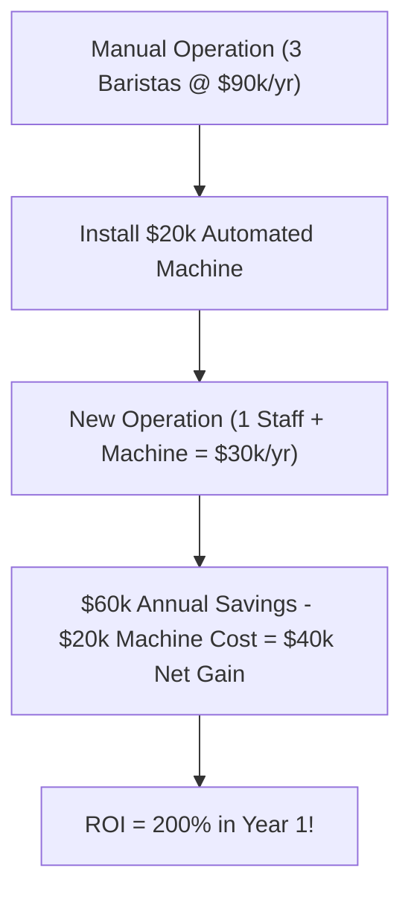

```ppt
# Slide 1: Calculating ROI on Software Projects
- **Definition:** Return on Investment — measuring financial returns generated by engineering software projects.
- **Formula:** ROI (%) = [(Net Financial Gain - Software Cost) / Software Cost] * 100
- **Author:** Pankaj Kumar | Associate Architect & Tech Leadership
<!-- slide -->
# Slide 2: The Automated Coffee Machine Analogy
- **Manual Work (Current State):** Hiring 3 baristas making coffee by hand ($90k/year salary cost).
- **Automated Espresso Machine ($20k upfront):** Reduces annual barista labor cost to $30k, generating $40k net annual savings!
- **ROI Result:** 200% Return on Investment in Year 1!
<!-- slide -->
# Slide 3: The 3 Types of Software ROI
- **1. Direct Revenue Generation:** Building a new e-commerce feature that sells $500k more products.
- **2. Cost Avoidance (Efficiency):** Automating customer support to handle 10k tickets without hiring 5 new staff.
- **3. Risk Reduction:** Upgrading database security to prevent a potential $5M GDPR fine.
<!-- slide -->
# Slide 4: Real-World Business Pitch Example
- **CTO Pitch to CFO:** *"We need $50,000 to build an AI automated invoice reader."*
- **Financial Return:** Eliminates 1,000 manual accounting hours per year ($40/hr) = $40,000 annual savings.
- **Payback Period:** Project pays for itself in 15 months!
<!-- slide -->
# Slide 5: The Financial Metric Trifecta
- **1. Payback Period:** How many months until the initial investment cost is completely recovered?
- **2. Net Present Value (NPV):** The value of future cost savings calculated in today's dollars.
- **3. Internal Rate of Return (IRR):** Expected annual percentage growth rate generated by the software project.
<!-- slide -->
# Slide 6: Common Mistakes Engineers Make
- **Mistake 1:** Presenting technical jargon (*"We need to rewrite code in Rust for 10% lower CPU cycles"*).
- **The Executive Translation:** *"This code rewrite cuts monthly AWS cloud server costs by $15,000."*
<!-- slide -->
# Slide 7: Common Beginner Misconception
- **Myth:** "Software ROI is only about earning direct sales money."
- **Fact:** Saving operational employee time and preventing security breaches are equally valid financial ROI metrics!
<!-- slide -->
# Slide 8: Summary for Beginners
- Calculate financial returns before writing code to win board-level project approval!
```

# Calculating ROI on Software Projects: How to Prove Business Value to the CFO

Engineering teams often complain: *"The CFO rejected our proposal to refactor our code architecture!"*

Why do CFOs reject technology projects? 

It's usually not because the project is bad. It's because engineers pitch projects using **technical features** (*"This updates our Node.js microservices framework"*), while CFOs allocate capital using **financial returns** (*"Will this $50,000 investment generate $100,000 in revenue or savings?"*).

To succeed as an executive technology leader, you must master **Software ROI (Return on Investment)**.

Let's break down Software ROI using the simple analogy of **The Automated Coffee Machine**!

---

## ☕ The Automated Coffee Machine Analogy

Imagine managing a busy office canteen:



- **Current State (Manual Labor):** You pay $90,000 every year in salaries for 3 baristas making coffee by hand.
- **The Tech Upgrade:** You invest **$20,000 upfront** to buy an automated commercial espresso machine.
- **Future State (Automated Efficiency):** You now require only 1 staff member to restock coffee beans ($30,000/year salary).
- **The ROI Calculation:**  
  $$\text{Annual Cost Savings} = \$90,000 - \$30,000 = \$60,000$$  
  $$\text{Net Financial Gain} = \$60,000 - \$20,000 \text{ (Machine Cost)} = \$40,000$$  
  $$\text{ROI (\%)} = \left(\frac{\$40,000}{\$20,000}\right) \times 100 = \mathbf{200\%}$$

---

## 💰 The 3 Ways Software Projects Generate Financial ROI

1. **🚀 Direct Revenue Growth:** Building new customer features (e.g. adding 1-click Apple Pay checkout) that increase checkout conversion rates by 15%.
2. **⚡ Cost Reduction (Operational Efficiency):** Building internal automation scripts that replace 2,000 hours of manual spreadsheet data entry.
3. **🛡️ Risk Mitigation & Penalty Avoidance:** Upgrading data encryption to prevent a $2 Million regulatory compliance fine.

---

## 🗣️ Translating Tech Jargon to CFO Language

| Technical Engineer Pitch (Rejected ❌) | Executive CTO Pitch (Approved ✅) |
| :--- | :--- |
| "We need $30k to upgrade our PostgreSQL database to version 16." | "Investing $30k in database optimization reduces monthly AWS storage costs by $2,500, paying for itself in 12 months." |
| "We need to build an AI chatbot using LLM embeddings." | "Building an AI customer support bot automates 50% of routine reset tickets, saving $45,000 in call center contractor fees annually." |

---

## 💡 Summary for Beginners

- **ROI Formula** = `[(Net Financial Return - Cost) / Cost] * 100`.
- **Payback Period** = Months required to recover initial cash investment.
- **The CTO's Job** = Quantifying software project benefits into clear dollars, time savings, and revenue metrics!

---

*Written by **Pankaj Kumar** | Associate Architect & Tech Leadership.*
