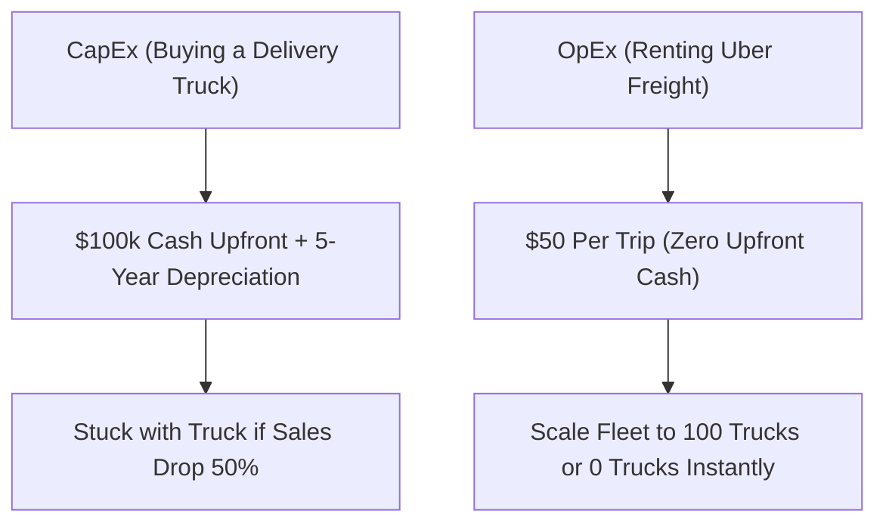

```ppt
# Slide 1: CapEx vs OpEx in Technology
- **CapEx (Capital Expenditure):** Upfront large investment buying long-term assets (Buying servers, office buildings).
- **OpEx (Operational Expenditure):** Ongoing pay-as-you-go operating expenses (Renting AWS cloud, monthly internet bills).
- **Author:** Pankaj Kumar | Associate Architect & Tech Leadership
<!-- slide -->
# Slide 2: Buying a Delivery Truck vs Renting Uber Freight
- **CapEx Analogy:** Buying a $100,000 delivery truck upfront. Depreciates over 5 years, requires maintenance.
- **OpEx Analogy:** Ordering an Uber Freight per delivery ($50 per trip). Zero upfront cost, pay only when you ship!
<!-- slide -->
# Slide 3: How CFOs View CapEx vs OpEx
- **CapEx Benefits:** Shows up on the Balance Sheet as a physical company asset; depreciation tax write-offs over time.
- **OpEx Benefits:** Shows up on the Income Statement instantly; maximum financial flexibility to scale up or down!
<!-- slide -->
# Slide 4: The 2010 vs 2026 Startup Revolution
- **Old World (2010 CapEx):** Needing $500k venture capital seed money just to buy servers before launching a website!
- **Modern World (2026 OpEx):** Launching a global web app for $20/month on AWS cloud!
<!-- slide -->
# Slide 5: The Financial Trap: Unchecked OpEx Growth
- **The Risk:** OpEx cloud subscriptions never expire. If unmonitored, monthly OpEx can exceed CapEx costs over 3 years!
- **The CTO Fix:** Hybrid cloud strategies — moving steady predictable workloads to cheaper reserved pricing.
<!-- slide -->
# Slide 6: Comparing CapEx & OpEx side-by-side
- **Upfront Cost:** CapEx High | OpEx Zero
- **Flexibility:** CapEx Low (Stuck with servers) | OpEx High (Cancel anytime)
- **Accounting:** CapEx Balance Sheet Asset | OpEx P&L Monthly Expense
<!-- slide -->
# Slide 7: Common Beginner Misconception
- **Myth:** "OpEx is always cheaper than CapEx in the long run."
- **Fact:** For massive 24/7 steady workloads (like Netflix), owning hardware (CapEx) can be cheaper than renting!
<!-- slide -->
# Slide 8: Summary for Beginners
- CapEx builds the foundation assets; OpEx provides operational speed and agility!
```

# CapEx vs OpEx in Tech: Buying Server Hardware vs Renting Cloud Utility

When technical leaders meet with the CFO to ask for money, the conversation instantly turns to two accounting terms: **CapEx** and **OpEx**.

- The CFO asks: *"Is this server budget CapEx or OpEx?"*
- The CTO answers: *"Moving to AWS shifts our infrastructure from CapEx to OpEx."*

What do these financial acronyms mean for non-technical executives and beginners?

Let's break down CapEx vs. OpEx using the simple analogy of **Buying a Delivery Fleet vs. Renting Uber Freight**!

---

## 🚚 Buying a Truck vs. Renting Uber Freight

Imagine running a bakery business that needs to deliver cakes across the city:



- **CapEx (Capital Expenditure - Buying the Delivery Truck):**  
  You pay **$100,000 in upfront cash** to buy a brand new delivery truck.  
  - *Accounting:* The truck is recorded on the company **Balance Sheet** as an asset. Its value decreases (depreciates) over 5 years.
  - *Risk:* If cake sales drop by 50% next month, you are still stuck owning an expensive truck sitting in the garage!

- **OpEx (Operational Expenditure - Renting Uber Freight):**  
  You pay **$50 per trip** every time a cake needs to be delivered.  
  - *Accounting:* The $50 expense appears immediately on your monthly **Income Statement (P&L)** as a routine business cost.
  - *Flexibility:* If sales drop next month, you simply order 0 Uber trips and your cost drops to **$0 instantly**!

---

## 💻 Tech Equivalent: Physical Servers vs. Cloud Computing

| Dimension | CapEx (Physical Data Center) | OpEx (Cloud AWS / Azure) |
| :--- | :--- | :--- |
| **Upfront Payment** | $250,000 for server racks & cooling | $0 to get started |
| **Setup Time** | 3 to 6 months procurement | 2 minutes in AWS Console |
| **Accounting Treatment** | Balance Sheet Asset (Depreciates over 3–5 yrs) | Monthly Operating Expense on P&L |
| **Scalability** | Hard capped by physical server capacity | Infinite instant auto-scaling |

---

## 💡 Executive Summary for Beginners

- **CapEx (Capital Expenditure)** = Upfront cash investment buying owned long-term assets.
- **OpEx (Operational Expenditure)** = Ongoing pay-as-you-go operating expenses.
- **The Modern CTO's Advantage** = OpEx allows startups to launch globally with minimal capital, while CapEx allows mature enterprises to optimize steady large-scale workloads!

---

*Written by **Pankaj Kumar** | Associate Architect & Tech Leadership.*
