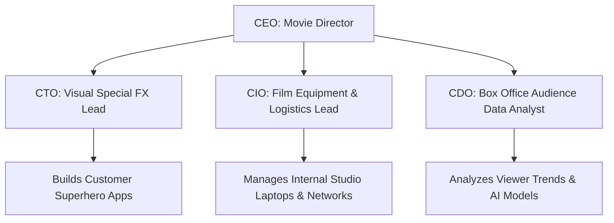

```ppt
# Slide 1: Executive Titles Demystified
- **C-Suite:** Chief-level executives managing key company departments.
- **The Core Four:** CEO, CTO, CIO, and CDO.
- **Movie Analogy:** Director (CEO), Visual FX Lead (CTO), IT Logistics Manager (CIO), Data Strategist (CDO).
<!-- slide -->
# Slide 2: The CEO (Chief Executive Officer)
- **Role:** The overall boss & ultimate business decision maker.
- **Ship Analogy:** The Captain holding the steering wheel and charting the course.
- **Focus:** Revenue growth, investor trust, company vision, and hiring C-level executives.
<!-- slide -->
# Slide 3: The CTO (Chief Technology Officer)
- **Role:** Executive tech architect & product builder.
- **Ship Analogy:** The Chief Engineer designing the ship's engine & navigation systems.
- **Focus:** Software platforms, AI strategy, engineering team leadership, and product tech.
<!-- slide -->
# Slide 4: The CIO (Chief Information Officer)
- **Role:** Internal IT operations & enterprise software manager.
- **Ship Analogy:** Quartermaster ensuring crew laptops, Wi-Fi, and communication radios work smoothly.
- **Focus:** Employee laptops, internal networks, ERP software, and cybersecurity defense.
<!-- slide -->
# Slide 5: The CDO (Chief Data Officer)
- **Role:** Enterprise data analytics & AI data pipeline leader.
- **Ship Analogy:** Navigator analyzing weather patterns, oceanic maps, and sonar data.
- **Focus:** Data governance, customer telemetry, business intelligence, and AI training data.
<!-- slide -->
# Slide 6: Real-World Collaboration: E-Commerce Launch
- **CEO:** Sets goal to launch Black Friday sale aiming for $10M revenue.
- **CTO:** Builds high-speed website cloud infrastructure to handle 1M buyers.
- **CIO:** Secures company payment gateways and ensures internal staff laptops are safe.
- **CDO:** Analyzes customer buying trends to recommend personalized AI product deals.
<!-- slide -->
# Slide 7: Quick Role Comparison Table
- **CEO:** Business Vision & Investors
- **CTO:** Customer-Facing Tech & Products
- **CIO:** Internal Employee IT & Networks
- **CDO:** Enterprise Data & AI Analytics
<!-- slide -->
# Slide 8: Common Beginner Confusion
- **Mistake:** Assuming CTO and CIO do the exact same job.
- **Truth:** CTO builds products for external customers; CIO manages internal tools for employees.
<!-- slide -->
# Slide 9: Executive Takeaways
- Every C-suite title has a specialized role.
- Together, they operate like a well-rehearsed orchestra creating business growth!
```

# CEO vs CTO vs CIO vs CDO: Who Does What in a Tech Company?

When you look at modern corporate leadership teams, seeing multiple acronyms starting with **"C"** (CEO, CTO, CIO, CDO) can be extremely confusing for beginners. 

While they all sit in the **C-Suite** (the top executive tier of a company), each officer has a completely distinct job, skillset, and daily focus.

Let's break down these 4 key roles using simple, real-world analogies!

---

## 🎭 The Movie Production Analogy

Imagine producing a blockbuster Hollywood superhero movie:



1. **CEO (Chief Executive Officer):** The **Movie Director**. Decides the storyline, manages the budget, pitches to studio investors, and guides the whole crew to success.
2. **CTO (Chief Technology Officer):** The **Visual Special Effects Lead**. Designs and builds futuristic CGI software, AI tools, and technical props that audiences see on screen.
3. **CIO (Chief Information Officer):** The **Studio Equipment Manager**. Ensures all cameras, editing computers, studio Wi-Fi, and sound gear run smoothly without crashing.
4. **CDO (Chief Data Officer):** The **Box Office Analyst**. Collects ticket sales data, viewer demographics, and streaming trends to help the team make smart decisions.

---

## 🏢 Breakdown of the 4 Executive Roles

### 👑 1. CEO (Chief Executive Officer)
- **Primary Job:** Overall business leader & decision maker.
- **Key Focus:** Setting company vision, raising money from investors, and keeping the company profitable.
- **Everyday Question:** *"Are we building a valuable business that customers love?"*

### ⚙️ 2. CTO (Chief Technology Officer)
- **Primary Job:** External technology & product architect.
- **Key Focus:** Building customer-facing apps, selecting AI frameworks, and leading software developers.
- **Everyday Question:** *"What technology should we build to deliver the best customer experience?"*

### 💻 3. CIO (Chief Information Officer)
- **Primary Job:** Internal IT infrastructure & operations manager.
- **Key Focus:** Employee laptops, corporate email systems, office Wi-Fi, internal security, and software licenses.
- **Everyday Question:** *"Are our internal employees equipped with fast, secure IT tools?"*

### 📊 4. CDO (Chief Data Officer)
- **Primary Job:** Enterprise data governance & AI analytics strategist.
- **Key Focus:** Cleaning company data, managing database pipelines, ensuring data privacy laws, and training AI models.
- **Everyday Question:** *"How can we turn raw business data into actionable AI insights?"*

---

## ⚡ Quick Summary Comparison

| Role | Primary Responsibility | Target Audience | Everyday Analogy |
| :--- | :--- | :--- | :--- |
| **CEO** | Business Strategy & Vision | Investors & Board | Ship Captain / Movie Director |
| **CTO** | External Products & Tech Architecture | Customers & Users | Chief Engineer / Special FX Lead |
| **CIO** | Internal IT Tools & Networks | Employees & Staff | Quartermaster / Equipment Manager |
| **CDO** | Enterprise Data & AI Analytics | Business Analysts | Navigator / Data Analyst |

---

## 💡 Key Takeaway for Beginners

- **CTO** builds software for **Customers**.
- **CIO** manages IT tools for **Employees**.
- **CDO** organizes data for **AI & Business Insights**.
- **CEO** guides the entire company toward **Revenue & Growth**.

---

*Written by **Pankaj Kumar** | Associate Architect & Tech Leadership.*
