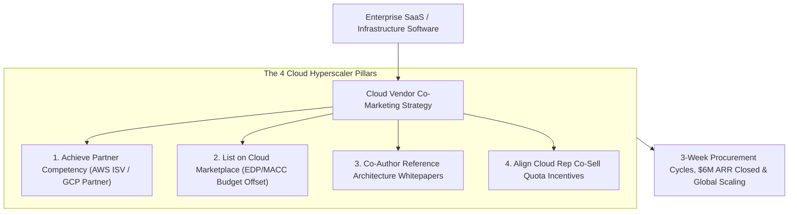
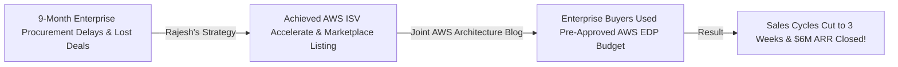

```ppt
# Slide 1: Co-Marketing with Cloud Vendors (AWS, GCP, Azure)
- **The Core Strategy:** Partnering with major cloud hyperscalers (AWS, Google Cloud, Microsoft Azure) to co-publish architecture case studies, list on Cloud Marketplaces, and unlock joint enterprise sales channels.
- **Executive Reality:** Selling to Fortune 500 enterprises alone takes 12 months — co-marketing with a cloud hyperscaler slashes sales cycles and unlocks pre-approved cloud commit budgets!
- **Author:** Pankaj Kumar | Associate Architect & Tech Leadership
<!-- slide -->
# Slide 2: Independent Smartphone Maker vs. Joint Camera Brand Venture Analogy
- **Struggling Independent Maker (Solo Marketing):** A boutique smartphone maker trying to advertise alone in a quiet corner with zero marketing budget (**Isolated Startup Marketing**). Enterprise buyers pass by without noticing!
- **Joint Camera Brand Venture (Cloud Co-Marketing):** Partnering with a world-famous camera brand to launch a co-branded flagship phone under mega spotlights (**AWS / GCP / Azure Co-Selling**)! Enterprise buyers line up to purchase using pre-approved cloud budgets!
<!-- slide -->
# Slide 3: The 3 Core Pillars of Cloud Co-Marketing
- **1. Cloud Marketplace Listing:** Allowing enterprise buyers to purchase your SaaS using committed cloud spend (EDP/MACC).
- **2. Joint Architecture Reference Papers:** Co-authoring official technical whitepapers with AWS / GCP Partner Solutions Architects.
- **3. Co-Sell Incentive Alignment:** Giving cloud vendor sales reps financial quota credit for introducing your platform to their enterprise accounts.
<!-- slide -->
# Slide 4: Real-World Case Study: Rajesh's AWS Co-Sell Breakthrough
- **The Challenge:** A data streaming startup led by Lead Architect **Rajesh Sharma** struggled to close enterprise deals due to 9-month procurement cycles.
- **The Co-Marketing Strategy:** Rajesh achieved AWS ISV Accelerate Partner status, co-published a joint reference architecture blog with AWS, and listed on AWS Marketplace.
- **The Result:** Enterprise sales cycles dropped from 9 months to 3 weeks, closing $6M in new ARR through AWS EDP commits!
<!-- slide -->
# Slide 5: The Cloud Co-Sell Playbook
- **Phase 1: Technical Partner Competency:** Achieving AWS Competency or GCP Expertise designation.
- **Phase 2: Marketplace Listing:** Integrating metering billing APIs for seamless enterprise purchasing.
- **Phase 3: Joint Case Studies:** Publishing real-world customer success stories backed by cloud vendor logos.
<!-- slide -->
# Slide 6: Unlocking Pre-Approved Enterprise Cloud Budgets
- **EDP / MACC Commits:** Enterprise customers MUST spend millions annually with cloud vendors or lose their budget.
- **Marketplace Offset:** Buying your software on Cloud Marketplace counts 100% toward their mandatory cloud commit!
<!-- slide -->
# Slide 7: Common Misconception
- **Myth:** "Cloud vendors automatically promote your product once you list on their marketplace."
- **Fact:** You must build proactive relationships with Cloud Partner Solutions Architects and prove customer ROI to drive co-sell referrals!
<!-- slide -->
# Slide 8: Summary for Beginners
- Master cloud co-marketing: achieve partner competency, list on Cloud Marketplaces, co-publish reference architectures, and leverage enterprise cloud commit budgets!
```

# Co-Marketing with Cloud Vendors (AWS, Google, Microsoft)

In the enterprise B2B software market, **Selling Software to Fortune 500 Enterprises is Brutally Hard.**

Enterprise procurement departments impose 12-month vendor risk reviews, complex security audits, and lengthy legal contract negotiations.

However, almost every enterprise already has a multi-million-dollar committed cloud contract with **Amazon Web Services (AWS), Google Cloud Platform (GCP), or Microsoft Azure**:
- Enterprises are legally obligated to spend millions annually with cloud hyperscalers under **Enterprise Discount Programs (EDP / MACC)**.
- If an enterprise buys your software through the **AWS / GCP / Azure Marketplace**, 100% of the purchase price counts directly toward their pre-approved cloud budget commit!

**Cloud Co-Marketing is the ultimate enterprise growth cheat code for B2B tech companies.**

How do CTOs partner with cloud hyperscalers, co-author architecture reference papers, and unlock joint enterprise sales channels?

Let's understand Cloud Co-Marketing using **The Independent Smartphone Maker vs. Joint Camera Brand Venture Analogy**!

---

## ☁️ The Independent Smartphone Maker vs. Joint Camera Brand Venture Analogy


Imagine building global distribution for a new consumer technology product:



- **The Struggling Independent Maker (Solo Marketing):**  
  A boutique smartphone maker trying to advertise alone in a quiet corner with zero marketing budget (**Isolated B2B Marketing**). Enterprise buyers pass by without noticing.

- **The Joint Camera Brand Venture (Cloud Co-Marketing):**  
  Partnering with a world-famous camera brand to launch a co-branded flagship phone under mega spotlights (**AWS / GCP / Azure Co-Selling**)! Enterprise buyers line up to purchase using pre-approved cloud budget commits!

---

## 📊 Real-World Case Study: Rajesh's AWS Co-Sell Breakthrough

Consider a real-time data streaming startup where **Rajesh Sharma** serves as Lead Architect.



1. **The Challenge:** Rajesh's startup built a high-performance data streaming platform. Although enterprise architects loved the software, deals stalled for **9+ months** in corporate procurement and legal reviews.
2. **The Cloud Co-Marketing Strategy:**  
   - Rajesh led the technical effort to integrate with **AWS Partner Network (APN)**:
   - **AWS Competency:** Achieved official AWS Migration & Data Competency validation.
   - **AWS Marketplace Listing:** Configured automated hourly metering billing on AWS Marketplace.
   - **Co-Authored Architecture Blog:** Co-wrote a deep technical reference architecture article on the official AWS Partner Blog with a Principal AWS Solutions Architect.
3. **The Result:** Enterprise sales cycles dropped from 9 months to **3 weeks**, enterprise buyers used pre-approved AWS EDP funds to purchase, and the company closed **$6 Million in new ARR**!

---

## 📊 Solo Software Sales vs. Cloud Vendor Co-Marketing

| Dimension | Solo Software Sales (Slow & Hard) | Cloud Vendor Co-Marketing (Fast & Scalable) |
| :--- | :--- | :--- |
| **Procurement Cycle** | 9–12 months of legal, security, & vendor onboarding | 2–3 weeks via pre-approved Cloud Marketplace terms |
| **Budget Source** | New discretionary department budget approval required | Pre-committed enterprise cloud spend (**EDP / MACC**) |
| **Sales Rep Reach** | Limited to your company's internal sales team | Extended to thousands of cloud vendor sales reps worldwide |
| **Technical Trust** | Unknown startup requiring extensive proof-of-concept | Validated by official AWS / GCP / Azure Partner Architecture badges |
| **Marketing Channel** | High-cost solo advertising campaigns | Co-branded blogs, joint webinars, & cloud summit booths |

---

## 💡 Summary for Beginners

- **Cloud Marketplace** = Digital stores managed by AWS, GCP, and Azure where enterprises purchase third-party software using existing cloud billing accounts.
- **EDP / MACC** = Enterprise Discount Program / Microsoft Azure Consumption Commitment — contracts where large enterprises commit to spending millions annually with cloud vendors.
- **ISV Accelerate** = AWS co-sell program that financially rewards AWS sales reps for introducing third-party partner software to enterprise clients.
- **CTO Golden Rule** = **"Don't fight enterprise procurement alone — achieve cloud partner competency, list on Cloud Marketplaces, and leverage pre-approved enterprise cloud budgets!"**

---

*Written by **Pankaj Kumar** | Associate Architect & Tech Leadership.*
