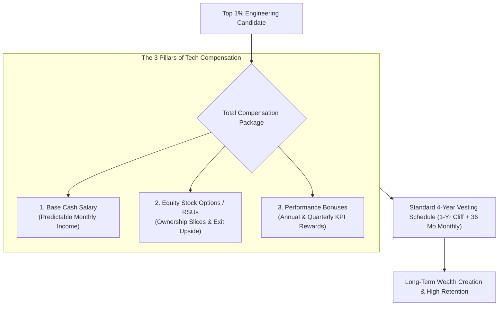

```ppt
# Slide 1: Compensation Strategy in Tech Leadership
- **The Core Goal:** Structuring competitive executive and engineering compensation packages using base cash salary, equity stock options, and performance bonuses.
- **Executive Purpose:** Aligning developer incentives directly with long-term company valuation growth!
- **Author:** Pankaj Kumar | Associate Architect & Tech Leadership
<!-- slide -->
# Slide 2: The Bakery Ownership Slices Analogy
- **Flat Cash Wage (Traditional Job):** Paying a master pastry baker a fixed hourly cash wage. The baker bakes delicious cakes, but has zero financial stake if the bakery expands to 50 global locations.
- **Equity Ownership (Startup Stock Options):** Giving the master baker a 2% ownership stake (*Stock Options*) in the bakery! As the bakery brand expands and gets acquired, their equity slice turns into life-changing wealth!
<!-- slide -->
# Slide 3: The 3 Core Components of Tech Compensation
- **1. Base Cash Salary:** Predictable monthly cash for living expenses and stability.
- **2. Equity Stock Options / RSUs:** Long-term ownership upside linked to company valuation.
- **3. Performance Bonuses:** Short-term annual or quarterly cash rewards linked to business KPIs.
<!-- slide -->
# Slide 4: Demystifying Equity: Options vs RSUs
- **Stock Options (ISO / NSO):** The right to purchase shares at a fixed strike price. Ideal for early-stage startups (Seed / Series A).
- **Restricted Stock Units (RSUs):** Direct grant of company shares upon vesting. Ideal for late-stage (Series C+) or public enterprise tech companies.
<!-- slide -->
# Slide 5: The Standard 4-Year Vesting Schedule
- **1-Year Cliff:** Employee must complete 12 months before earning 25% of their total stock grant.
- **Monthly Vesting (Years 2-4):** Remaining 75% vests in equal monthly increments over the next 36 months.
- **Exercise Window:** Time allowed to purchase options after leaving the company (Standard 90 days vs 7 years extended).
<!-- slide -->
# Slide 6: Educating Candidates on Equity Value
- **Transparent Cap Table:** Explaining total shares outstanding, strike price, and potential exit scenarios.
- **Total Rewards Statement:** Showing candidates their complete cash + equity package value clearly.
<!-- slide -->
# Slide 7: Common Misconception
- **Myth:** "Stock options are just worthless lottery tickets offered by cheap startups."
- **Fact:** Properly structured equity in high-growth tech companies generates life-changing wealth for early engineers!
<!-- slide -->
# Slide 8: Summary for Beginners
- Align compensation with ownership: balance competitive base cash, transparent stock options with 1-year cliffs, and performance bonuses!
```

# Compensation Strategy: Equity, Options & Cash Bonuses

How do fast-growing technology startups compete for top 1% software engineers against mega-corporations like Google, Apple, and Microsoft who offer massive $300,000+ cash salaries?

The secret weapon of technology startups is **Equity Compensation (Stock Options & RSUs).**

Equity allows early employees and technical leaders to own a real financial slice of the company they are building. If the startup succeeds and exits via an IPO or acquisition, early equity grants can generate life-changing wealth.

However, equity compensation can be confusing for candidates to understand.

Let's demystify Tech Compensation Strategy using **The Bakery Ownership Slices Analogy**!

---

## 🥐 The Bakery Ownership Slices Analogy

Imagine opening a new gourmet bakery:



- **The Flat Cash Wage (Traditional Corporate Job):**  
  Paying a master pastry baker a fixed hourly cash wage. The baker bakes world-class cakes, but receives zero financial benefit when the bakery opens 50 global stores and gets acquired for $50 Million.

- **The Equity Ownership Slice (Startup Tech Compensation):**  
  Paying the master baker a competitive base salary plus a **2% equity ownership stake (*Stock Options*)** in the bakery! As the bakery grows from 1 shop to a global franchise, their equity slice turns into millions of dollars in wealth!

---

## 📊 Stock Options (ISOs/NSOs) vs. Restricted Stock Units (RSUs)

| Equity Type | Target Company Stage | How It Works | Tax & Value Consideration |
| :--- | :--- | :--- | :--- |
| **Stock Options (ISOs / NSOs)** | Early-Stage Startup (Seed ➔ Series B) | Right to buy shares at a fixed, low *Strike Price* | Value depends on company valuation growth above strike price |
| **Restricted Stock Units (RSUs)** | Late-Stage / Public Tech Company (Series C+) | Direct grant of full shares upon completing vesting milestones | Taxed as income upon vesting; instant liquid cash value |

---

## 💡 Summary for Beginners

- **Stock Options** = The right to purchase company shares at a pre-set strike price.
- **4-Year Vesting Schedule** = Earning your equity over 4 years, with 25% vesting after 1 year (the 1-year cliff).
- **CTO Golden Rule** = **"Be transparent about equity value — educate candidates on strike prices, vesting schedules, and potential exit scenarios!"**

---

*Written by **Pankaj Kumar** | Associate Architect & Tech Leadership.*
