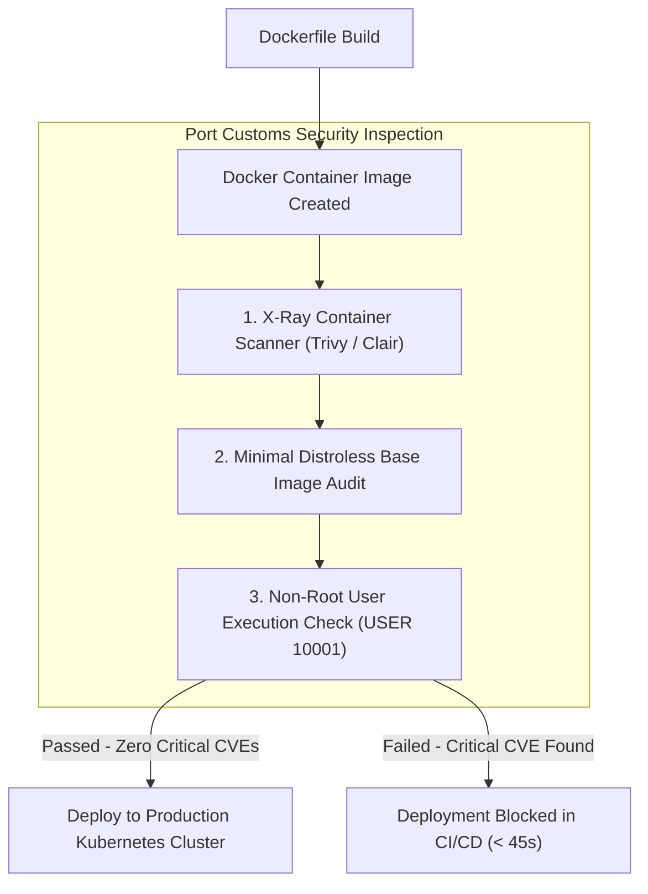
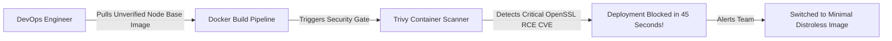

```ppt
# Slide 1: Container Security Scanning & Docker
- **The Core Discipline:** Automatically scanning Docker container images for OS-level vulnerabilities, outdated libraries, and misconfigurations before cloud deployment.
- **Executive Security Rule:** Never deploy un-inspected Docker containers into production Kubernetes clusters!
- **Author:** Pankaj Kumar | Associate Architect & Tech Leadership
<!-- slide -->
# Slide 2: The Customs Cargo Container X-Ray Analogy
- **Careless Shipping Port (Unscanned Containers):** Allows 1,000 sealed steel shipping crates onto a cargo ship without X-raying them. One crate contains a hidden contraband bomb that explodes mid-ocean, sinking the ship!
- **Master Customs Authority (CTO Container Security):** Passes every shipping crate through high-resolution X-ray scanners (*Trivy / Clair Container Scanners*) at the port gate, detects illegal contraband (*Vulnerable OS Packages & Outdated Libraries*), and rejects the crate before loading!
<!-- slide -->
# Slide 3: Why Container Security Matters
- **1. Base Image Vulnerabilities:** Public Docker Hub images (e.g. `node:latest`) often contain 50+ known Linux OS vulnerabilities.
- **2. Container Escape Risks:** Misconfigured root containers allowing hackers to escape and compromise the host cloud node.
- **3. Hardcoded Secrets in Layers:** Secret keys cached inside hidden Docker image build layers.
<!-- slide -->
# Slide 4: Real-World Case Study: Ananya's Microservice Vulnerability Blocked
- **The Incident:** A DevOps developer on VP **Ananya Verma's** team pulled an unverified base image for a payment processing microservice.
- **The Threat:** The base image contained an unpatched OpenSSL vulnerability (CVE-2024-3721) allowing remote code execution.
- **The Container Scan:** An automated `Trivy` scan ran inside the CI/CD pipeline, identified the critical CVE in 45 seconds, and blocked the deployment to Kubernetes!
<!-- slide -->
# Slide 5: The 4 Pillars of Container Hardening
- **1. Minimal Base Images:** Using distroless or Alpine Linux base images to minimize attack surface.
- **2. Non-Root User Execution:** Enforcing `USER 10001` in Dockerfiles (Never run containers as root!).
- **3. Read-Only Root Filesystems:** Making container filesystems immutable at runtime.
- **4. Automated Vulnerability Scanning:** Running Trivy / Grype scans on every build and container registry push.
<!-- slide -->
# Slide 6: Continuous Registry Scanning
- **Static Registry Auditing:** AWS ECR / Quay scanning container images continuously for newly discovered CVEs.
- **Automated Security Patching:** Rebuilding containers automatically when base image patches are released.
<!-- slide -->
# Slide 7: Common Misconception
- **Myth:** "Docker containers provide complete security isolation like virtual machines."
- **Fact:** Containers share the host OS kernel — a vulnerable container run as root can compromise the entire Kubernetes cluster!
<!-- slide -->
# Slide 8: Summary for Beginners
- Hardened Docker containers: use minimal distroless base images, run containers as non-root users, scan images with Trivy in CI/CD, and enforce read-only filesystems!
```

# Container Security Scanning: Inspecting Docker Images

In modern cloud-native software architecture, **Docker containers and Kubernetes are the foundation of application deployment.**

Containers package your microservice code, dependencies, and Linux operating system libraries into a single, portable unit.

However, containers create a major cybersecurity challenge: **Vulnerable Base Images!**

When developers pull public Docker images from Docker Hub (such as `ubuntu:latest` or `node:18`), those images often contain dozens of unpatched operating system vulnerabilities and outdated open-source libraries.

If you deploy un-inspected Docker containers into production, hackers can exploit container vulnerabilities to execute remote code or escape the container to breach your entire cloud cluster!

To secure cloud infrastructure, **CTOs enforce Container Security Scanning and Container Hardening!**

Let's understand Container Security using **The Customs Cargo Container X-Ray Analogy**!

---

## 🚢 The Customs Cargo Container X-Ray Analogy

Imagine managing security at a major international seaport:



- **The Careless Seaport (Unscanned Docker Images):**  
  Allows 1,000 sealed steel shipping crates onto a cargo vessel without inspecting them. One crate contains a hidden contraband bomb that explodes mid-ocean, sinking the entire cargo ship (**Kubernetes Cluster Breach**)!

- **The Master Customs Authority (CTO Container Security):**  
  Passes every shipping crate through high-resolution X-ray scanners (**Trivy / Clair Container Scanners**) at the port gate, detects illegal contraband (**Vulnerable OS Packages & CVEs**), and rejects the crate *before* it is loaded onto the ship!

---

## 📊 Real-World Case Study: Ananya's Microservice CVE Blocked in 45 Seconds

Consider a regional healthcare cloud platform managed by Technology VP **Ananya Verma**.



1. **The Vulnerability:** A DevOps engineer created a Dockerfile using a bloated public Node.js base image: `FROM node:latest`.
2. **The Hidden Threat:** The base image contained an unpatched critical OpenSSL vulnerability (CVE-2024-3721) that allowed remote code execution.
3. **The Container Security Gate:**  
   - Ananya's team had embedded **Trivy Container Scanning** inside their GitHub Actions CI/CD pipeline.
   - The scanner inspected the container filesystem layers in **45 seconds**, flagged the critical OpenSSL CVE, and automatically failed the build.
   - The team updated the Dockerfile to use a minimal **Distroless Base Image** (`FROM gcr.io/distroless/nodejs20`), eliminating 98% of unused OS packages and resolving the vulnerability before deployment!

---

## 📊 Unhardened Docker Images vs. Hardened Container Architecture

| Container Dimension | Unhardened Docker Image (Vulnerable) | Hardened Container Architecture (Resilient) |
| :--- | :--- | :--- |
| **Base Image** | Bloated Linux OS (`ubuntu:latest`, `node:latest`) | Minimal Alpine or Google Distroless base image |
| **User Privileges** | Runs as `root` (UID 0) inside container | Runs as non-root user (`USER 10001`) with dropped capabilities |
| **Filesystem State** | Writable filesystem at runtime | Read-only root filesystem (`readOnlyRootFilesystem: true`) |
| **Security Scanning** | Manual or zero container vulnerability scanning | Automated Trivy / Clair scans on every CI/CD build & ECR push |
| **Package Count** | 400+ OS utility packages (bash, curl, apt) | Zero shell utilities (Code binaries & runtime dependencies only) |

---

## 💡 Summary for Beginners

- **Container Security Scanning** = Inspecting Docker image layers for known operating system vulnerabilities (CVEs) and secret leaks.
- **Distroless Images** = Minimal container images containing only your application binary and runtime dependencies, omitting package managers and shell commands.
- **CTO Golden Rule** = **"Never run Docker containers as root — use minimal distroless base images, scan container layers with Trivy, and enforce read-only filesystems!"**

---

*Written by **Pankaj Kumar** | Associate Architect & Tech Leadership.*
