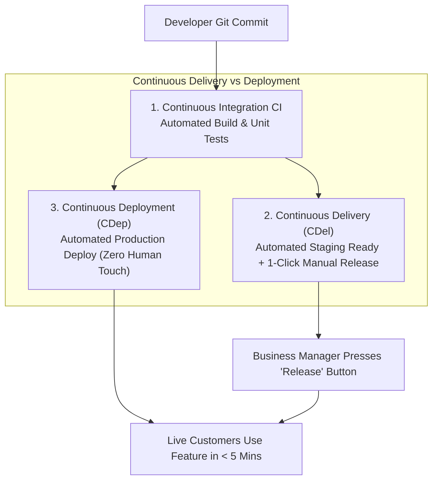
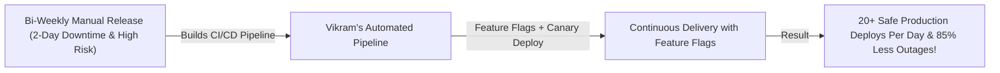

```ppt
# Slide 1: Continuous Delivery vs Continuous Deployment
- **The Core DevOps Strategy:** Understanding the critical distinction between automated staging readiness (Continuous Delivery) and hands-free production releases (Continuous Deployment).
- **Executive Rule:** Continuous Delivery is a business strategy choice — Continuous Deployment is an automated engineering capability!
- **Author:** Pankaj Kumar | Associate Architect & Tech Leadership
<!-- slide -->
# Slide 2: The Package Shipping & Delivery Analogy
- **Continuous Delivery (Box Ready at Loading Dock):** An automated warehouse packages a customer order into a box, tapes it shut, attaches the shipping label, and places it on the loading dock (**Staging Ready**). A human manager presses the "Ship Now" button when business timing is right!
- **Continuous Deployment (Instant Automated Drone Delivery):** The moment an order is placed, an automated robot arm packs the box and a drone flies it directly into the customer's backyard within 5 minutes (**Zero Human Intervention**)!
<!-- slide -->
# Slide 3: The 3 Continuous Automation Stages
- **1. Continuous Integration (CI):** Merging code changes daily, running automated unit tests and security scans.
- **2. Continuous Delivery (CDel):** Automatically deploying verified code to staging environments ready for instant 1-click production release.
- **3. Continuous Deployment (CDep):** Automatically deploying every green git commit straight to live production customers.
<!-- slide -->
# Slide 4: Real-World Case Study: Vikram's Automated Deployment Loop
- **The Setup:** A fintech scaleup led by Lead Architect **Vikram Patel** scaled from bi-weekly manual deployments to Continuous Delivery.
- **The Execution:** Built automated CI/CD pipelines with feature flags, automated rollback triggers, and blue-green deployments.
- **The Result:** Reduced deployment failure rates by 85% and enabled 20+ safe production deployments per day!
<!-- slide -->
# Slide 5: Feature Flags & Decoupling Deployment from Release
- **Decoupled Strategy:** Deploying dark code to production behind a Feature Flag (`isNewCheckoutEnabled: false`).
- **Targeted Rollout:** Toggling feature flags instantly for specific user segments without redeploying code.
<!-- slide -->
# Slide 6: Blue-Green & Canary Deployments
- **Blue-Green Deployment:** Running two identical production environments (Blue active, Green staging) and switching traffic instantly.
- **Canary Release:** Routing 5% of real user traffic to new code before rolling out 100%.
<!-- slide -->
# Slide 7: Common Misconception
- **Myth:** "Continuous Deployment means developers push untested, dangerous code directly to production."
- **Fact:** Continuous Deployment requires extreme engineering discipline, 90%+ automated test coverage, and instant rollback safety nets!
<!-- slide -->
# Slide 8: Summary for Beginners
- Match deployment to business needs: enforce Continuous Integration daily, use Continuous Delivery for business release control, and leverage Feature Flags for safe rollouts!
```

# Continuous Delivery vs Continuous Deployment Explained

In modern software development, executive teams frequently hear terms like **CI/CD, Continuous Delivery, and Continuous Deployment.**

While these concepts sound identical, they represent **fundamentally different business strategies and engineering architectures:**
- Why do some companies release code to production 50 times a day without breaking anything?
- Why do other companies require a 2-day manual testing window before every release?
- Is Continuous Deployment safe for regulated enterprises like banking or healthcare?

To design a high-velocity software organization, **CTOs must master the distinction between Continuous Delivery and Continuous Deployment!**

Let's demystify these strategies using **The Package Shipping & Drone Delivery Analogy**!

---

## 📦 The Package Shipping & Drone Delivery Analogy

Imagine managing a high-tech e-commerce fulfillment warehouse:



- **Continuous Integration (CI):**  
  Line workers scan, inspect, and verify that manufactured items are free of defects before placing them into the warehouse inventory.

- **Continuous Delivery (CDel - Box Ready on Loading Dock):**  
  An automated warehouse packs the order, seals the box, attaches the shipping label, and places it on the loading dock (**Automated Staging Deployment**). The package sits safely on the dock until a business manager presses the *"Ship to Customers"* button (**1-Click Business Controlled Release**)!

- **Continuous Deployment (CDep - Instant Automated Drone Delivery):**  
  The instant an order is placed, a robot arm packages the item, and a drone flies it directly into the customer's backyard within 5 minutes (**Zero Human Intervention**)! Every single verified code commit goes live automatically.

---

## 📊 Real-World Case Study: Vikram's 20-Deployments-Per-Day Pipeline

Consider a fast-scaling fintech platform where **Vikram Patel** serves as Lead Architect.



1. **The Problem:** Vikram's company executed manual production deployments once every 2 weeks. Releases were terrifying 8-hour events occurring at midnight on Sundays, frequently causing production outages and emergency rollbacks.
2. **The Automation Overhaul:**  
   - Vikram built an automated **Continuous Delivery Pipeline**:
   - **CI Phase:** Every git pull request ran 1,200 automated unit tests, SAST security scans, and container vulnerability audits in 4 minutes.
   - **CDel Phase:** Code was automatically deployed to a production-identical staging environment.
   - **Feature Flags:** Features were wrapped in Feature Flags (`enableNewPaymentGateway: false`), allowing code to be deployed safely without exposing it to customers.
3. **The Result:** Deployment failure rates dropped by **85%**, and the team safely executed **20+ production releases per day** during normal business hours!

---

## 📊 Continuous Delivery vs. Continuous Deployment Reference Guide

| Dimension | Continuous Delivery (CDel) | Continuous Deployment (CDep) |
| :--- | :--- | :--- |
| **Production Gate** | **1-Click Manual Business Approval** required to release to live users | **Zero Human Touch** (Automated pipeline deploys directly to live users) |
| **Staging State** | Code is continuously packaged and verified in a production-ready state | Code moves from git commit to live production in minutes |
| **Business Control** | High (Business determines marketing/sales release timing) | High Engineering Velocity (Engineers ship small, continuous updates) |
| **Prerequisites** | Automated unit tests, integration tests, and staging deployments | 90%+ test coverage, automated canary rollouts, and instant auto-rollback |
| **Best Used For** | FinTech, Healthcare, Enterprise B2B SaaS | High-scale B2C Consumer Web Apps, Social Media, Mobile APIs |

---

## 💡 Summary for Beginners

- **Continuous Integration (CI)** = Automatically building and testing code every time a developer commits changes to Git.
- **Continuous Delivery (CDel)** = Automating the release process so code can be deployed to production at any time with the click of a button.
- **Continuous Deployment (CDep)** = Automatically releasing every code commit that passes tests directly to live production customers.
- **Feature Flags** = Software levers that allow developers to turn features on or off in production without redeploying code.
- **CTO Golden Rule** = **"Decouple code deployment from business feature release — use Continuous Delivery with Feature Flags to ship code continuously with zero customer risk!"**

---

*Written by **Pankaj Kumar** | Associate Architect & Tech Leadership.*
