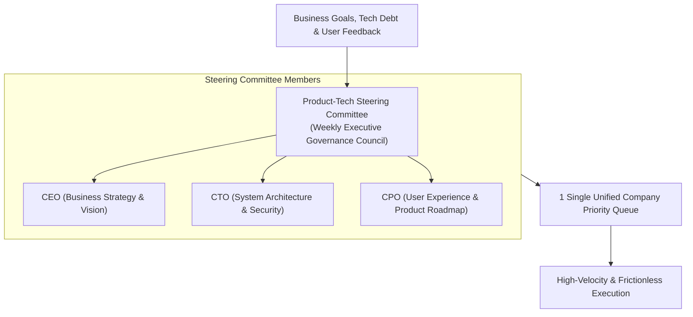

```ppt
# Slide 1: Product-Engineering Steering Committee
- **The Core Goal:** Establishing a joint governance body between Product, Engineering, and Executive Leadership to align roadmaps.
- **Executive Purpose:** Eliminating departmental silos and creating 1 single, unified company priority list.
- **Author:** Pankaj Kumar | Associate Architect & Tech Leadership
<!-- slide -->
# Slide 2: Head Chef & Restaurant Manager Meeting Analogy
- **Uncoordinated Restaurant:** The Head Chef prepares 50 expensive seafood specials while the Restaurant Manager sells 100 steak dinners to customers. The kitchen runs out of steaks, fish goes spoiled, and guests leave angry!
- **Master Steering Council:** The Head Chef and Restaurant Manager sit down every Monday morning to review ingredient inventory, customer reservation trends, and menu pricing together!
<!-- slide -->
# Slide 3: What is a Product-Tech Steering Committee?
- **Definition:** A recurring cross-functional executive meeting (CTO, CPO, CEO, VP Eng) held weekly or bi-weekly.
- **Key Deliverable:** Maintaining 1 single, prioritized backlog across commercial features, tech debt, and security.
<!-- slide -->
# Slide 4: Core Responsibilities of the Steering Committee
- **1. Roadmap Governance:** Approving quarterly feature releases and architectural refactoring budgets.
- **2. Trade-Off Arbitration:** Resolving conflicts when product scope exceeds engineering capacity.
- **3. Resource Allocation:** Adjusting developer squad allocations based on business shifts.
- **4. Risk Review:** Inspecting system uptime SLAs, security vulnerabilities, and cloud costs.
<!-- slide -->
# Slide 5: The Steering Committee Meeting Structure
- **Section 1 (10 mins):** Business KPI & Revenue Update (CEO / CPO).
- **Section 2 (15 mins):** Engineering Velocity & System Health (CTO / VPE).
- **Section 3 (25 mins):** Priority Arbitration & Capacity Trade-Offs (Joint Council).
- **Section 4 (10 mins):** Action Items & Communication Handoff.
<!-- slide -->
# Slide 6: Guiding Principles for High Impact
- **Data Over Opinion:** Use RICE scoring and telemetry data to rank features.
- **Single Source of Truth:** Publish decisions in a shared Jira/Linear roadmap accessible to the entire company.
- **Unified Executive Front:** Commit to decisions publicly even if your department compromised privately.
<!-- slide -->
# Slide 7: Common Misconception
- **Myth:** "A steering committee is just another slow administrative bureaucracy meeting."
- **Fact:** A well-run steering committee accelerates execution by eliminating mid-sprint priority changes!
<!-- slide -->
# Slide 8: Summary for Beginners
- Build a weekly Product-Tech Steering Committee to maintain a single company priority list and resolve trade-offs fast!
```

# Creating a Product-Engineering Steering Committee

Why do so many tech companies struggle with misaligned roadmaps, delayed releases, and friction between Product and Engineering?

In many organizations, Product Managers create feature roadmaps in isolation, Sales promises custom features to enterprise clients without consulting architects, and Developers refactor backend microservices without informing product managers.

The result is **departmental chaos, wasted engineering capacity, and missed revenue targets!**

To solve this, leading technology organizations establish a **Product-Engineering Steering Committee**.

Let's understand how a Steering Committee works using **The Head Chef & Restaurant Manager Analogy**!

---

## 🍽️ The Head Chef & Restaurant Manager Analogy

Imagine operating a high-end restaurant:



- **The Uncoordinated Restaurant:**  
  The Head Chef (*Engineering*) cooks 50 expensive seafood specials in isolation. Meanwhile, the Restaurant Manager (*Product/Sales*) sells 100 steak dinners to guests out front. The kitchen runs out of steaks, the seafood spoils in the fridge, and guests leave furious!

- **The Master Steering Council:**  
  The Head Chef and Restaurant Manager meet every Monday morning to review food inventory, reservation trends, and menu pricing together. They agree on a unified menu, prep the exact right ingredients, and deliver a 5-star dining experience!

---

## 📊 Product-Engineering Steering Committee Framework

| Dimension | Standard Siloed Organization | Steering Committee Governance |
| :--- | :--- | :--- |
| **Roadmap Ownership** | Separate Product & Engineering lists | 1 Single, Unified Company Priority Backlog |
| **Conflict Resolution** | Escalates into passive-aggressive email threads | Resolved in 30 minutes during weekly sync |
| **Feature Prioritization** | HiPPO opinions & loudest voice wins | Data-driven RICE scoring & ROI metrics |
| **Cross-Team Visibility** | Teams surprised by sudden roadmap changes | Full transparency published in company Jira/Linear |

---

## 💡 Summary for Beginners

- **Steering Committee** = A recurring executive council (CTO, CPO, CEO) that governs company product and tech priorities.
- **Single Queue** = Maintaining 1 prioritized backlog containing commercial features, tech debt, and security tasks.
- **CTO Golden Rule** = **"Eliminate departmental silos — establish a Product-Engineering Steering Committee to ensure technology and product move in perfect lockstep!"**

---

*Written by **Pankaj Kumar** | Associate Architect & Tech Leadership.*
