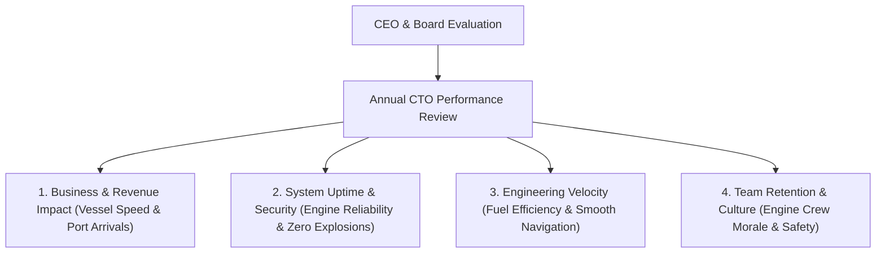

```ppt
# Slide 1: CTO Performance Reviews & Success Metrics
- **The Core Question:** How do CEOs and Boards evaluate whether a Chief Technology Officer is succeeding or failing?
- **Key Realization:** Technical leaders are measured by commercial impact, team velocity, system reliability, and leadership culture — not lines of code written.
- **Author:** Pankaj Kumar | Associate Architect & Tech Leadership
<!-- slide -->
# Slide 2: The Ocean Liner Inspection Analogy
- **Evaluating a Chief Engineer:** When inspecting an ocean liner after a 12-month voyage, the shipowner doesn't check if the engineer spent 10 hours polishing wrenches.
- **The True Metrics:** Did the ship reach its destination port on schedule? (*Delivery Velocity*), Was fuel consumed efficiently? (*Cloud FinOps*), Did the engines run safely without breaking down? (*System Uptime*), Is the engine crew well-trained and loyal? (*Talent Retention*).
<!-- slide -->
# Slide 3: The 4 Core Quadrants of CTO Evaluation
- **1. Business & Revenue Impact:** Enabling commercial growth and customer acquisition through software capabilities.
- **2. System Reliability & Security:** SLA/SLO compliance, zero catastrophic data breaches, and high availability.
- **3. Engineering Velocity & Quality:** Deployment frequency, lead time for changes, and low bug rates (DORA Metrics).
- **4. Leadership & Culture:** Team retention rates, low developer turnover, and C-suite alignment.
<!-- slide -->
# Slide 4: CEO Evaluation Framework
- **Commercial Alignment:** Does the CTO translate tech investments into clear financial ROI for the board?
- **Predictability:** Does the engineering team deliver promised roadmap features on schedule?
- **Risk Mitigation:** Are database backups, disaster recovery plans, and security compliance (SOC2) actively maintained?
<!-- slide -->
# Slide 5: Good Metrics vs Vanity Metrics
- **Vanity Metric (Bad):** *"Our developers wrote 500,000 lines of code this year!"*
- **Real Business Metric (Good):** *"We reduced checkout load times by 40%, increasing online sales conversion by 8%!"*
<!-- slide -->
# Slide 6: Managing Upward During Performance Reviews
- **Self-Assessment Brief:** Presenting a 1-page summary of annual wins, cost savings, and risk reduction before the formal review.
- **Addressing Failures Transparently:** Highlighting post-mortem learnings from outages to demonstrate executive maturity.
<!-- slide -->
# Slide 7: Common Misconception
- **Myth:** "A CTO's performance review is based on how many technical frameworks they introduced."
- **Fact:** Technology is a tool; a CTO's performance is judged entirely on business results and team execution!
<!-- slide -->
# Slide 8: Summary for Beginners
- Measure CTO success across 4 pillars: Business Impact, System Uptime, Delivery Velocity, and Team Culture!
```

# CTO Performance Reviews: How CEOs Measure Technology Success

How is a Chief Technology Officer actually evaluated during an annual executive performance review?

For junior developers, performance reviews focus on code quality, tickets closed, and peer feedback. For engineering managers, reviews focus on sprint completion rates.

However, at the C-suite level, **a CTO's performance review is fundamentally different!**

CEOs and Board members rarely care about which programming language or cloud framework the CTO chose. They evaluate technology leadership through the lens of **business growth, system reliability, financial efficiency, and team culture.**

Let's understand CTO Performance Reviews using **The Ocean Liner Inspection Analogy**!

---

## 🚢 The Ocean Liner Inspection Analogy

Imagine a shipowner evaluating their Chief Engineer at the end of a year-long voyage:



- **The Irrelevant Metric:**  
  Checking whether the engineer spent 10 hours a day polishing wrenches in the tool shed.

- **The Executive Metrics:**  
  1. Did the ship dock at all planned commercial ports on schedule? (*Roadmap Execution*)  
  2. Did the engines operate continuously without catastrophic blackouts? (*System Availability*)  
  3. Was fuel consumption kept within budget? (*Cloud FinOps*)  
  4. Is the engine crew well-trained, motivated, and sticking with the ship? (*Talent Retention*)

---

## 📊 The 4 Quadrants of CTO Performance Evaluation

| Quadrant | Key Performance Indicators (KPIs) | Executive Success Benchmark |
| :--- | :--- | :--- |
| **1. Business Impact** | Revenue enablement, feature time-to-market, customer churn reduction | Technology directly drives commercial growth goals |
| **2. Reliability & Security** | System SLA/SLO uptime (99.9%+), zero security breaches, fast RTO | Zero unannounced site-wide outages or data leaks |
| **3. Engineering Velocity** | Deployment frequency, lead time for changes, mean-time-to-recovery | High DORA metric scores & predictable delivery |
| **4. People & Culture** | Developer turnover rate (< 10%), time-to-first-PR, internal DevEx | High team morale, strong talent pipeline, low attrition |

---

## 💡 Summary for Beginners

- **CTO Performance Review** = An executive evaluation measuring business alignment, system stability, delivery speed, and team health.
- **Focus Shift** = Move away from vanity metrics (*lines of code written*) toward business outcomes (*revenue enabled & costs saved*).
- **CTO Golden Rule** = **"Measure your success as CTO by the commercial success of the business and the health of the engineering team you lead!"**

---

*Written by **Pankaj Kumar** | Associate Architect & Tech Leadership.*
