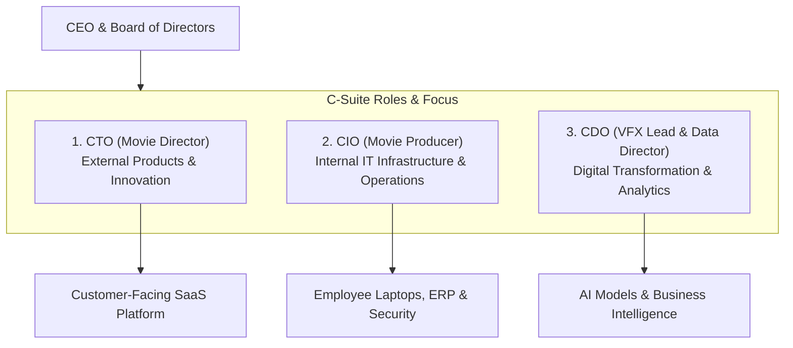

```ppt
# Slide 1: CTO vs CIO vs CDO
- **The C-Suite Confusion:** Demystifying executive titles in modern technology-driven companies.
- **Key Leadership Roles:** Chief Technology Officer (CTO), Chief Information Officer (CIO), and Chief Digital / Data Officer (CDO).
- **Author:** Pankaj Kumar | Associate Architect & Tech Leadership
<!-- slide -->
# Slide 2: The Hollywood Movie Crew Analogy
- **CTO (Movie Director):** Shapes the creative vision, decides camera technology, and directs how the movie is shot.
- **CIO (Movie Producer):** Manages film budgets, studio infrastructure, equipment logistics, and payroll.
- **CDO (Visual Special Effects Lead):** Uses digital CGI tools, AI, and data analytics to transform the viewer experience!
<!-- slide -->
# Slide 3: The CTO (Chief Technology Officer)
- **Primary Focus:** Customer-facing software products, software architecture, and technical innovation.
- **Key Objective:** Building scalable software that generates company revenue.
- **Core Metric:** Product velocity, system uptime, and customer satisfaction.
<!-- slide -->
# Slide 4: The CIO (Chief Information Officer)
- **Primary Focus:** Internal enterprise IT infrastructure, employee laptops, ERP systems, and internal security.
- **Key Objective:** Ensuring internal business operations run securely without interruption.
- **Core Metric:** Internal IT uptime, cost efficiency, and compliance.
<!-- slide -->
# Slide 5: The CDO (Chief Digital / Data Officer)
- **Primary Focus:** Digital transformation, data analytics, AI initiatives, and customer data monetization.
- **Key Objective:** Unlocking business value from enterprise data pipelines.
- **Core Metric:** Data quality, analytics adoption, and digital revenue growth.
<!-- slide -->
# Slide 6: How the 3 Roles Collaborate
- **CTO** builds the customer SaaS platform.
- **CIO** secures the corporate network and manages employee identity (Okta/SAML).
- **CDO** analyzes user behavior data to drive AI-powered recommendation features!
<!-- slide -->
# Slide 7: Common Misconception
- **Myth:** "Traditional companies only need a CIO; software companies only need a CTO."
- **Fact:** Modern digital enterprises require a unified technology triad across internal IT, external products, and data strategy!
<!-- slide -->
# Slide 8: Summary for Beginners
- CTO = External Products; CIO = Internal IT; CDO = Data & Digital Transformation!
```

# CTO vs CIO vs CDO: Who Owns What in Digital Companies?

In corporate executive suites, technical titles can sound confusingly similar.

When non-technical executives or investors look at a leadership chart containing a **CTO (Chief Technology Officer)**, a **CIO (Chief Information Officer)**, and a **CDO (Chief Digital/Data Officer)**, they frequently ask:  
*"Don't all three of these executives just manage computers and software?"*

While all three roles deal with technology, their target audiences, daily responsibilities, and strategic goals are completely different!

Let's clarify these roles using **The Hollywood Movie Crew Analogy**!

---

## 🎬 The Hollywood Movie Crew Analogy

Imagine producing a blockbuster Hollywood movie:



- **The CTO (The Movie Director):**  
  Focuses on **External Product Creation**. They choose camera technologies, design the artistic vision, and direct how the movie is built for paying cinema audiences.

- **The CIO (The Movie Producer):**  
  Focuses on **Internal Infrastructure & Operations**. They manage studio payroll, lease equipment, secure the filming set, and make sure the crew has working tools and laptops every day.

- **The CDO (The Visual Effects & Data Lead):**  
  Focuses on **Digital Transformation & Data Insights**. They use CGI software, AI algorithms, and audience analytics to turn raw footage into a digital masterpiece!

---

## 📊 CTO vs. CIO vs. CDO Comparison Matrix

| Executive Role | Primary Audience | Core Focus | Key Technologies Managed |
| :--- | :--- | :--- | :--- |
| **CTO (Chief Technology Officer)** | External Customers | Customer-Facing Software & Architecture | AWS/GCP, React, Microservices, APIs |
| **CIO (Chief Information Officer)** | Internal Employees | Enterprise IT Infrastructure & Security | ERP (SAP), VPNs, Identity (Okta), Laptops |
| **CDO (Chief Digital / Data Officer)** | Business Executives | Data Analytics, AI & Digital Strategy | Snowflake, Databricks, AI/ML Models, BI |

---

## 💡 Summary for Beginners

- **CTO** = Drives revenue by building external customer software.
- **CIO** = Saves costs & risks by securing internal employee IT infrastructure.
- **CDO** = Unlocks business value by leveraging data analytics and AI strategy.
- **CTO Golden Rule** = **"Clarify executive boundaries early: CTO owns external products, CIO owns internal IT, and CDO owns data governance!"**

---

*Written by **Pankaj Kumar** | Associate Architect & Tech Leadership.*
