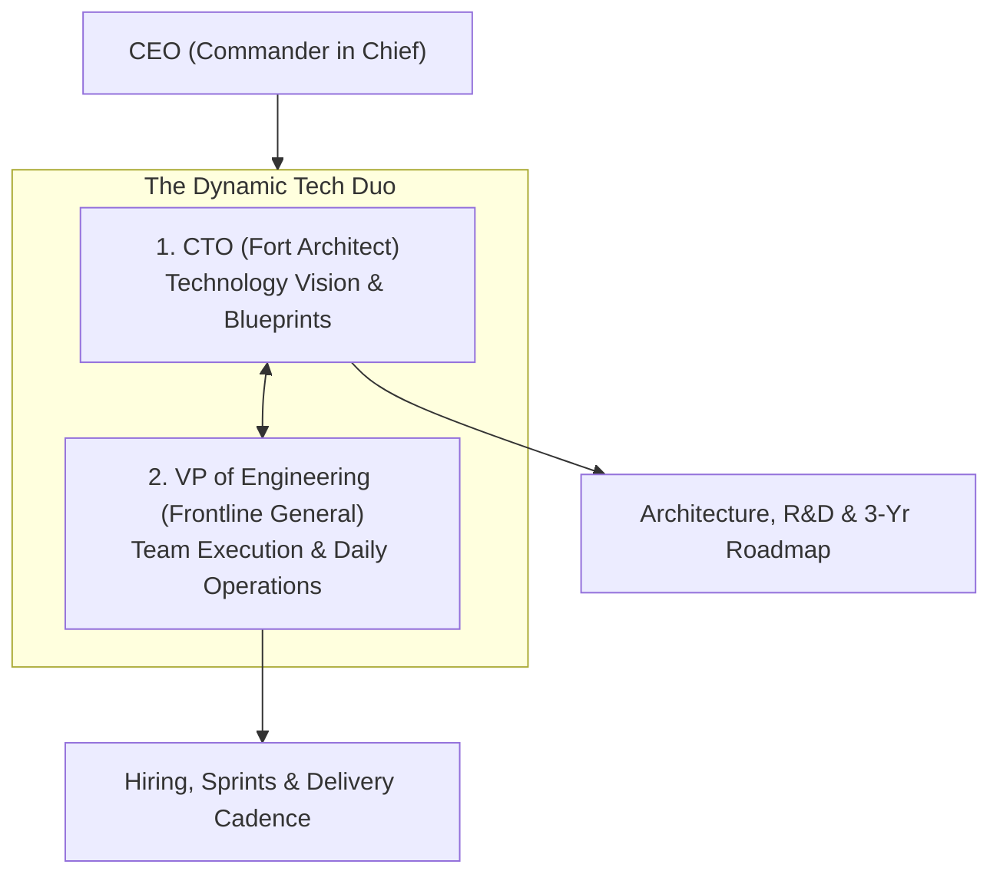

```ppt
# Slide 1: CTO vs VP of Engineering
- **The Core Question:** Why do growing technology companies need both a Chief Technology Officer and a Vice President of Engineering?
- **Key Distinction:** Strategic Innovation & Technical Architecture (CTO) vs Operational Execution & Team Management (VPE).
- **Author:** Pankaj Kumar | Associate Architect & Tech Leadership
<!-- slide -->
# Slide 2: The Fort Architect vs Frontline General Analogy
- **The CTO (Fort Architect):** Designs the structural blueprints, chooses building materials, assesses future siege threats, and plans 5-year expansions.
- **The VP of Engineering (Frontline General):** Recruits soldiers, organizes battalions into disciplined squads, manages daily supply lines, and wins the battle on schedule!
<!-- slide -->
# Slide 3: Core Focus Areas of the CTO
- **1. Technology Vision:** Defining the 3-5 year technical architecture and cloud strategy.
- **2. R&D & Innovation:** Exploring AI/ML capabilities, new frameworks, and emerging tech.
- **3. External Representation:** Pitching technology vision to investors, enterprise customers, and board members.
- **4. Architecture Governance:** Setting coding standards, security baselines, and data policies.
<!-- slide -->
# Slide 4: Core Focus Areas of the VP of Engineering
- **1. People Management:** Hiring, career development, 1-on-1s, and talent retention.
- **2. Sprint Execution:** Ensuring engineering squads deliver features predictably on-time.
- **3. Process Optimization:** CI/CD pipelines, sprint planning, and removing day-to-day developer friction.
- **4. Resource Budgeting:** Managing developer salaries, contractor costs, and tooling licenses.
<!-- slide -->
# Slide 5: The CTO & VPE Dynamic Partnership
- **CTO asks:** *"WHERE should our technology go over the next 3 years to beat competitors?"*
- **VPE asks:** *"HOW do we organize our 50 developers to ship this roadmap predictably this quarter?"*
<!-- slide -->
# Slide 6: Evolution by Company Scale
- **Seed Stage (1-10 devs):** 1 person acts as both CTO and VPE (Hands-on coding & manager).
- **Growth Stage (10-50 devs):** Split roles! CTO focuses on architecture; VPE hired to scale the team.
- **Enterprise Stage (50+ devs):** Multiple VPEs reporting to the CTO or operating alongside each other in executive partnership.
<!-- slide -->
# Slide 7: Common Misconception
- **Myth:** "The VP of Engineering reports to the CTO in every single company."
- **Fact:** In many high-scale tech companies, the CTO and VPE are equal peers reporting directly to the CEO!
<!-- slide -->
# Slide 8: Summary for Beginners
- The CTO owns the Technology Vision (What & Why); the VPE owns Execution & People (How & When)!
```

# CTO vs VP of Engineering: Clarifying C-Suite Responsibilities

When a tech startup grows from 5 developers to 50 engineers, executives quickly realize that a single leader can no longer handle both long-term software architecture AND daily team management.

This is when companies split leadership into two complementary roles: **The Chief Technology Officer (CTO)** and **The Vice President of Engineering (VP of Engineering / VPE)**.

Yet, non-technical founders and developers often ask:  
*"What is the actual difference between a CTO and a VP of Engineering? Aren't they both managing tech?"*

Let's clarify these roles using **The Fort Architect vs. Frontline General Analogy**!

---

## 🏰 The Fort Architect vs. Frontline General Analogy

Imagine building and defending a massive medieval fortress:



- **The CTO (The Fort Architect):**  
  Stands at the drafting table designing structural blueprints, choosing building materials, evaluating 5-year siege threats, and pitching grand defense strategies to the King (*CEO & Board*).

- **The VP of Engineering (The Frontline General):**  
  Stands on the battlefield organizing 100 stonecutters and soldiers into disciplined squads, ensuring supply lines arrive on time, resolving interpersonal conflicts, and completing wall construction on schedule!

---

## 📊 CTO vs. VP of Engineering Responsibility Matrix

| Responsibility Area | CTO (Chief Technology Officer) | VP of Engineering (VPE) |
| :--- | :--- | :--- |
| **Primary Domain** | Technology Strategy & Architecture | Execution, People & Operations |
| **Core Question** | *"WHAT technology should we build?"* | *"HOW do we build it predictably on-time?"* |
| **People Management** | Mentors principal architects; external focus | Direct management of engineering managers & devs |
| **Hiring & Headcount** | Sets technical hiring standards | Drives recruiting pipelines, offers & onboarding |
| **Sprint Operations** | Advisory input during sprint planning | Owns sprint execution, velocity & deadlines |
| **Key Metric** | Tech ROI, System Uptime, Scalability | Delivery Velocity, DevEx, Retention Rate |

---

## 💡 Summary for Beginners

- **CTO** = The Visionary Architect (Technology strategy, long-term architecture, investor pitching).
- **VP of Engineering** = The Operational Leader (People management, hiring, sprint delivery, team velocity).
- **CTO Golden Rule** = **"A CTO without a strong VP of Engineering gets trapped in daily bug fixes; a VP of Engineering without a strong CTO risks building flawless software on a dead architecture!"**

---

*Written by **Pankaj Kumar** | Associate Architect & Tech Leadership.*
