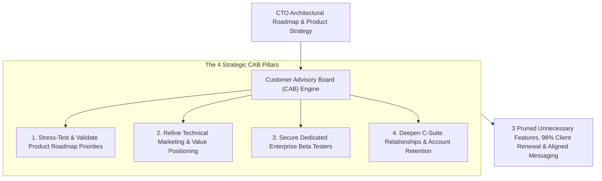
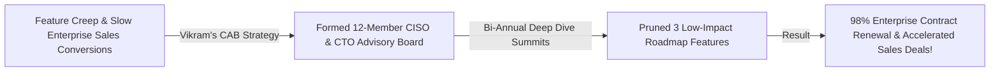

```ppt
# Slide 1: Customer Advisory Boards (CAB): Tech Marketing Insights
- **The Core Strategy:** Establishing a curated Customer Advisory Board (CAB) of senior client executives and chief architects to validate product roadmaps, review technical marketing messaging, and co-design high-value features.
- **Executive Reality:** Engineering teams that build software in isolated vacuum chambers risk shipping complex features that nobody wants — a CAB aligns your architecture with real enterprise buyer demand!
- **Author:** Pankaj Kumar | Associate Architect & Tech Leadership
<!-- slide -->
# Slide 2: Isolated Aircraft Design vs. Frequent Flyer Round Table Analogy
- **Isolated Boardroom Design (Vacuum Development):** Aircraft engineers designing a new airliner inside a locked room without consulting passengers (**Isolated Product Roadmap**). Seats are cramped, legroom is terrible, and frequent flyers revolt!
- **Frequent Flyer Advisory Round Table (Customer Advisory Board):** Hosting top frequent flyer executives in a private lounge to review cabin blueprints (**Bi-Annual CAB Sessions**)! Passengers share real travel pain points, help design spacious seating, and become fierce brand advocates!
<!-- slide -->
# Slide 3: The 4 Strategic Objectives of a CAB
- **1. Product Roadmap Validation:** Stress-testing architectural priorities with real enterprise buyers before spending engineering cycles.
- **2. Technical Marketing Alignment:** Refining product messaging so it resonates with enterprise C-suite buyers.
- **3. Early Access Beta Testing:** Securing committed enterprise beta testers for new major releases.
- **4. Executive Relationship Lock-In:** Deepening multi-million-dollar account retention and preventing churn.
<!-- slide -->
# Slide 4: Real-World Case Study: Vikram's CAB Strategy
- **The Challenge:** An enterprise security platform led by Lead Architect **Vikram Patel** suffered from high feature creep and slow deal closing.
- **The CAB Strategy:** Vikram formed a 12-member Customer Advisory Board consisting of CISOs and CTOs from top client accounts, meeting bi-annually.
- **The Result:** Cut 3 unnecessary roadmap features, prioritized zero-trust compliance dashboarding, and increased enterprise renewal rates to 98%!
<!-- slide -->
# Slide 5: Structuring a Successful CAB Meeting
- **Frequency:** Bi-annual (2 times per year) 1-day executive summit.
- **Agenda Mix:** 20% CTO Product Vision, 60% Interactive Roundtable Discussion, 20% Networking Dinner.
- **Strict Rule:** Never turn CAB meetings into a high-pressure sales pitch!
<!-- slide -->
# Slide 6: Selecting the Right CAB Members
- **Ideal Member Profile:** Chief Information Security Officers (CISOs), CTOs, & VP of Infrastructure.
- **Diversity of Accounts:** Mix of long-term power customers, recently onboarded accounts, and strategic expansion targets.
<!-- slide -->
# Slide 7: Common Misconception
- **Myth:** "Customer Advisory Boards are just passive focus groups managed by customer support."
- **Fact:** A CAB is a strategic executive partnership led by the CTO to guide high-level engineering architecture and market positioning!
<!-- slide -->
# Slide 8: Summary for Beginners
- Master Customer Advisory Boards: form a curated executive council of top clients, stress-test your architecture roadmap, refine technical marketing positioning, and drive long-term customer retention!
```

# Customer Advisory Boards (CAB): Gathering Tech Marketing Insights

In enterprise software engineering, one of the most expensive mistakes a CTO can make is **Building Software in an Isolated Vacuum.**

When product management and engineering teams design new features inside internal meeting rooms without consulting real enterprise buyers:
- Engineers spend 6 months building complex algorithms that customers never use.
- Marketing launches product campaigns with technical jargon that fails to resonate with enterprise decision-makers.
- Key enterprise accounts churn because their real operational pain points were ignored.

**A Customer Advisory Board (CAB) is an Executive Strategic Compass that aligns engineering roadmaps with real market demand.**

How do CTOs form, structure, and run a high-impact Customer Advisory Board that refines technical marketing messaging and deepens client retention?

Let's understand Customer Advisory Boards using **The Isolated Aircraft Design vs. Frequent Flyer Round Table Analogy**!

---

## ✈️ The Isolated Aircraft Design vs. Frequent Flyer Round Table Analogy


Imagine designing a flagship commercial aircraft:



- **The Isolated Boardroom Design (Vacuum Development):**  
  Aircraft engineers designing a new airliner cabin inside a locked room without asking real passengers (**Isolated Product Roadmap**). Seats are cramped, legroom is terrible, and frequent flyers revolt when the plane lands!

- **The Frequent Flyer Advisory Round Table (Customer Advisory Board):**  
  Hosting top frequent flyer executives in a private lounge to review cabin blueprints together (**Bi-Annual CAB Sessions**)! Passengers share real travel pain points, help design spacious seating, and become fierce brand advocates.

---

## 📊 Real-World Case Study: Vikram's CAB Strategy

Consider an enterprise cybersecurity platform where **Vikram Patel** serves as Lead Architect.



1. **The Challenge:** Vikram's company was struggling with feature creep. Engineering was stretched thin building 15 different feature requests, while enterprise sales deals were stalling in procurement.
2. **The CAB Execution:**  
   - Vikram established a 12-member **Customer Advisory Board (CAB)** consisting of CISOs and CTOs from their top 12 enterprise accounts:
   - **Executive Summit:** Hosted a 1-day bi-annual summit presenting the 18-month engineering architecture roadmap.
   - **Interactive Feedback:** Asked advisory members to vote on feature priorities and explain their biggest operational bottlenecks.
   - **Roadmap Pruning:** Discovered that 3 planned complex features were completely unnecessary to customers, freeing up 40% of engineering capacity for automated compliance reporting.
3. **The Result:** Engineering delivered the compliance reporting suite 3 months ahead of schedule, enterprise contract renewal rates jumped to **98%**, and CAB members served as reference accounts for new enterprise sales!

---

## 📊 Isolated Vacuum Development vs. Customer Advisory Board (CAB)

| Dimension | Isolated Vacuum Development (Avoid) | Customer Advisory Board Model (Adopt) |
| :--- | :--- | :--- |
| **Roadmap Source** | Internal guesswork and opinionated feature requests | Validated real-world needs from top enterprise buyers |
| **Technical Marketing** | Generic marketing buzzwords detached from buyer pain | Refined messaging tested directly against C-suite executives |
| **Beta Testing** | Untested software pushed to unsuspecting customers | Committed enterprise CAB members testing early releases |
| **Customer Relationship** | Transactional support tickets & renewal invoices | Strategic partnership with direct access to CTO leadership |
| **Engineering ROI** | High risk of wasted engineering cycles on unused code | Maximum engineering ROI focused on high-value features |

---

## 💡 Summary for Beginners

- **Customer Advisory Board (CAB)** = A curated council of representative enterprise customers who meet periodically with executive leadership to advise on strategy and product direction.
- **Roadmap Validation** = Testing planned engineering features against customer needs before writing production code.
- **Account Churn Prevention** = Building deep executive relationships that prevent clients from switching to competitors.
- **CTO Golden Rule** = **"Don't build software in a vacuum — form a Customer Advisory Board, stress-test your roadmap with real enterprise buyers, and align engineering with market demand!"**

---

*Written by **Pankaj Kumar** | Associate Architect & Tech Leadership.*
