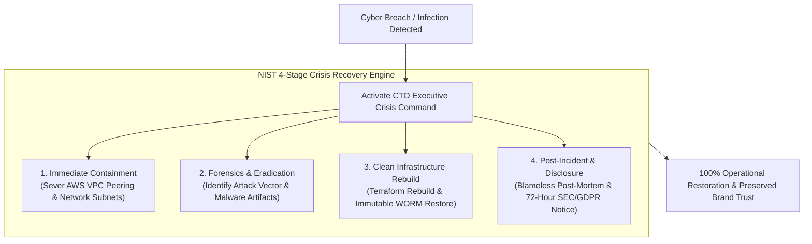
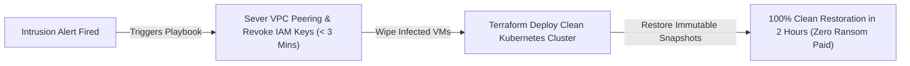

```ppt
# Slide 1: Cyber Crisis Recovery (Series 15 Capstone)
- **The Executive Capstone Playbook:** Leading an enterprise through a major cyber breach, containing damage, and executing a clean system restoration under extreme pressure.
- **Series 15 Capstone:** Cybersecurity Strategy & Zero Trust Defense.
- **Author:** Pankaj Kumar | Associate Architect & Tech Leadership
<!-- slide -->
# Slide 2: Isolating an Infected Hospital Wing Analogy
- **Panicked Hospital (Uncoordinated Crisis Response):** When a contagious virus enters a hospital ward, administrators run around screaming, leave doors wide open, and let infected patients roam freely. The virus infects the entire hospital!
- **Master Quarantine Command (CTO Incident Playbook):** Seals emergency quarantine doors within 60 seconds (*Network Microsegmentation & Subnet Isolation*), sanitizes surgical rooms (*Terraform Cluster Rebuild*), and restores clean patient records (*Immutable WORM Backup Restoration*)!
<!-- slide -->
# Slide 3: The 4 Stages of Cyber Incident Response (NIST)
- **Stage 1 (Preparation):** Building incident playbooks, command chains, and tabletop drills.
- **Stage 2 (Detection & Containment):** Identifying breach indicators & isolating affected network subnets (< 15 mins).
- **Stage 3 (Eradication & Recovery):** Wiping compromised nodes, deploying clean Terraform infrastructure, and restoring immutable backups.
- **Stage 4 (Post-Incident Activity):** Conducting blameless post-mortems and updating security controls.
<!-- slide -->
# Slide 4: Real-World Case Study: Vikram's Ransomware Containment
- **The Crisis:** A fintech company led by Lead Architect **Vikram Patel** detected unauthorized administrative access in a staging cluster.
- **The Triage:** Vikram activated the Cyber Incident Playbook — severed AWS VPC peering in 3 minutes, isolated the subnet, and rebuilt clean Kubernetes clusters using Terraform.
- **The Result:** 100% data recovery in 2 hours, zero customer data compromised, and zero ransom paid!
<!-- slide -->
# Slide 5: The Executive Crisis Command Structure
- **Technical Commander (CTO):** Directs technical isolation, forensic analysis, and infrastructure restoration.
- **Communications Lead (PR/Legal):** Manages mandatory SEC / GDPR breach disclosures and customer statements.
- **Executive Sponsor (CEO/Board):** Authorizes emergency business continuity budgets.
<!-- slide -->
# Slide 6: Transparent Customer & Regulatory Disclosure
- **Mandatory Notification Windows:** Reporting material data breaches within 72 hours (GDPR / SEC guidelines).
- **Customer Trust Preservation:** Providing affected users with clear facts, remediation steps, and free identity monitoring.
<!-- slide -->
# Slide 7: Common Misconception
- **Myth:** "A successful cyber recovery means getting systems back online as fast as possible, even without finding the root vulnerability."
- **Fact:** Restoring systems without patching the entry vulnerability invites cyber attackers to re-infect your network immediately!
<!-- slide -->
# Slide 8: Summary for Beginners
- Master cyber crisis recovery: prepare playbooks, isolate infected subnets immediately, rebuild clean Terraform infrastructure from immutable backups, and disclose transparently!
```

# Cyber Crisis Recovery: Restoring Clean Systems After a Hack

Welcome to the **Series 15 Capstone Guide: Cybersecurity Strategy & Zero Trust Defense!**

Across the past 15 articles, we have explored how Chief Technology Officers (CTOs) position cybersecurity as a Boardroom Risk, architect Zero Trust networks, conduct STRIDE threat modeling, build immutable ransomware defenses, secure APIs, train human firewalls, run penetration tests, enforce AES-256 encryption, manage IAM/SSO credentials, deploy WAFs, embed DevSecOps gates, manage secret vaults, scan container images, enforce least privilege access, and cultivate a cyber-resilient culture.

Now comes the ultimate executive test:  
*"How does a CTO lead the company when a major cyber breach or ransomware attack actually occurs?"*

During a live cyber crisis, executive panic, uncoordinated actions, and poor communication can cause far more financial damage than the initial hack itself.

To survive a major cyber incident, **CTOs execute a structured Cyber Crisis Recovery Playbook!**

Let's understand Cyber Crisis Recovery using **The Isolating an Infected Hospital Wing Analogy**!

---

## 🏥 The Isolating an Infected Hospital Wing Analogy


Imagine responding to a viral outbreak inside a major medical hospital:



- **The Panicked Hospital (Uncoordinated Response):**  
  When a contagious virus enters a ward, administrators panic, run through the hallways screaming, and leave quarantine doors wide open. The virus spreads to every floor, infecting the entire hospital!

- **Master Quarantine Command (CTO Incident Playbook):**  
  Seals emergency quarantine doors within 60 seconds (**Network Microsegmentation & Subnet Isolation**), sanitizes surgical rooms (**Terraform Clean Cluster Rebuild**), and restores clean patient records (**Immutable WORM Backup Restoration**)!

---

## 📊 Real-World Case Study: Vikram's 2-Hour Fintech Ransomware Recovery

Consider a fast-growing fintech platform led by Lead Architect **Vikram Patel**.



1. **The Breach:** At 2:00 AM on a Saturday, automated SIEM alerts detected an unauthorized administrative session inside a secondary staging AWS account. Cyber attackers were preparing to deploy LockBit ransomware.
2. **The Containment Execution:**  
   - Vikram immediately activated the company's **Cyber Incident Response Playbook**.
   - Within **3 minutes**, the engineering team severed AWS VPC peering between the staging and production environments, revoking all IAM access tokens and isolating the infected subnet.
3. **The Clean Restoration:**  
   - Rather than trying to "clean" infected virtual machines, Vikram executed a **Terraform Teardown & Rebuild**.
   - The team destroyed the infected cluster, deployed a brand new Kubernetes environment using automated Infrastructure-as-Code scripts, and restored clean database snapshots from **AWS S3 Immutable Object Lock WORM storage**.
   - Full clean operations were restored in **2 hours** with **zero customer data loss and zero ransom paid**!

---

## 📊 The NIST Incident Response 4-Stage Reference Framework

| NIST Stage | Primary Goal | Executive & Technical Actions | Key SLA Benchmark |
| :--- | :--- | :--- | :--- |
| **1. Preparation** | Incident Readiness | Build playbooks, configure SIEM logging, run quarterly C-suite tabletop drills | Pre-breach readiness |
| **2. Detection & Containment** | Stop Breach Spread | Sever network subnets, revoke IAM credentials, isolate infected virtual machines | **Containment < 15 Mins** |
| **3. Eradication & Recovery** | Clean System Rebuild | Teardown infected nodes, run Terraform rebuilds, restore immutable WORM backups | **Restoration < 2 Hours** |
| **4. Post-Incident Activity** | Learning & Compliance | Conduct blameless post-mortem, issue required 72-hr SEC/GDPR breach notices | **Disclosure < 72 Hours** |

---

## 💡 Summary for Beginners

- **NIST Incident Response Framework** = A standardized 4-stage computer security incident handling guide (Preparation, Containment, Eradication, Post-Incident Activity).
- **Break-Glass Procedure** = Pre-authorized emergency protocols allowing technical leads to sever cloud networks or shut down services instantly during an active attack.
- **CTO Golden Rule** = **"In a cyber crisis, contain first and ask questions later — isolate infected subnets within minutes, rebuild clean infrastructure from immutable backups, and lead with transparent communication!"**

---

*Written by **Pankaj Kumar** | Associate Architect & Tech Leadership.*
