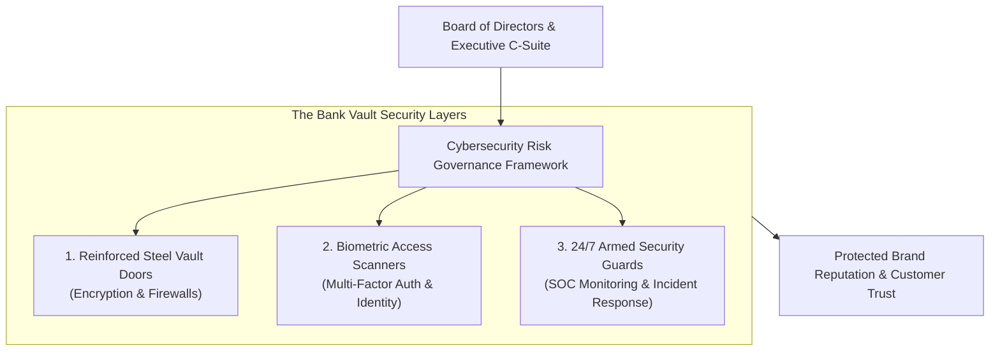
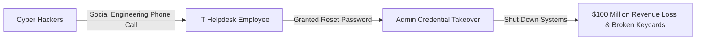

```ppt
# Slide 1: Cybersecurity as a Boardroom Risk
- **The Executive Imperative:** Elevating cybersecurity from an IT department problem to a top-tier Boardroom risk and business continuity priority.
- **Series 15 Kickoff:** Cybersecurity Strategy & Zero Trust Defense.
- **Author:** Pankaj Kumar | Associate Architect & Tech Leadership
<!-- slide -->
# Slide 2: The Bank Vault & Armed Guards Analogy
- **Careless Retail Bank (Ignoring Cyber Risk):** Stores $100 Million cash in a glass display case with a cheap padlock because armed security guards and steel vault doors cost money. One night, robbers smash the glass and steal everything. The bank goes bankrupt!
- **Master Financial Institution (CTO Boardroom Defense):** Installs 12-inch reinforced steel vault doors (*Encryption & Firewalls*), biometric scanners (*Multi-Factor Auth*), and 24/7 armed guards (*SOC Security Operations Center*). The bank earns total customer trust!
<!-- slide -->
# Slide 3: Why Cybersecurity Belongs in the Boardroom
- **1. Financial Loss:** Average data breach costs $4.45 Million in legal fines, ransomware payments, and lost business.
- **2. Brand Reputation Damage:** 60% of customers abandon companies after a public security breach.
- **3. Legal & Regulatory Liabilities:** GDPR, SEC mandates, and SOC2 compliance fines.
<!-- slide -->
# Slide 4: Translating Security Jargon to Boardroom Metrics
- **IT Technical Jargon:** *"We need to upgrade our WAF rules and patch CVE-2026-1142."*
- **Executive Boardroom Translation:** *"Investing $50,000 in API security prevents a $2 Million customer data breach that could halt operations."*
<!-- slide -->
# Slide 5: The 4 Pillars of Executive Security Governance
- **Pillar 1 (Risk Quantification):** Calculating Annual Loss Expectancy (ALE) for cyber threats.
- **Pillar 2 (Zero Trust Architecture):** Never trust, always verify every network request.
- **Pillar 3 (Incident Response Readiness):** Running quarterly tabletop crisis drills with the C-suite.
- **Pillar 4 (Cyber Insurance & Compliance):** Protecting balance sheet assets with comprehensive cyber insurance.
<!-- slide -->
# Slide 6: The Real-World MGM Casino Breach Case Study
- **The $100M Hack:** In 2023, MGM Resorts suffered a major cyberattack triggered by a simple vishing phone call to the IT helpdesk.
- **Boardroom Impact:** Hotel keycards stopped working, slot machines shut down, and MGM lost $100 Million in revenue in 10 days!
<!-- slide -->
# Slide 7: Common Misconception
- **Myth:** "Cybersecurity is just an IT problem to solve with software tools."
- **Fact:** Cybersecurity is a strategic risk governance discipline that protects shareholder value, brand reputation, and customer trust!
<!-- slide -->
# Slide 8: Summary for Beginners
- Elevate cybersecurity to the boardroom: quantify financial risk, communicate in business metrics, and protect customer trust!
```

# Cybersecurity as a Boardroom Risk: Protecting Reputation

Welcome to **Series 15: Cybersecurity Strategy & Zero Trust Defense!**

For decades, business executives treated cybersecurity as a minor IT inconvenience — a back-office chore managed by system administrators in dark server rooms.

When security engineers asked for budget to upgrade firewalls, CEOs and Board Directors often replied:  
*"Why spend $100,000 on security tools when our software hasn't been hacked yet?"*

That mindset is now a recipe for company bankruptcy.

In today's digital economy, **a single major data breach can destroy a company's brand reputation overnight, trigger millions in regulatory fines, and wipe out shareholder value.**

Cybersecurity is no longer an IT issue — **Cybersecurity is a top-tier Boardroom Risk!**

Let's understand Boardroom Cybersecurity using **The Bank Vault & Armed Guards Analogy**!

---

## 🏦 The Bank Vault & Armed Guards Analogy

Imagine building a financial bank branch storing $100 Million in cash:



- **The Careless Bank Manager (Ignoring Cyber Risk):**  
  Stores $100 Million in cash inside a glass display case with a $10 padlock because installing reinforced steel vault doors and hiring 24/7 guards seems "too expensive." One night, thieves smash the glass, steal all the money, and the bank goes bankrupt the next morning!

- **The Master Financial Institution (CTO Boardroom Defense):**  
  Installs 12-inch reinforced steel vault doors (**Encryption at Rest**), biometric palm scanners (**Zero Trust Multi-Factor Auth**), and 24/7 armed security guards (**Security Operations Center**). Customers trust the bank with their life savings!

---

## 📊 Real-World Case Study: The $100 Million MGM Casino Breach

In September 2023, MGM Resorts — one of the largest hotel and casino operators in the world — suffered a catastrophic cyberattack.



1. **The Attack Vector:** Hackers found an MGM employee's details on LinkedIn, called the MGM IT helpdesk posing as the employee, and persuaded the helpdesk operator to reset the multi-factor authentication credentials.
2. **The Damage:** Within 10 minutes, hackers gained administrator access to MGM's cloud systems.
3. **The Boardroom Impact:**  
   - Digital hotel room keycards stopped working for thousands of guests.
   - Slot machines and casino floors shut down completely.
   - **MGM lost over $100 Million in revenue** and spent $10 Million in remediation!

---

## 📊 Translating IT Jargon into Boardroom Financial Metrics

To get budget approval from the CEO and Board of Directors, a CTO must translate technical security jargon into **Financial Risk Metrics**:

| Technical IT Jargon | Executive Boardroom Translation | Business ROI & Risk Reduction |
| :--- | :--- | :--- |
| *"We need to upgrade our Web Application Firewall (WAF) rules."* | *"Investing $50,000 in API security protects our $10M ecommerce revenue stream from cyber outages."* | Eliminates 99% of automated SQL injection & bot attacks |
| *"We must mandate YubiKey hardware tokens for all employees."* | *"Hardware MFA prevents social engineering phone hacks like the MGM casino breach."* | Eliminates phishing vulnerability completely |
| *"We need immutable database backup snapshots on AWS S3."* | *"Immutable backups guarantee we can recover from a ransomware attack in 2 hours without paying ransom."* | Protects business continuity and avoids $5M ransom demands |

---

## 💡 Summary for Beginners

- **Cybersecurity as a Boardroom Risk** = Treating security threats as strategic business risks that affect financial stability, legal compliance, and brand reputation.
- **Zero Trust** = A security model assuming every user and network request is potentially malicious until proven otherwise.
- **CTO Golden Rule** = **"Never present cybersecurity as technical jargon — translate security investments into risk reduction metrics that protect shareholder value and brand reputation!"**

---

*Written by **Pankaj Kumar** | Associate Architect & Tech Leadership.*
