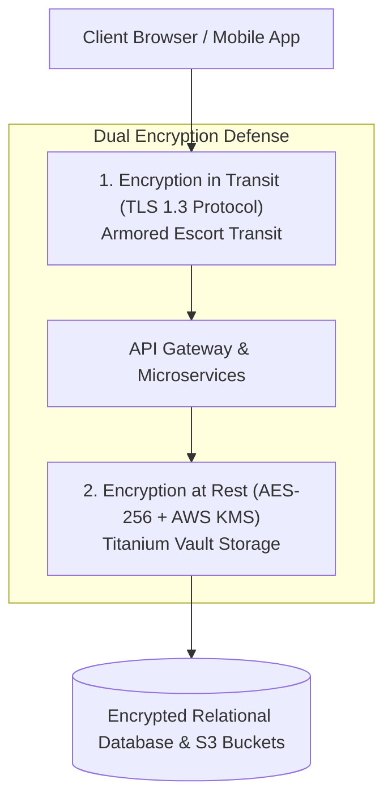
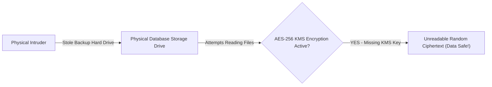

```ppt
# Slide 1: Data Encryption at Rest & In Transit
- **The Core Security Discipline:** Protecting sensitive enterprise data from eavesdropping and theft using strong cryptographic standards (TLS 1.3 & AES-256).
- **Executive Security Rule:** Data without encryption is just raw loot waiting for a thief!
- **Author:** Pankaj Kumar | Associate Architect & Tech Leadership
<!-- slide -->
# Slide 2: The Secret Coded Message in an Armor Briefcase Analogy
- **Unencrypted Postcard (Plaintext Transmission):** Sending confidential bank account numbers written in pencil on a postcard mailed across the country. Anyone at the post office can read or copy the numbers!
- **Encrypted Armor Briefcase (TLS & AES-256):** Locking the message in a 500-pound titanium briefcase (*AES-256 Encryption at Rest*), scrambling the text into unbroken cipher code, and transporting it via an armored police escort (*TLS 1.3 Encryption in Transit*)!
<!-- slide -->
# Slide 3: Two Critical Encryption States
- **1. Encryption in Transit (TLS 1.3):** Protecting data moving across the public internet between user browsers, API gateways, and backend cloud servers.
- **2. Encryption at Rest (AES-256):** Protecting data stored statically inside databases, hard drives, S3 buckets, and backup snapshots.
<!-- slide -->
# Slide 4: Real-World Case Study: Rajesh's Healthcare Data Breach Avoided
- **The Incident:** An intruder stole a physical backup hard drive from a medical clinic managed by Lead Architect **Rajesh Sharma**.
- **The Protection:** Because Rajesh enforced **AES-256 hardware encryption** on all storage volumes and KMS key management, the stolen drive was completely unreadable gibberish to the thief!
- **The Result:** Zero patient record exposure and zero compliance fines!
<!-- slide -->
# Slide 5: Cryptographic Keys & KMS Governance
- **Symmetric Encryption (AES-256):** Single key used to encrypt and decrypt stored database records rapidly.
- **Asymmetric Encryption (RSA / ECC):** Public key encrypts, private key decrypts (Used in TLS 1.3 handshakes).
- **Key Management Service (AWS KMS / HashiCorp Vault):** Centralized key rotation, access policies, and audit logging.
<!-- slide -->
# Slide 6: Common Encryption Mistakes to Avoid
- **Hardcoding Keys in Code:** Never commit encryption keys or passwords into git repositories!
- **Weak Cipher Suites:** Disabling outdated SSL v3 and TLS 1.0 protocols.
- **Unencrypted Internal Traffic:** Forgetting to encrypt traffic between internal cloud microservices (mTLS).
<!-- slide -->
# Slide 7: Common Misconception
- **Myth:** "Encryption makes database queries slow and ruins application performance."
- **Fact:** Modern CPU hardware acceleration (AES-NI) performs AES-256 encryption in sub-microseconds with zero noticeable latency!
<!-- slide -->
# Slide 8: Summary for Beginners
- Encrypt everywhere: enforce TLS 1.3 for data in transit, AES-256 for data at rest, manage keys centrally in KMS, and never hardcode secret keys!
```

# Data Encryption at Rest and in Transit (TLS & AES-256)

What happens when a cyber attacker intercepts your company's network traffic, or steals a physical backup hard drive from a cloud data center?

If your data is stored or transmitted in **Plaintext (Unencrypted)**, the attacker can immediately read every customer password, social security number, and credit card balance!

In modern cybersecurity, **Encryption is the ultimate safety net.**

Even if an attacker breaches your perimeter firewall or physically steals your servers, strong cryptographic encryption renders the stolen data completely unreadable and useless to the hacker.

To meet compliance standards (SOC2, PCI-DSS, GDPR) and protect customer privacy, **CTOs enforce End-to-End Encryption at Rest and in Transit!**

Let's understand Encryption using **The Secret Coded Message in an Armor Briefcase Analogy**!

---

## 🔒 The Secret Coded Message in an Armor Briefcase Analogy

Imagine sending a confidential financial document across the world:



- **The Plaintext Postcard (No Encryption):**  
  Writing your credit card number and password in pencil on a paper postcard and mailing it. Every mail carrier, sorting facility worker, and bystander can read, copy, or alter your confidential details!

- **The Armor Briefcase & Cipher Code (TLS & AES-256 Encryption):**  
  Scrambling the text into an unbroken cipher code, locking the paper inside a 500-pound titanium vault (**AES-256 Encryption at Rest**), and transporting it inside an armored police convoy (**TLS 1.3 Encryption in Transit**)! Even if thieves ambush the truck, they cannot open the vault or decipher the code.

---

## 📊 Real-World Case Study: Rajesh's Stolen Backup Drive

Consider a healthcare software company where **Rajesh Sharma** serves as Lead System Architect.



1. **The Incident:** An intruder broke into an offsite backup facility and physically stole a server hard drive containing 200,000 patient medical records.
2. **The Security Safeguard:** Because Rajesh had enforced **AES-256 Volume Encryption via AWS KMS (Key Management Service)**, every byte of data on the disk was encrypted with a 256-bit key stored securely in the cloud.
3. **The Result:** When the thief plugged the stolen hard drive into their computer, they saw nothing but random ciphertext gibberish! Not a single patient record was exposed, avoiding millions of dollars in HIPAA compliance penalties.

---

## 📊 Encryption in Transit vs. Encryption at Rest

| Dimension | Encryption in Transit (TLS 1.3) | Encryption at Rest (AES-256) |
| :--- | :--- | :--- |
| **Protected State** | Data actively moving across networks | Data stored statically on disk / database / S3 |
| **Primary Threats** | Eavesdropping, Man-in-the-Middle (MitM) attacks | Physical disk theft, unauthorized database dumps |
| **Core Technologies** | TLS 1.3, HTTPS, mTLS, IPsec | AES-256, AWS KMS, HashiCorp Vault |
| **Key Mechanism** | Asymmetric Handshake (RSA/ECC) + Symmetric session key | Symmetric Master Key managed by KMS with automatic rotation |
| **Compliance Requirement** | Mandatory for all web/mobile HTTP endpoints | Mandatory for all production databases & backup storage |

---

## 💡 Summary for Beginners

- **Encryption in Transit (TLS 1.3)** = Scrambling network data while it travels between user devices and cloud servers.
- **Encryption at Rest (AES-256)** = Encrypting static files and database records stored on physical hard drives.
- **KMS (Key Management Service)** = A centralized cloud security service used to generate, rotate, and manage cryptographic keys safely.
- **CTO Golden Rule** = **"Never store or send plaintext data — enforce TLS 1.3 for all network traffic and AES-256 encryption at rest across every database and storage bucket!"**

---

*Written by **Pankaj Kumar** | Associate Architect & Tech Leadership.*
