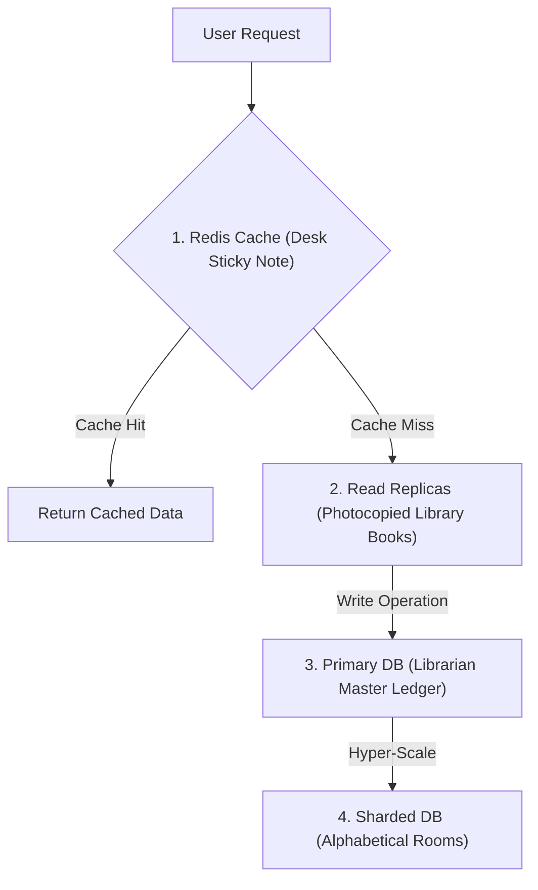

```ppt
# Slide 1: Database Scaling Strategies
- **The Core Problem:** The single primary database is the #1 bottleneck in scaling modern web applications.
- **Key Techniques:** Read Replicas, In-Memory Caching (Redis), and Horizontal Database Sharding.
- **Author:** Pankaj Kumar | Associate Architect & Tech Leadership
<!-- slide -->
# Slide 2: The Library & Filing Cabinet Analogy
- **In-Memory Caching (Desk Sticky Note):** Keeping top 10 frequently requested answers on your desk sticky note (Instant 1ms access).
- **Read Replicas (Photocopied Library Books):** Placing 5 read-only copies of popular books across room tables so readers don't crowd the librarian desk!
- **Sharding (Alphabetical Filing Cabinets):** Splitting filing cabinets into A-M and N-Z rooms!
<!-- slide -->
# Slide 3: 1. In-Memory Caching (Redis / Memcached)
- **Concept:** Storing frequent database query results in super-fast RAM memory instead of querying slow hard drives.
- **Cache Hit Ratio:** Aiming for 90%+ cache hits to eliminate 90% of database traffic!
<!-- slide -->
# Slide 4: 2. Read-Write Splitting & Read Replicas
- **Primary Database (Write Only):** Handles all `INSERT`, `UPDATE`, and `DELETE` queries.
- **Read Replicas (Read Only):** 3+ secondary databases that replicate primary data asynchronously to handle all `SELECT` queries.
- **Benefit:** Scaling user read traffic infinitely without slowing down payments or user registrations!
<!-- slide -->
# Slide 5: 3. Horizontal Database Sharding
- **Concept:** Splitting a single 10 Terabyte database table across 5 separate physical database servers based on a `Shard Key` (e.g. `User_ID`).
- **Shard Router:** Directing `User_ID 1 to 1000` to Server A, and `User_ID 1001 to 2000` to Server B!
- **Trade-off:** Complex cross-shard JOIN queries become impossible.
<!-- slide -->
# Slide 6: Database Scaling Maturity Progression
- **Level 1:** Single Database Server (Vertical scaling / Bigger CPU & RAM).
- **Level 2:** Adding Redis In-Memory Cache.
- **Level 3:** Primary Database + Read Replicas.
- **Level 4:** Horizontal Database Sharding (Hyper-Scale).
<!-- slide -->
# Slide 7: Common Beginner Misconception
- **Myth:** "If our website is slow, we should immediately shard our relational database."
- **Fact:** Sharding adds massive engineering complexity; 99% of companies scale using Redis caching & Read Replicas!
<!-- slide -->
# Slide 8: Summary for Beginners
- Scale database performance systematically: Cache first, replicate second, and shard only when scaling past terabytes of data!
```

# Database Scaling Strategies: Read Replicas, Sharding, and Caching Layers

When a software application grows from 1,000 users to 5 million active users, web servers are easy to scale: you simply spin up 50 extra web server instances behind a load balancer.

However, **databases are notoriously difficult to scale!**

Why? Because web servers are *stateless*, while databases store *state* (customer accounts, credit card payments, order histories). If 5,000 concurrent web servers spam a single primary SQL database at the same time, the database crashes!

Modern software architects scale databases using **Caching, Read Replicas, and Sharding**.

Let's demystify Database Scaling using **The Public Library Analogy**!

---

## 📚 The Public Library Analogy

Imagine managing a busy public library:



- **In-Memory Caching (The Desk Sticky Note):**  
  The librarian writes the top 10 most frequently asked questions (*"Where is the bathroom?"*) on a sticky note on their desk. When visitors ask, the librarian reads the sticky note in 1 second without walking to the back filing room!

- **Read Replicas (Photocopied Library Books):**  
  1,000 students want to read the exact same history textbook. Instead of making them queue up for 1 single book at the librarian desk, the library prints 10 identical **Read-Only Copies** and places them across 10 tables!  
  - *Tech Equivalent:* **Read Replicas** that handle 95% of database read traffic (`SELECT` queries).

- **Horizontal Sharding (Alphabetical Filing Rooms):**  
  The filing cabinet becomes so heavy that the floor collapses! The library splits the records into two separate buildings: **Building A (Names A-M)** and **Building B (Names N-Z)**.

---

## 📊 Database Scaling Strategies Compared

| Strategy | Primary Mechanism | Primary Benefit | Implementation Complexity |
| :--- | :--- | :--- | :--- |
| **Redis Caching** | RAM Memory Storage | Offloads 90% of database reads | 🟢 Low |
| **Read Replicas** | Asynchronous DB Replication | Scales read-heavy traffic (`SELECT`) | 🟡 Medium |
| **Vertical Scaling** | Upgrading CPU / RAM Hardware | Quick temporary capacity boost | 🟢 Low (Expensive) |
| **Horizontal Sharding** | Partitioning tables across servers | Scales write traffic & massive data volumes | 🔴 High |

---

## 💡 Summary for Beginners

- **Redis Cache** = Storing query results in super-fast RAM.
- **Read Replica** = Read-only copies of your database offloading query traffic from the primary DB.
- **Sharding** = Splitting large database tables horizontally across multiple physical servers.
- **CTO Golden Rule** = *"Cache first, replicate second, and shard only as a last resort!"*

---

*Written by **Pankaj Kumar** | Associate Architect & Tech Leadership.*
