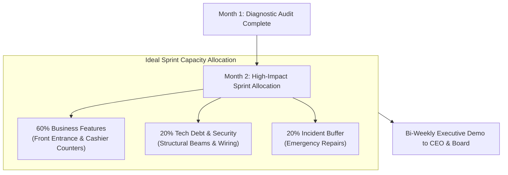

```ppt
# Slide 1: Days 31 to 60 as CTO
- **The Core Objective:** Transitioning from audit mode into active execution by aligning sprint backlogs with business revenue priorities.
- **Key Strategy:** Delivering early visible wins to build momentum across engineering and product teams.
- **Author:** Pankaj Kumar | Associate Architect & Tech Leadership
<!-- slide -->
# Slide 2: The High-Traffic Store Polishing Analogy
- **Retail Store Renovation:** When renovating a busy department store, you don't start by painting hidden backroom storage closets. You polish the front entrance and main cashier counters first!
- **CTO Parallel:** Focus your team's first execution sprints on fixing high-visibility bugs and user-facing bottlenecks that directly impact customers and the CEO!
<!-- slide -->
# Slide 3: The 3 Goals of Days 31 to 60
- **1. Re-prioritize Backlog:** Filter sprint tasks by business value rather than technical curiosity.
- **2. Establish Sprint Cadence:** Enforce predictable 2-week sprint planning, standups, and retrospectives.
- **3. Execute Quick Wins:** Fix long-standing developer complaints and high-impact customer bugs.
<!-- slide -->
# Slide 4: Structuring Business-Driven Sprints
- **60% Feature Delivery:** User-facing commercial features requested by Product & CEO.
- **20% Technical Debt:** Critical refactoring, security patches, and performance optimizations.
- **20% Unplanned Work / Bugs:** Buffer for production incidents and customer support escalations.
<!-- slide -->
# Slide 5: The Value vs Effort Prioritization Matrix
- **Quick Wins (High Value, Low Effort):** Fix checkout form errors, speed up slow search API.
- **Strategic Investments (High Value, High Effort):** Database sharding, multi-region failover.
- **Time Wasters (Low Value, High Effort):** Complete codebase rewrites for cosmetic reasons.
<!-- slide -->
# Slide 6: Building Momentum Across Teams
- **Show & Tell Demos:** Host bi-weekly sprint demos for the CEO and sales leaders to showcase working software.
- **Celebrate Team Success:** Recognize top contributors to boost developer morale.
<!-- slide -->
# Slide 7: Common Misconception
- **Myth:** "Engineering sprints should only contain code cleanup tasks in Month 2."
- **Fact:** Technical improvements must be packaged alongside customer-facing features to maintain executive buy-in!
<!-- slide -->
# Slide 8: Summary for Beginners
- Focus on high-visibility wins, establish predictable sprint cadences, and balance feature delivery with technical refactoring!
```

# Days 31 to 60 as CTO: Structuring Sprints for Business Priorities

After completing your first 30-day technical diagnostic audit, you enter the critical second phase of your executive onboarding: **Days 31 to 60**.

In Month 1, you diagnosed what was broken. In Month 2, the team expects you to **deliver tangible results!**

If you try to tackle all technical debt at once, engineering velocity stalls. If you ignore technical debt completely, systems become unstable.

Let's understand how to structure sprints in Month 2 using **The High-Traffic Store Polishing Analogy**!

---

## 🏬 The High-Traffic Store Polishing Analogy

Imagine managing the renovation of a multi-story department store:



- **The Amateur Manager:**  
  Spends the entire renovation budget painting hidden backroom storage closets that no customer ever sees. Customers leave because the front entrance looks run-down!

- **The Master Retailer (The Executive CTO):**  
  Polishes the main entrance glass, fixes the broken credit card machines at the front registers, and brightens the lobby lighting first! Customers immediately notice the improvement, boosting sales while backroom repairs continue in parallel.

---

## 📊 The Value vs. Effort Sprint Prioritization Matrix

| Category | Value to Business | Engineering Effort | Executive Priority |
| :--- | :--- | :--- | :--- |
| **Quick Wins** | 🔴 High | 🟢 Low | **P0 (Do Immediately in Sprint 1)** |
| **Major Initiatives** | 🔴 High | 🔴 High | **P1 (Schedule in 60-Day Roadmap)** |
| **Fill-ins** | 🟢 Low | 🟢 Low | **P2 (Do when capacity permits)** |
| **Thankless Traps** | 🟢 Low | 🔴 High | **Avoid / Cancel** |

---

## 💡 Summary for Beginners

- **Days 31 to 60 Goal** = Deliver rapid, visible wins that demonstrate engineering velocity to the CEO and product team.
- **Sprint Mix** = Balance 60% business features, 20% technical debt, and 20% production incident buffers.
- **CTO Golden Rule** = **"Polish high-visibility user-facing areas first to build the organizational momentum needed for long-term architectural investments!"**

---

*Written by **Pankaj Kumar** | Associate Architect & Tech Leadership.*
