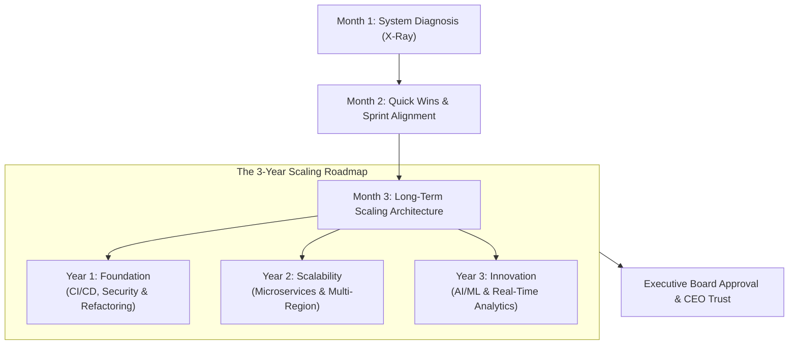

```ppt
# Slide 1: Days 61 to 90 as CTO
- **The Core Objective:** Transitioning from early quick wins to long-term architectural scaling and multi-quarter tech roadmapping.
- **Milestone Goal:** Completing the First 90 Days CTO Onboarding Plan with measurable business impact.
- **Author:** Pankaj Kumar | Associate Architect & Tech Leadership
<!-- slide -->
# Slide 2: The Master Builder & Skyscraper Foundation Analogy
- **Skyscraper Construction:** A master builder never installs a luxury glass sky-lounge on the 50th floor before pouring reinforced steel concrete into the basement foundation!
- **CTO Parallel:** Days 61-90 are about hardening core database schemas, CI/CD automation, and cloud infrastructure so the application can scale 10x without crashing!
<!-- slide -->
# Slide 3: Key Objectives for Month 3
- **1. Present 3-Year Tech Vision:** Deliver a clear, board-ready technology roadmap to the CEO and Board.
- **2. Formalize Engineering Culture:** Establish clear career ladders, post-mortem procedures, and DevEx standards.
- **3. Optimize Cloud Costs (FinOps):** Eliminate cloud waste to free up budget for new engineering hires.
<!-- slide -->
# Slide 4: Building the 3-Year Technology Roadmap
- **Year 1 (Foundation):** Modernize legacy code, automate deployment pipelines, fix single points of failure.
- **Year 2 (Scalability):** Modularize monolith into domain microservices, implement multi-region failover.
- **Year 3 (Innovation):** Integrate AI/ML automation, edge computing, and real-time streaming analytics.
<!-- slide -->
# Slide 5: The 90-Day Transition Checklist
- **Month 1 (Audit):** Diagnostic X-rays, 1-on-1 listening tour, security audit.
- **Month 2 (Quick Wins):** Re-prioritizing sprint backlog, fixing high-visibility bugs, building trust.
- **Month 3 (Scaling Strategy):** Long-term architectural roadmap, FinOps optimization, board alignment.
<!-- slide -->
# Slide 6: Presenting Your 90-Day Wins to the CEO
- **Metric 1:** Deployment frequency increased from monthly to daily.
- **Metric 2:** Cloud infrastructure costs reduced by 15%.
- **Metric 3:** Critical bug backlog reduced by 40%.
<!-- slide -->
# Slide 7: Common Beginner Misconception
- **Myth:** "After 90 days, a CTO's job is done and systems run on autopilot."
- **Fact:** The first 90 days establish the foundation; long-term leadership requires continuous adaptation!
<!-- slide -->
# Slide 8: Summary for Beginners
- Build solid architectural foundations, present a clear multi-year roadmap, and solidify executive alignment by Day 90!
```

# Days 61 to 90 as CTO: Executing Quick Wins & Scaling Strategy

Congratulations! You have navigated the first 60 days as Chief Technology Officer.

In Month 1, you audited systems (Diagnostic X-Ray). In Month 2, you fixed high-visibility bugs and polished customer-facing features (Quick Wins).

Now comes **Month 3 (Days 61 to 90)**: **Establishing the Long-Term Architecture & Scaling Strategy!**

This is where you shift from a tactical engineering manager into a visionary C-suite executive who shapes the future of the company.

Let's understand Month 3 using **The Master Builder & Skyscraper Foundation Analogy**!

---

## 🏗️ The Master Builder & Skyscraper Foundation Analogy

Imagine constructing a 50-story skyscraper:



- **The Amateur Architect:**  
  Rushes to install a fancy glass sky-lounge on the 50th floor without reinforcing the underground basement pillars. The moment wind blows, the entire skyscraper sways dangerously!

- **The Master Builder (The Executive CTO):**  
  Pours deep, reinforced concrete foundation pillars into the bedrock first. Once the foundation is solid, adding 50 floors of luxury features happens smoothly and safely!

---

## 📊 The 90-Day Executive Onboarding Summary

| Month | Core Executive Theme | Primary Milestone / Deliverable | CEO Impact |
| :--- | :--- | :--- | :--- |
| **Month 1 (Days 1–30)** | **Diagnosis & Listening** | System Audit Report & Risk Map | Diagnostic clarity & trust |
| **Month 2 (Days 31–60)** | **Execution & Quick Wins** | High-Impact Sprint Re-alignment | Visible velocity & morale |
| **Month 3 (Days 61–90)** | **Scaling & Strategy** | 3-Year Technology Roadmap & FinOps | Board confidence & 10x scale |

---

## 💡 Summary for Beginners

- **Days 61 to 90 Focus** = Harden core infrastructure, optimize cloud costs, and present a 3-year tech roadmap.
- **Boardroom Rule** = Speak in terms of competitive moat, risk reduction, and ROI rather than software framework version numbers.
- **CTO Golden Rule** = **"Build a rock-solid architectural foundation in your first 90 days so your engineering organization can scale 10x without crumbling!"**

---

*Written by **Pankaj Kumar** | Associate Architect & Tech Leadership.*
