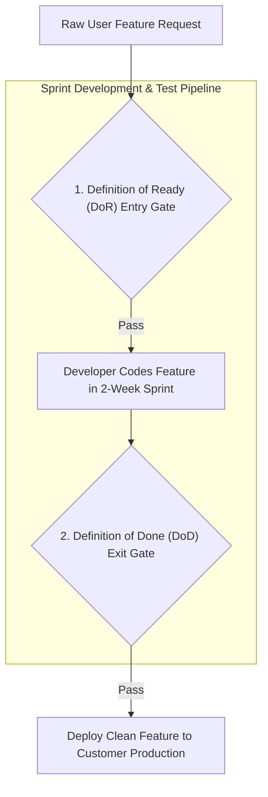
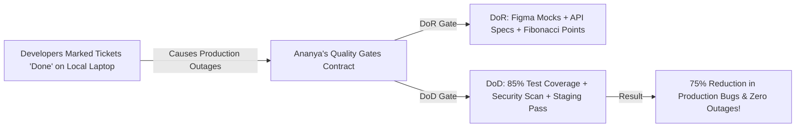

```ppt
# Slide 1: Definition of Ready (DoR) vs Definition of Done (DoD)
- **The Core Quality Discipline:** Enforcing strict entry and exit quality gates to prevent half-baked tickets from entering sprints and half-finished code from reaching production.
- **Executive Rule:** DoR protects developer sanity — DoD protects customer security and software quality!
- **Author:** Pankaj Kumar | Associate Architect & Tech Leadership
<!-- slide -->
# Slide 2: The Recipe Prep vs Plated Dish Inspection Analogy
- **Definition of Ready (Prepped Recipe Bowls):** Kitchen prep team verifies all ingredients are chopped, measured, and recipe steps are crystal clear (*DoR Criteria Met*) before line cooks begin cooking.
- **Definition of Done (Plated Dish Quality Audit):** Before the waiter serves the dish to a VIP guest (*Customer Production*), the Head Chef inspects temperature, taste, food presentation, and hygiene standards (*DoD Criteria Met*)!
<!-- slide -->
# Slide 3: Definition of Ready (DoR) — Entry Gate
- **Purpose:** Quality gate for a ticket entering a 2-week Sprint.
- **Checklist:**
  - 1. User Story contains clear INVEST business value.
  - 2. Figma UI/UX mocks attached and approved.
  - 3. Backend API payload contract agreed.
  - 4. Relative Fibonacci Story Points estimated.
<!-- slide -->
# Slide 4: Real-World Case Study: Ananya's Quality Gates Overhaul
- **The Problem:** A software team managed by VP **Ananya Verma** suffered constant production outages because developers marked tickets "Done" as soon as code ran on their local laptops.
- **The Solution:** Ananya instituted strict DoR & DoD contracts across Jira.
- **The Result:** Cut production bugs by 75% and reduced developer onboarding time by half!
<!-- slide -->
# Slide 5: Definition of Done (DoD) — Exit Gate
- **Purpose:** Quality gate for a ticket shipping to Staging / Production.
- **Checklist:**
  - 1. Source code unit-tested (> 85% coverage).
  - 2. Peer code review approved by Staff Engineer.
  - 3. SAST & Secret security scanning passed in CI/CD.
  - 4. Automated regression tests passed in Staging.
  - 5. Release notes and API documentation updated.
<!-- slide -->
# Slide 6: Protecting Engineering Culture
- **Zero Excuses:** Never bypassing DoD checklist items to meet artificial sprint deadlines.
- **Squad Accountability:** Both Product Owners (DoR owners) and Engineering Squads (DoD owners) share quality ownership.
<!-- slide -->
# Slide 7: Common Misconception
- **Myth:** "A developer marking a ticket 'Done' means the code is written on their local machine."
- **Fact:** Code on a local laptop has zero business value — it is only Done when tested, peer-reviewed, security-scanned, and deployed!
<!-- slide -->
# Slide 8: Summary for Beginners
- Enforce dual quality gates: use DoR to ensure clear sprint inputs and DoD to guarantee secure, fully tested production outputs!
```

# Definition of Done (DoD) vs Definition of Ready (DoR)

In software development, two of the most common causes of project failure are:
1. **Starting work on vague, half-baked feature requirements.**
2. **Shipping half-finished, un-tested code into production.**

When developers start working on tickets without clear acceptance criteria, they waste days guessing requirements.

When developers mark tickets as "Done" simply because code compiles on their personal laptop, **un-tested bugs, security vulnerabilities, and database errors crash production!**

How do technology leaders guarantee high software quality and predictable sprint execution?

They enforce **Two Ironclad Quality Gates: The Definition of Ready (DoR) and The Definition of Done (DoD)!**

Let's understand DoR vs. DoD using **The Recipe Prep vs. Plated Dish Inspection Analogy**!

---

## 👨‍🍳 The Recipe Prep vs. Plated Dish Inspection Analogy

Imagine managing a 5-star Michelin restaurant kitchen:



- **Definition of Ready (Recipe Prep Bowl - Entry Gate):**  
  Before line cooks turn on the stove, the kitchen prep team verifies that all ingredients are washed, chopped, measured into glass bowls, and the recipe instructions are crystal clear (**DoR Criteria Met**). Cooks never waste time looking for missing ingredients!

- **Definition of Done (Plated Dish Quality Audit - Exit Gate):**  
  Before the waiter serves the meal to a VIP dining guest (**Customer Production Release**), the Head Chef inspects temperature, taste, presentation, and health code compliance (**DoD Criteria Met**)! If the sauce is lukewarm, the dish does NOT leave the kitchen!

---

## 📊 Real-World Case Study: Ananya's Quality Gates Overhaul

Consider a cloud engineering department overseen by Technology VP **Ananya Verma**.



1. **The Problem:** Ananya's developers were marking Jira tickets as "Done" the second code ran on their local laptops. However, when code was merged into production, un-tested API bugs crashed the mobile app every Friday night.
2. **The Quality Overhaul:**  
   - Ananya instituted strict **DoR and DoD contracts** inside Jira:
   - **DoR (Sprint Entry Gate):** Ticket must contain clear acceptance criteria, Figma UI mocks, backend API contracts, and Fibonacci story point estimates.
   - **DoD (Sprint Exit Gate):** Code must have 85% unit test coverage, pass peer code review, pass automated SAST security scans, and pass automated regression tests in staging.
3. **The Result:** Production bugs dropped by **75%**, weekend outage alerts were eliminated, and new developer onboarding time was cut in half!

---

## 📊 Definition of Ready (DoR) vs. Definition of Done (DoD)

| Quality Gate Dimension | Definition of Ready (DoR) | Definition of Done (DoD) |
| :--- | :--- | :--- |
| **Pipeline Position** | **Entry Gate** into Sprint Planning | **Exit Gate** into Staging / Production Deployment |
| **Primary Goal** | Prevent vague, un-refined tickets from clogging sprints | Prevent un-tested, insecure code from reaching customers |
| **Key Ownership** | Product Owner, Tech Lead, & UX Designers | Engineering Squad, QA Engineers, & DevOps Leads |
| **Standard Checklist** | - Clear Acceptance Criteria<br/>- Approved Figma Mocks<br/>- API Payload Contracts<br/>- Fibonacci Story Points Assigned | - Unit tests written & passing (> 85%)<br/>- Peer code review approved<br/>- Security SAST scan passed<br/>- Automated staging regression pass |
| **Failure Consequence** | Developers stall mid-sprint asking requirement questions | Production crashes, security leaks, & customer outages |

---

## 💡 Summary for Beginners

- **Definition of Ready (DoR)** = The entry checklist a user story must satisfy before it can be pulled into a 2-week sprint.
- **Definition of Done (DoD)** = The exit checklist a feature must satisfy before it can be considered complete and shipped to production.
- **CTO Golden Rule** = **"Never compromise on quality gates — use DoR to protect developer sprint focus and DoD to protect customer production stability!"**

---

*Written by **Pankaj Kumar** | Associate Architect & Tech Leadership.*
