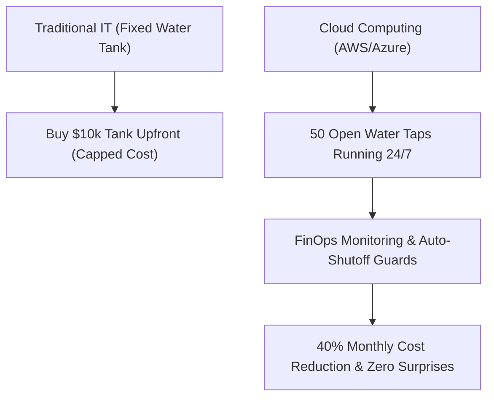
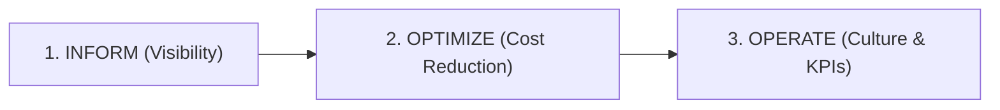

```ppt
# Slide 1: Demystifying Cloud FinOps
- **Definition:** Financial Operations — bringing financial accountability to cloud computing.
- **Why It Matters:** Cloud servers can easily create $50,000 unexpected monthly bill surprises if unmonitored.
- **Author:** Pankaj Kumar | Associate Architect & Tech Leadership
<!-- slide -->
# Slide 2: The Leaking Utility Tap Analogy
- **Traditional IT:** Buying a fixed water tank ($10k upfront) — capacity is capped, no bill surprises.
- **Cloud IT:** Leaving 50 water taps running 24/7 across 5 houses — easy to forget taps on until the monthly bill arrives!
<!-- slide -->
# Slide 3: The 3 Pillars of Cloud FinOps
- **1. Inform:** Creating real-time visibility into who is spending what cloud money.
- **2. Optimize:** Shutting down idle servers and reserving instances for 40% discounts.
- **3. Operate:** Aligning engineering teams with financial KPIs.
<!-- slide -->
# Slide 4: Real-World Disaster: The $100k Developer Mistake
- **The Mistake:** A developer launches a massive AI GPU cloud server for a 2-hour test and forgets to delete it over the weekend.
- **FinOps Safeguard:** Automated budget alerts that shut down idle servers after 30 minutes.
<!-- slide -->
# Slide 5: On-Demand vs Reserved vs Spot Instances
- **On-Demand:** Renting a hotel room per night (Full Price).
- **Reserved Instances:** Signing a 1-year apartment lease (50% Discount).
- **Spot Instances:** Buying last-minute standby plane tickets (80% Discount).
<!-- slide -->
# Slide 6: The Executive CTO Formula
- **Unit Economics:** Cost per Active User = Total Monthly Cloud Bill / Total Active Users.
- **Goal:** Ensuring cloud cost grows slower than company revenue growth!
<!-- slide -->
# Slide 7: Common Beginner Misconception
- **Myth:** "FinOps is just cutting cloud infrastructure costs."
- **Fact:** FinOps is about maximizing business value and revenue per cloud dollar spent!
<!-- slide -->
# Slide 8: Summary for Beginners
- FinOps turns surprise cloud bills into predictable strategic business investments!
```

# Demystifying Cloud FinOps: How CTOs Control Unexpected AWS & Azure Bills

In the old days of corporate technology, buying computer hardware was straightforward: you asked the CFO for $50,000, bought physical server racks, and put them in a locked server room.

When companies moved to **Cloud Computing (AWS, Google Cloud, Azure)**, buying servers shifted from a slow 3-month procurement process to a **1-click instant developer action**.

While this unlocked incredible speed, it created a new executive nightmare: **Uncontrolled, surprise monthly cloud bills!**

Enter **Cloud FinOps (Financial Operations)** — the practice of bringing financial discipline and accountability to cloud computing.

Let's break down Cloud FinOps using the simple analogy of **Leaving Water Taps Running in a Luxury Hotel**!

---

## 🚰 The Leaking Utility Tap Analogy

Imagine managing a 50-room hotel:



- **Traditional IT (The Fixed Water Tank):** You pay $10,000 upfront to install a water tank on the roof. Once filled, guests use water until the tank is empty. You never receive a surprise bill because you paid upfront!
- **Cloud Computing (Open Water Taps):** Every developer has a magic key to turn on water taps. A developer turns on 5 high-pressure taps in Room 302 for a quick 10-minute test, but forgets to turn them off when going home for the weekend. The water runs continuously for 72 hours, resulting in a shocking $20,000 monthly utility bill!
- **Cloud FinOps (Smart Automated Sensors):** Installing automated smart sensors that detect idle running taps, alerting room managers in real-time, and automatically shutting off water when no guest is in the room!

---

## 🏛️ The 3 Phases of the FinOps Lifecycle



1. **📊 Inform (Visibility):** Tagging every cloud server with an owner tag (`Department: Marketing`, `Project: MobileApp`). If AWS charges $10,000 this month, the CFO can see exactly which department spent it.
2. **✂️ Optimize (Cost Reduction):** 
   - **Right-Sizing:** Shrinking oversized virtual computers down to match actual usage.
   - **Reserved Instances (RIs):** Committing to use a server for 1 to 3 years in exchange for a **40% to 60% discount** compared to hourly rates.
   - **Spot Instances:** Renting unused cloud capacity at an **80% discount**, perfect for background batch jobs that can tolerate brief interruptions.
3. **🔄 Operate (Continuous Culture):** Teaching developers to treat cloud cost as a core engineering metric alongside speed and security.

---

## 💡 Summary for Beginners

- **Cloud FinOps** = Financial Operations for Cloud Infrastructure.
- **Goal** = Maximizing revenue value generated for every $1 spent on AWS/Azure.
- **The CTO's Job** = Building automated budget guardrails so developers can build fast without creating $50,000 bill surprises!

---

*Written by **Pankaj Kumar** | Associate Architect & Tech Leadership.*
