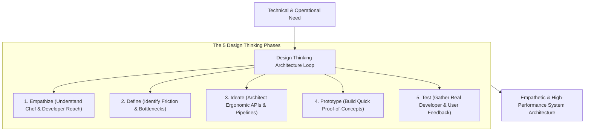

```ppt
# Slide 1: Design Thinking for Technical Leaders
- **The Core Discipline:** Applying human-centered design thinking principles to software architecture and technical decision-making.
- **Key Insight:** Software architecture is not just about server performance; it is about empowering humans to solve problems effortlessly!
- **Author:** Pankaj Kumar | Associate Architect & Tech Leadership
<!-- slide -->
# Slide 2: Ergonomic Kitchen Counter Analogy
- **Generic Kitchen Builder:** Builds standard 36-inch high kitchen counters without considering who cooks in the kitchen, forcing a 5-foot chef to stand on tiptoes or strain their back all day.
- **Empathetic Architect (Design Thinking Leader):** Measures the chef's exact reach, positions spice racks at eye level, and places prep tables within arm's reach! The chef cooks effortlessly with zero fatigue.
<!-- slide -->
# Slide 3: The 5 Phases of Design Thinking in Tech
- **1. Empathize:** Understanding developer friction, customer pain, and operational workflows.
- **2. Define:** Framing the core technical problem clearly.
- **3. Ideate:** Brainstorming multiple architectural solutions with trade-offs.
- **4. Prototype:** Building quick spikes and proof-of-concepts.
- **5. Test:** Gathering real-world feedback from developers and end users.
<!-- slide -->
# Slide 4: Empathetic Architecture for Developers (DevEx)
- **Internal APIs:** Designing intuitive, self-documenting APIs so backend and frontend engineers integrate in minutes.
- **CI/CD Pipelines:** Reducing test suite execution time from 45 minutes to 5 minutes to boost developer joy.
- **Clear Documentation:** Writing READMEs that welcome new engineers seamlessly.
<!-- slide -->
# Slide 5: Empathetic Architecture for End Users
- **Offline Mode Support:** Designing mobile apps that gracefully handle poor 3G cell connections.
- **Accessibility (a11y):** Supporting screen readers, high contrast, and keyboard navigation.
- **Zero-Data Loss:** Auto-saving draft forms locally so users never lose entered text.
<!-- slide -->
# Slide 6: Measuring Empathetic Engineering
- **Developer Experience (DevEx) NPS:** Internal surveys measuring developer satisfaction.
- **Time-to-First-PR:** Days required for a new engineer to ship their first code change.
<!-- slide -->
# Slide 7: Common Misconception
- **Myth:** "Design Thinking belongs exclusively to UI/UX designers, not backend software architects."
- **Fact:** Every API contract, database schema, and CLI tool is a user interface for engineers or software components!
<!-- slide -->
# Slide 8: Summary for Beginners
- Practice human-centered architecture: design software APIs, workflows, and pipelines around human ergonomics and empathy!
```

# Design Thinking for Technical Leaders: Empathetic Architecture

When engineers hear the phrase **Design Thinking**, they often assume it is a creative workshop exercise reserved exclusively for UI/UX designers and product managers.

However, modern software technology leaders know that **Design Thinking is a vital discipline for System Architecture!**

Every API endpoint you publish, every microservice contract you establish, and every CI/CD deployment pipeline you build has a human user on the receiving end — whether that user is a customer, a frontend developer, or an infrastructure engineer.

When technical leaders design systems without empathy, they create clunky APIs, slow build pipelines, and painful operational workflows.

Let's understand Empathetic Architecture using **The Ergonomic Kitchen Counter Analogy**!

---

## 🍳 The Ergonomic Kitchen Counter Analogy

Imagine building a custom restaurant kitchen:



- **The Rigid Kitchen Builder:**  
  Installs standard 36-inch high marble counters and high shelves without asking who will cook in the kitchen. A 5-foot-tall chef is forced to stand on tiptoes, strain their back, and reach dangerously over hot stoves all day!

- **The Ergonomic Architect (Design Thinking Leader):**  
  Measures the chef's exact physical reach, positions spice racks at eye level, lowers prep tables, and places knife racks within arm's reach! The chef cooks meals twice as fast with zero back strain and maximum joy!

---

## 📊 Empathetic Architecture: Developer Experience (DevEx) vs. User Experience (UX)

| Architecture Domain | Unempathetic System (Avoid) | Empathetic System (Design Thinking) |
| :--- | :--- | :--- |
| **Internal API Design** | Cryptic error codes (`Err: 5092`), undocumented endpoints | Self-documenting OpenAPI/Swagger schemas with clear error messages |
| **CI/CD Pipelines** | 50-minute slow build pipeline requiring manual approvals | 5-minute automated pipeline with instant Slack feedback on test failures |
| **Mobile Network UX** | App crashes or shows blank screen when connection drops | Graceful offline caching with local storage auto-save & background sync |
| **Developer Onboarding** | 2 weeks to set up local dev environment manually | Single Docker command (`docker-compose up`) setting up local dev in 10 mins |

---

## 💡 Summary for Beginners

- **Design Thinking** = A human-centered approach to solving complex problems through empathy, rapid prototyping, and feedback.
- **Empathetic Architecture** = Designing APIs, dev environments, and user workflows around human ergonomics and ease of use.
- **CTO Golden Rule** = **"Treat every API, codebase, and build pipeline as a product designed for humans — great technical leaders build for developer joy!"**

---

*Written by **Pankaj Kumar** | Associate Architect & Tech Leadership.*
