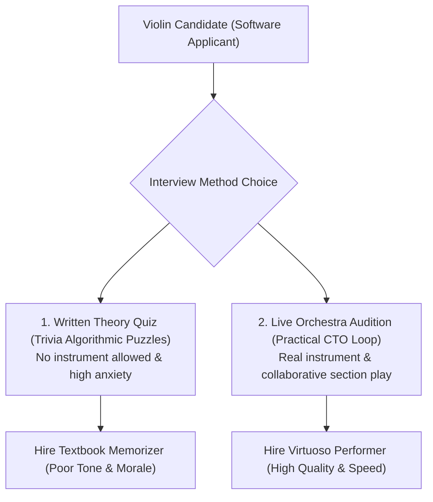

```ppt
# Slide 1: Designing Practical Technical Interview Loops
- **The Core Objective:** Replacing outdated computer science quiz trivia with realistic, practical coding and system architecture interviews.
- **Employer Branding Rule:** Candidates should walk away from your interview process respecting your engineering team — even if they don't receive an offer!
- **Author:** Pankaj Kumar | Associate Architect & Tech Leadership
<!-- slide -->
# Slide 2: The Orchestra Live Audition Analogy
- **Written Music Quiz (Traditional Interview):** Asking a virtuoso violinist to complete a written multiple-choice test on music theory from 1750 without letting them pick up an instrument!
- **Live Audition (Practical CTO Loop):** Handing the violinist a fine instrument, inviting them to play a piece alongside the lead orchestra section, and listening to their tone and rhythm!
<!-- slide -->
# Slide 3: The 3 Golden Rules of Practical Interview Loops
- **1. Test Real-World Skills:** Evaluate code readability, API design, debugging, and trade-off choices.
- **2. Eliminate Rote Memorization:** Allow candidates to use Google, StackOverflow, and official documentation during coding sessions.
- **3. Standardized Rubrics:** Grade every candidate using identical objective criteria to eliminate interviewer bias.
<!-- slide -->
# Slide 4: The 4-Stage Candidate-Friendly Loop
- **Stage 1 (30 Mins):** Technical & Culture Intro Sync with Hiring Manager.
- **Stage 2 (60 Mins):** Practical Pair Programming (Debugging a real bug or extending an existing API endpoint).
- **Stage 3 (60 Mins):** System Architecture Discussion (Designing a scalable production feature).
- **Stage 4 (30 Mins):** Leadership & Values Chat with Engineering VP/CTO.
<!-- slide -->
# Slide 5: The Pair Programming Best Practice
- **Collaborative Environment:** The interviewer acts as a helpful teammate, not a stern exam proctor.
- **Open-Book Policy:** Candidates can look up syntax, libraries, and documentation freely.
<!-- slide -->
# Slide 6: Candidate Feedback & Candidate Experience
- **Prompt Communication:** Offer or rejection feedback delivered within 48 hours of loop completion.
- **Constructive Feedback:** Providing brief, respectful technical feedback to candidates.
<!-- slide -->
# Slide 7: Common Misconception
- **Myth:** "Harder computer science brain-teasers weed out bad candidates."
- **Fact:** Brain-teasers weed out great practical software builders and select for candidates who spent 3 months memorizing interview puzzles!
<!-- slide -->
# Slide 8: Summary for Beginners
- Build practical, collaborative interview loops: test real-world coding, allow documentation search, and respect candidate time!
```

# Designing Practical Technical Interview Loops Candidates Love

Why do so many software engineering teams struggle to hire great developers, even after conducting dozens of candidate interviews?

The problem lies in **broken, outdated technical interview loops.**

In many tech companies, candidates are subjected to 4-hour whiteboarding interrogations where they are forced to invert binary trees or solve obscure mathematical puzzles without access to Google, an IDE, or documentation.

These artificial quiz tests fail to measure how a developer writes production code, collaborates with teammates, or designs scalable systems.

To attract top 1% engineering talent, **CTOs must design practical, candidate-friendly interview loops!**

Let's understand Practical Interview Loops using **The Orchestra Live Audition Analogy**!

---

## 🎻 The Orchestra Live Audition Analogy

Imagine auditioning a new violinist for a world-class symphony orchestra:



- **The Written Music Quiz (Traditional Interview):**  
  Forcing a virtuoso violinist to sit in a quiet room and answer 100 written multiple-choice questions about 18th-century music theory without ever letting them pick up a violin! You end up hiring someone who memorized test textbooks but plays with poor tone.

- **The Live Orchestra Audition (Practical CTO Loop):**  
  Handing the violinist a fine instrument, inviting them onto the stage to play alongside the orchestra section, observing how they blend their sound, adjust tempo, and respond to the conductor!

---

## 📊 Traditional Interview Trivia vs. Practical CTO Loop

| Dimension | Traditional Quiz Interview | Practical CTO Interview Loop |
| :--- | :--- | :--- |
| **Coding Assessment** | Whiteboard algorithmic brain-teasers | Pair programming in a modern IDE extending a real REST API |
| **Documentation Access** | Banned (Must memorize exact syntax) | Allowed (Google, StackOverflow, and official docs permitted) |
| **Interviewer Role** | Silent exam proctor grading mistakes | Collaborative teammate pairing on a coding problem |
| **System Design** | Generic abstract Twitter/URL-shortener clone | Interactive design session based on company's actual architecture |
| **Candidate Sentiment** | Exhausted, frustrated, and stressed | Respected, energized, and eager to join the team |

---

## 💡 Summary for Beginners

- **Practical Interview Loop** = A collaborative evaluation measuring real-world coding, system architecture, and teamwork.
- **Open-Book Policy** = Allowing candidates to use IDEs and documentation just like they would during a normal workday.
- **CTO Golden Rule** = **"Don't test candidates on algorithm trivia they will never use — test how they write clean code, debug APIs, and collaborate with your team!"**

---

*Written by **Pankaj Kumar** | Associate Architect & Tech Leadership.*
