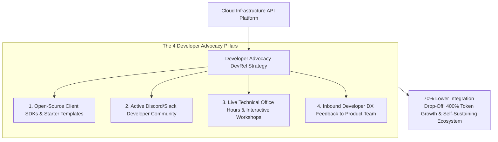
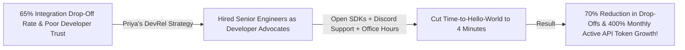

```ppt
# Slide 1: Developer Advocacy (DevRel) & API Communities
- **The Core Strategy:** Building authentic, two-way developer relationships around software APIs through technical advocacy, open-source SDKs, and developer-first community support.
- **Executive Reality:** Developer Advocates are not salespeople — they are engineers who champion the developer's voice inside your product team and empower external builders!
- **Author:** Pankaj Kumar | Associate Architect & Tech Leadership
<!-- slide -->
# Slide 2: The Locked Vending Machine vs. Neighborhood Garden Club Analogy
- **Locked Commercial Vending Machine (Legacy Sales Model):** A cold steel machine charging expensive coins for locked seed packets (**Gated APIs & Forced Sales Calls**). Gardeners walk away empty-handed and frustrated!
- **Thriving Neighborhood Garden Club (Developer Advocacy):** A welcoming master gardener sharing high-quality seeds, demonstrating soil preparation, and building open wooden benches for advice (**DevRel Open Community & Free Sandbox**)! Gardeners grow lush crops and share seeds with everyone!
<!-- slide -->
# Slide 3: The 3 Core Responsibilities of Developer Advocacy
- **1. Inbound Product Advocacy:** Feeding developer friction, API bugs, and feature requests back to internal product engineering.
- **2. Outbound Technical Empowerment:** Creating sample apps, starter templates, and video guides.
- **3. Community Ecosystem Nurturing:** Fostering active Discord/Slack channels and StackOverflow support.
<!-- slide -->
# Slide 4: Real-World Case Study: Priya's DevRel API Ecosystem
- **The Challenge:** A fintech API platform managed by Lead Architect **Priya Nair** suffered from high drop-offs during developer integration.
- **The DevRel Strategy:** Priya established a Developer Advocacy team: released open-source SDKs in 4 languages, launched an active Discord community, and hosted weekly live coding office hours.
- **The Result:** API integration drop-offs fell by 70%, monthly active developer tokens grew by 400%, and community members began answering each other's questions!
<!-- slide -->
# Slide 5: The DevRel Growth Loop
- **Phase 1: Frictionless Onboarding:** 5-minute Time-to-Hello-World (TTHW) with copy-pasteable SDKs.
- **Phase 2: Community Support:** Rapid response times on Discord & StackOverflow.
- **Phase 3: Developer Advocacy:** Spotlighting community-built projects on your official blog & newsletter.
- **Phase 4: Feedback Loop:** Iterating API design based on real developer pain points.
<!-- slide -->
# Slide 6: Key Metrics for DevRel Leadership
- **Primary Metric:** Active Weekly API Tokens & Developer Retention.
- **Secondary Metric:** Time-to-First-Successful-200-OK-Response.
- **Anti-Metric:** Never evaluate DevRel on traditional sales quota leads!
<!-- slide -->
# Slide 7: Common Misconception
- **Myth:** "Developer Advocates are just technical marketing representatives who give conference talks."
- **Fact:** True DevRel Advocates are skilled software engineers who write code, build SDKs, fix API DX friction, and represent developer interests inside your company!
<!-- slide -->
# Slide 8: Summary for Beginners
- Master Developer Advocacy: nurture an open community garden, empower builders with open-source SDKs, reduce Time-to-Hello-World, and advocate for developers inside your product team!
```

# Developer Advocacy (DevRel): Building Community Around APIs

In modern cloud platforms, APIs are no longer just technical data pipes — **APIs are Products, and Developers are the Primary Customers.**

When software engineers integrate a new payment gateway, AI API, or cloud database:
- If the integration experience is clunky, documented poorly, or requires a sales call, developers abandon the API for an open alternative.
- If the API offers instant registration, copy-pasteable client SDKs, and an active community where engineers answer questions in 5 minutes, developers become passionate product champions!

**Developer Advocacy (DevRel) is the bridge of empathy and code between your product team and external software engineers.**

How do CTOs build an impactful Developer Relations (DevRel) engine that scales API adoption and fosters thriving developer communities?

Let's understand Developer Advocacy using **The Locked Vending Machine vs. Neighborhood Garden Club Analogy**!

---

## 🌱 The Locked Vending Machine vs. Neighborhood Garden Club Analogy


Imagine cultivating a flourishing agricultural community in your town:



- **The Locked Commercial Vending Machine (Legacy Sales Model):**  
  A cold steel machine charging expensive coins for locked seed packets (**Gated APIs & Forced Sales Calls**). Gardeners walk away empty-handed, frustrated, and cynical about your brand.

- **The Thriving Neighborhood Garden Club (Developer Advocacy):**  
  A welcoming master gardener sharing high-quality seeds, demonstrating soil preparation techniques, and building open wooden benches for advice (**DevRel Open Community & Free Developer Tier**)! Gardeners grow lush crops, swap tips, and bring new builders to the garden every day.

---

## 📊 Real-World Case Study: Priya's DevRel API Ecosystem

Consider a fintech API platform where **Priya Nair** serves as Lead Architect.



1. **The Challenge:** Priya's fintech API platform was losing **65% of developers** during initial sandbox setup. Developers complained about ambiguous error codes, missing Python client libraries, and lack of technical support.
2. **The DevRel Strategy:**  
   - Priya established a dedicated **Developer Advocacy (DevRel) Team**:
   - **Idiomatic SDKs:** Built official, open-source client libraries in Python, Node.js, Go, and Java with automated GitHub releases.
   - **Discord Hub:** Launched a developer Discord server where Advocates answered integration questions in under 10 minutes.
   - **Inbound DX Feedback:** DevRel Advocates participated in weekly engineering sprint planning, advocating for clearer error messages and better pagination endpoints.
3. **The Result:** Developer integration drop-offs fell by **70%**, monthly active API token usage grew by **400%**, and community members began answering incoming questions autonomously!

---

## 📊 Traditional Corporate Sales vs. Developer Advocacy (DevRel)

| Dimension | Traditional Corporate Sales (Fails with Devs) | Developer Advocacy DevRel (Wins Builders) |
| :--- | :--- | :--- |
| **Primary Goal** | Closing short-term quota contracts | Empowering developers to build successful applications |
| **Team Background** | Enterprise sales reps & account managers | Senior software engineers & open-source contributors |
| **Communication Channel** | High-pressure phone calls & email drip campaigns | Public Discord, Slack, GitHub Issues, & StackOverflow |
| **Collateral Provided** | Sales pitch decks & pricing sheets | Copy-pasteable sample apps, SDKs, & video tutorials |
| **Success Metric** | Monthly quota revenue dollars | **Active API Tokens, Developer Retention & TTHW (< 5 Mins)** |

---

## 💡 Summary for Beginners

- **Developer Relations (DevRel)** = The strategic discipline of building authentic relationships with developers through technical content, SDKs, and community engagement.
- **Developer Experience (DX)** = The overall ease, clarity, and satisfaction a developer feels when integrating and using an API or software platform.
- **Inbound Advocacy** = Bringing external developer feedback, pain points, and feature requests directly back into your company's product engineering backlog.
- **CTO Golden Rule** = **"Developers build with tools they trust — treat APIs as products, hire engineers as advocates, and nurture a thriving open community garden!"**

---

*Written by **Pankaj Kumar** | Associate Architect & Tech Leadership.*
