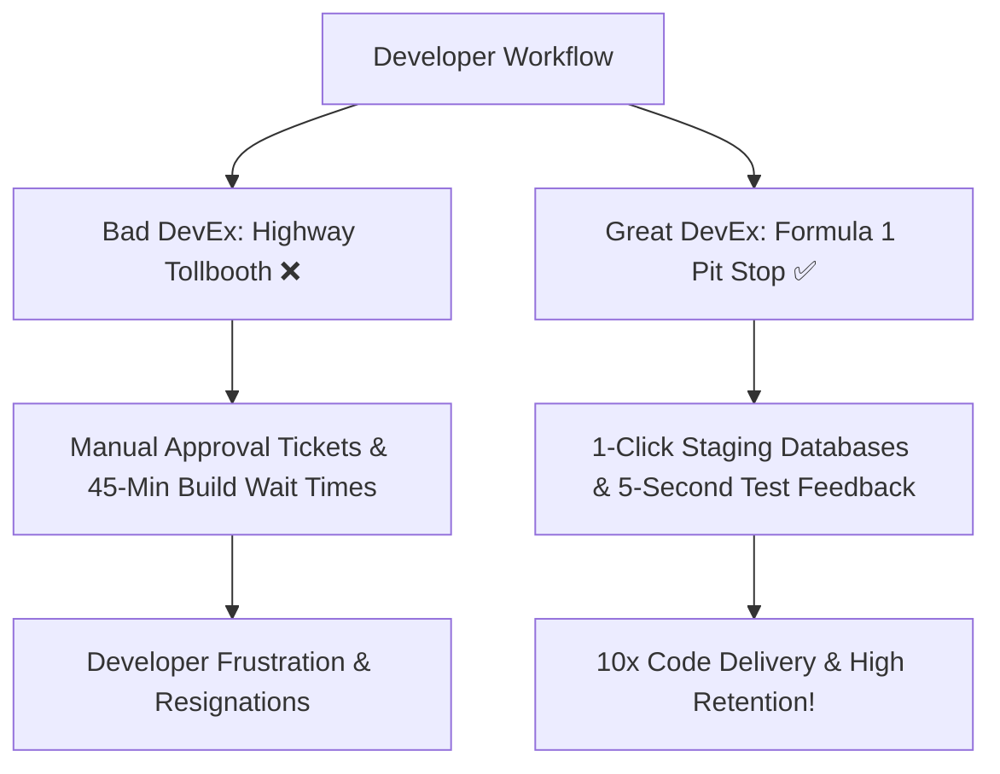

```ppt
# Slide 1: Developer Experience (DevEx) & Inner Loop
- **Executive Reality:** Developers spend less than 30% of their working day writing code. The rest is wasted waiting on slow tools and administrative red tape!
- **Goal:** Maximizing "Inner Loop Productivity" and engineer happiness.
- **Author:** Pankaj Kumar | Associate Architect & Tech Leadership
<!-- slide -->
# Slide 2: The Formula 1 Pit Stop & Highway Tollbooth Analogy
- **Bad DevEx (Highway Tollbooth):** Stopping at 10 manual toll gates every 5 miles (Slow approval pipelines & 20-minute code compiles).
- **Great DevEx (F1 Pit Stop):** Standardized, automated tools changing 4 tires in 2 seconds flat!
<!-- slide -->
# Slide 3: Inner Loop vs Outer Loop
- **Inner Loop (Fast Feedback Loop):** Writing code, running local unit tests, debugging, and viewing local live previews (Goal: Seconds).
- **Outer Loop (Delivery Pipeline):** Code reviews, CI/CD builds, security scanning, and production deployment (Goal: Minutes).
<!-- slide -->
# Slide 4: The 3 Dimensions of DevEx (SPACE Framework)
- **1. Feedback Loops:** How fast can a developer verify that their code works?
- **2. Cognitive Load:** Is local environment setup taking 3 days or 5 minutes?
- **3. Flow State:** Are developers interrupted by meetings every 30 minutes?
<!-- slide -->
# Slide 5: Internal Developer Portals (IDPs) & Self-Service
- **Self-Service Infrastructure:** Allowing developers to provision a staging database in 1 click via Backstage / Port without waiting for IT tickets.
- **Automated Ephemeral Environments:** Generating temporary preview URLs for every pull request automatically.
<!-- slide -->
# Slide 6: ROI of Investing in DevEx
- **Developer Retention:** Happy engineers don't quit; burnout rates drop by 50%.
- **Time to Market:** Feature release cycle times drop from 2 weeks to 2 hours!
<!-- slide -->
# Slide 7: Common Beginner Misconception
- **Myth:** "Developer Experience is just buying fancy laptops or ergonomic office chairs for coders."
- **Fact:** DevEx is about eliminating tool friction, build waiting times, and fragmented workflows!
<!-- slide -->
# Slide 8: Summary for Beginners
- Invest in developer tooling to unlock engineering speed, reduce burnout, and retain top technical talent!
```

# Developer Experience (DevEx) & Inner Loop Productivity: Removing Friction for Engineers

When non-technical executives hire senior software developers at $150,000/year salaries, they expect them to spend 40 hours a week building revenue-generating features.

However, industry research reveals a shocking metric: **the average developer spends less than 30% of their working day actually writing code!**

Where does the remaining 70% go?
- Waiting 45 minutes for automated tests to run.
- Spending 3 days trying to configure a local database on a new laptop.
- Filling out manual ticket forms asking DevOps for server permissions.

This frustration is called poor **Developer Experience (DevEx)**.

Let's break down **DevEx & Inner Loop Productivity** using **The Highway Tollbooth vs Formula 1 Pit Stop Analogy**!

---

## 🏎️ The Highway Tollbooth vs Formula 1 Pit Stop Analogy

Imagine driving a high-performance sports car:



- **Bad DevEx (Highway Tollbooth):**  
  Every 5 miles, your sports car must come to a complete stop, roll down the window, wait in a long queue, and hand cash to a toll collector. You have a 500-horsepower engine, but your average speed is 15 mph!

- **Great DevEx (Formula 1 Pit Stop):**  
  You pull into the pit lane at 150 mph. 18 mechanics work in synchronized harmony, changing 4 tires and refueling in **2.1 seconds flat**, propelling you right back onto the racetrack at top speed!

---

## 🔄 Inner Loop vs Outer Loop Productivity

Modern engineering splits developer workflows into two loops:

1. **➰ The Inner Loop (Local Feedback):**  
   *Write Code ➔ Save File ➔ Run Local Test ➔ See Instant Result.*  
   - **Goal:** The Inner Loop should take **seconds**. If a developer has to wait 2 minutes every time they change one line of code to see if it works, they lose their focus ("Flow State").

2. **🔁 The Outer Loop (Production Pipeline):**  
   *Push Code ➔ Code Review ➔ CI/CD Build ➔ Security Scan ➔ Production Deploy.*  
   - **Goal:** Automated self-service pipelines that deploy clean code to production in **minutes** without manual intervention.

---

## 💡 Summary for Beginners

- **DevEx (Developer Experience)** = The overall ease, speed, and satisfaction engineers feel when building software in an organization.
- **Flow State** = Deep, uninterrupted concentration where engineers do their best work.
- **The CTO's Job** = Removing administrative tollbooths so developers spend their energy solving business problems!

---

*Written by **Pankaj Kumar** | Associate Architect & Tech Leadership.*
