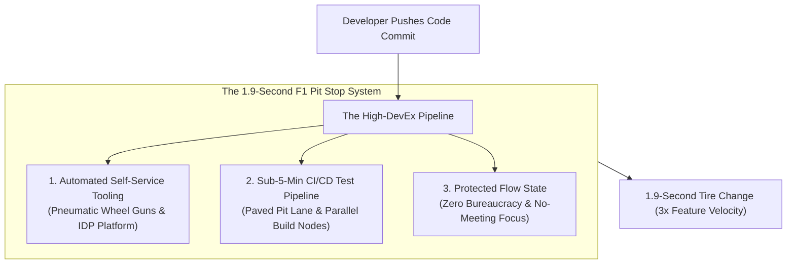

```ppt
# Slide 1: Developer Experience (DevEx) & Velocity
- **The Core Discipline:** Systematically removing engineering friction to boost developer productivity, joy, and release velocity.
- **Executive Rule:** DevEx is not a luxury perk — DevEx is your primary engineering velocity lever!
- **Author:** Pankaj Kumar | Associate Architect & Tech Leadership
<!-- slide -->
# Slide 2: Formula 1 Pit Stop Analogy
- **Sloppy Street Garage (Poor DevEx):** Mechanics use rusty hand wrenches, fight stuck wheel nuts, and take 2 full minutes to change tires. The race car loses 5 laps and finishes last!
- **Formula 1 Pit Crew (High DevEx):** Mechanics use high-speed pneumatic wheel guns, work on a paved pit lane, and change all 4 tires in **1.9 seconds flat!** The driver re-enters the track at 200 mph and wins the championship!
<!-- slide -->
# Slide 3: The 3 Core Pillars of DevEx (SPACE Framework)
- **1. Feedback Loops:** Instant feedback on code changes (fast unit tests, automated CI/CD under 5 mins).
- **2. Cognitive Load:** Clean architecture, modular APIs, and intuitive documentation that reduces mental strain.
- **3. Flow State:** Protecting long stretches of uninterrupted deep work time (No-Meeting Days).
<!-- slide -->
# Slide 4: Measuring Friction (DevEx Metrics)
- **Time-to-Build:** How long a developer waits for local builds and unit tests.
- **Time-to-PR-Review:** Average hours a Pull Request waits for peer review.
- **Deployment Frequency:** Number of code deployments pushed to production per day.
<!-- slide -->
# Slide 5: Building a Platform Engineering Team
- **Internal Developer Platform (IDP):** Providing self-service cloud infrastructure (Backstage, Terraform) so developers don't wait on DevOps ticket queues.
- **Automated Guardrails:** Pre-commit hooks, automated linters, and security scanning.
<!-- slide -->
# Slide 6: The Business Impact of Great DevEx
- **Higher Velocity:** Engineering squads ship 3x more commercial features per quarter.
- **Lower Turnover:** Engineers love coding in a frictionless environment.
- **Fewer Outages:** Automated testing guardrails catch bugs before live production.
<!-- slide -->
# Slide 7: Common Misconception
- **Myth:** "DevEx means buying fancy coffee machines and beanbag chairs for the office."
- **Fact:** True DevEx is fast CI/CD pipelines, sub-second local builds, and zero administrative bureaucracy!
<!-- slide -->
# Slide 8: Summary for Beginners
- Slash developer friction: automate local dev setup, reduce CI/CD test wait times to < 5 mins, and protect flow state!
```

# Developer Experience (DevEx): Slashing Friction in Coding

Imagine hiring elite $200,000/year software engineers, only to watch them spend **40% of their workday waiting for slow CI/CD test builds, wrestling with broken local environments, and filling out manual approval forms!**

This daily friction is called **Poor Developer Experience (DevEx)**.

When DevEx is neglected:
- Developers lose their focus and "flow state."
- Pull Requests sit unreviewed for 5 days.
- Sprint delivery stalls, and engineers become burned out.

In modern software organizations, **CTOs treat Developer Experience as a core architectural discipline.**

Let's understand DevEx using **The Formula 1 Pit Stop Analogy**!

---

## 🏎️ The Formula 1 Pit Stop Analogy

Imagine competing in the Formula 1 World Championship:



- **The Sloppy Street Garage (Poor DevEx):**  
  Mechanics use rusty manual hand wrenches, fight stripped lug nuts, and take 2 full minutes to change tires. The race car loses 5 laps and finishes dead last!

- **The Formula 1 Pit Crew (High-DevEx CTO Culture):**  
  Mechanics use custom high-speed pneumatic wheel guns, train on a smooth paved pit lane, and change all 4 tires in **1.9 seconds flat!** The race car re-enters the track at 200 mph and wins the championship!

---

## 📊 Poor DevEx Bottlenecks vs. High-DevEx CTO Solutions

| Friction Bottleneck | Poor DevEx Impact (Avoid) | High-DevEx Solution (Adopt) |
| :--- | :--- | :--- |
| **Local Dev Setup** | 3 days manually installing dependencies & environment variables | Single command (`docker-compose up`) setting up local dev in < 10 mins |
| **CI/CD Pipeline** | 45-minute monolithic test build run sequentially | Parallelized sub-5-minute automated test suite execution |
| **Cloud Infrastructure** | 3-day ticket wait for DevOps to provision a staging database | Self-service developer portal (Backstage/Terraform) in 2 mins |
| **Code Reviews** | PRs sit in reviewer inbox for 4 days | Automated Slack PR review reminders & 24-hour review SLA |

---

## 💡 Summary for Beginners

- **Developer Experience (DevEx)** = The overall ease, speed, and satisfaction engineers experience when building software in an organization.
- **Flow State** = Deep, uninterrupted mental focus where developers write their best code.
- **CTO Golden Rule** = **"Pave smooth pit lanes for your developers — slash build times below 5 minutes and remove every obstacle between code commit and production release!"**

---

*Written by **Pankaj Kumar** | Associate Architect & Tech Leadership.*
