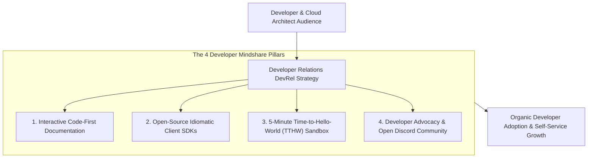
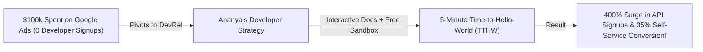

```ppt
# Slide 1: Developer Marketing & Mindshare (Series 6 Kickoff)
- **The Core Strategy:** Winning software developer trust and adoption through technical authenticity, outstanding documentation, and open-source contribution rather than slick corporate ads.
- **Executive Reality:** Developers hate traditional marketing hype — they trust working code, clear API docs, and seamless developer experience!
- **Author:** Pankaj Kumar | Associate Architect & Tech Leadership
<!-- slide -->
# Slide 2: The Free High-Quality Craftsman Toolkit Analogy
- **Slick Sales Pitchman (Corporate Hype Marketing):** A suited salesperson shouting through a megaphone at a carpenters' convention, handing out glossy brochures claiming their hammers are "AI-driven revolutionary disruptors." Carpenters throw the brochures in the trash!
- **Master Master Craftsman (Developer Experience Marketing):** Sets up a workshop table, hands carpenters a free, perfectly balanced titanium hammer (**Open-Source SDK / Free API Tier**), provides a clear blueprint booklet (**Interactive API Documentation**), and lets them test it on real wood (**5-Minute Quickstart Code**)!
<!-- slide -->
# Slide 3: The 3 Golden Rules of Developer Marketing
- **1. Show, Don't Tell:** Provide working code snippets, public GitHub repos, and interactive API playgrounds (Swagger / Postman).
- **2. Respect Technical Authenticity:** Speak developer-to-developer — eliminate corporate buzzwords and marketing fluff.
- **3. Optimize Time-to-Hello-World (TTHW):** Enable a developer to make their first successful API call in < 5 minutes.
<!-- slide -->
# Slide 4: Real-World Case Study: Ananya's Developer Relations Strategy
- **The Challenge:** A cloud API startup led by VP **Ananya Verma** spent $100,000 on Google Ads, but software engineers refused to sign up.
- **The DevRel Pivot:** Ananya shifted budget to technical Developer Relations (DevRel): built open-source SDKs, interactive API docs, and published real-world code tutorials written by Senior Engineers.
- **The Result:** Developer API signups surged by 400%, and self-service conversion jumped to 35%!
<!-- slide -->
# Slide 5: The 4 Pillars of Developer Relations (DevRel)
- **1. Documentation:** Clear, searchable, code-first documentation with copy-pasteable snippets.
- **2. Open-Source SDKs:** Idiomatic client libraries in Python, Node.js, Go, and Java.
- **3. Developer Advocacy:** Senior engineers speaking at conferences, writing technical blogs, and answering Discord/StackOverflow questions.
- **4. Frictionless Onboarding:** Free sandbox tier requiring zero credit card for initial testing.
<!-- slide -->
# Slide 6: Time-to-Hello-World (TTHW) Benchmark
- **The 5-Minute Benchmark:** If a developer cannot register, fetch an API key, and execute a working script in 5 minutes, 70% will abandon your product!
- **Interactive Sandboxes:** Providing inline code sandboxes (CodeSandbox / StackBlitz).
<!-- slide -->
# Slide 7: Common Misconception
- **Myth:** "Developer marketing is handled by the traditional corporate marketing department."
- **Fact:** Developers buy from engineers — Developer Marketing requires CTO leadership, DevRel engineers, and authentic technical content!
<!-- slide -->
# Slide 8: Summary for Beginners
- Win developer mindshare: optimize Time-to-Hello-World under 5 minutes, publish open-source SDKs, create interactive API docs, and lead with technical authenticity!
```

# Developer Marketing: How CTOs Win Developer Mindshare

Welcome to **Series 6: Marketing, Developer Relations & Technical Brand Strategy!**

In traditional enterprise B2B sales, software companies sold products by taking C-level executives to expensive steak dinners.

In the modern cloud economy, **Developers are the New Software Decision-Makers.**

Software engineers, cloud architects, and DevOps leads decide which APIs, cloud databases, and SaaS tools a company adopts:
- If a developer loves your API documentation, they integrate your service over a weekend.
- If a developer encounters broken code snippets or marketing hype, they abandon your tool forever.

However, traditional corporate marketing fails miserably when targeting developers: **Software developers hate traditional sales pitches and corporate marketing fluff!**

How do technology leaders win developer mindshare and turn software engineers into passionate brand advocates?

They execute **Authentic Developer Marketing & DevRel Strategy!**

Let's understand Developer Marketing using **The Free High-Quality Craftsman Toolkit Analogy**!

---

## 🛠️ The Free High-Quality Craftsman Toolkit Analogy

Imagine marketing tools at an international master carpenters' convention:



- **The Slick Sales Pitchman (Corporate Hype Marketing):**  
  A suited salesperson stands on a stage shouting through a megaphone, handing out glossy brochures claiming their hammers are *"AI-driven, revolutionary paradigm shifts."* Carpenters roll their eyes and throw the brochures directly in the trash!

- **The Master Craftsman Workshop (Developer Marketing):**  
  Sets up an open workbench, hands carpenters a free, perfectly balanced titanium hammer (**Open-Source SDK & Free API Sandbox**), provides a clear blueprint booklet (**Interactive API Documentation**), and lets them test it on real wood (**5-Minute Quickstart Code**)! Carpenters fall in love with the tool instantly.

---

## 📊 Real-World Case Study: Ananya's DevRel Transformation

Consider a cloud API platform where **Ananya Verma** serves as Technology VP.



1. **The Challenge:** Ananya's company spent $100,000 on generic digital display ads targeting CTOs. Despite high ad clicks, developer signups and API usage were virtually zero.
2. **The DevRel Pivot:**  
   - Ananya eliminated corporate display ads and shifted budget to **Developer Relations (DevRel)**:
   - **Interactive Docs:** Built interactive API documentation with copy-pasteable snippets in Python, Node.js, and Go.
   - **Free Sandbox Tier:** Created a free developer sandbox account requiring zero credit card.
   - **5-Minute TTHW:** Optimized the onboarding flow so developers could copy a curl command and see live JSON response data in **3 minutes**.
3. **The Result:** Developer API signups surged by **400%**, self-service conversion jumped to 35%, and developers organically championed the product inside enterprise companies!

---

## 📊 Traditional Corporate Marketing vs. Developer-First Marketing

| Marketing Dimension | Traditional Corporate Marketing (Fails with Devs) | Developer-First Marketing (Wins Mindshare) |
| :--- | :--- | :--- |
| **Messaging Tone** | Corporate buzzwords (*"Synergistic AI Paradigm Shift"*) | Authentic technical clarity (*"Sub-10ms Vector Database"*)|
| **Primary Collateral** | 20-page marketing PDF whitepapers | Copy-pasteable code snippets, open-source SDKs, & API docs |
| **Sales Channel** | High-pressure sales calls & gated forms | Frictionless self-service free tier with zero credit card |
| **Key Performance Metric** | Cost per lead (CPL) & form downloads | **Time-to-Hello-World (TTHW)** & Monthly Active API Keys |
| **Advocacy Model** | Paid celebrity endorsements | Developer advocates answering questions on GitHub & Discord |

---

## 💡 Summary for Beginners

- **Developer Marketing** = The practice of engaging software developers through authentic technical content, open-source tools, and friction-free product experiences.
- **Time-to-Hello-World (TTHW)** = The time it takes for a developer to sign up, configure credentials, and execute their first successful API call or code script.
- **Developer Relations (DevRel)** = The team and strategy bridging the gap between an engineering company and the external developer community.
- **CTO Golden Rule** = **"Developers buy working code, not sales hype — optimize your Time-to-Hello-World under 5 minutes, publish open-source SDKs, and lead with technical authenticity!"**

---

*Written by **Pankaj Kumar** | Associate Architect & Tech Leadership.*
