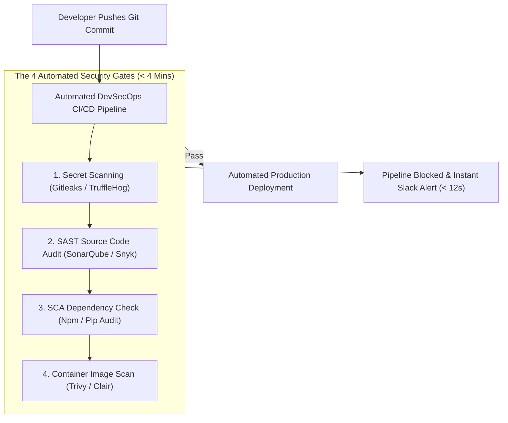
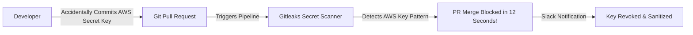

```ppt
# Slide 1: DevSecOps & CI/CD Security Gates
- **The Core Discipline:** Embedding automated security scanning and vulnerability testing directly inside continuous integration / continuous delivery (CI/CD) pipelines.
- **Executive Security Rule:** Security is not a final bottleneck gatekeeper — security is a continuous automated quality check!
- **Author:** Pankaj Kumar | Associate Architect & Tech Leadership
<!-- slide -->
# Slide 2: Installing Door Locks During Construction Analogy
- **Retrofit Security (Traditional DevOps):** Building a 5-story mansion, painting the walls, moving furniture inside, and *then* trying to cut open finished drywall to install door locks and alarm wiring. It costs $100,000 extra and damages the house!
- **DevSecOps Security (Shift-Left Pipeline):** Installing high-security lock casings, window sensors, and fire alarms into the structural blueprints (*CI/CD Pipeline*) **while the house framing is being built**!
<!-- slide -->
# Slide 3: The Shift-Left Security Principle
- **Traditional Waterfall Security:** Security team audits code 1 day before major production launch (Delays release by 3 weeks!).
- **DevSecOps Shift-Left:** Automated SAST, DAST, and secret scanners test every git commit in 3 minutes.
<!-- slide -->
# Slide 4: Real-World Case Study: Rajesh's Secret Leak Blocked
- **The Incident:** A developer on Lead Architect **Rajesh Sharma's** team accidentally committed an AWS secret access key into a public git pull request.
- **The DevSecOps Safeguard:** An automated Secret Scanner (`Gitleaks` / `TruffleHog`) ran inside the GitHub Actions pipeline.
- **The Result:** The pipeline immediately failed, blocked the merge, and alerted security in 12 seconds flat — zero AWS credentials exposed!
<!-- slide -->
# Slide 5: The 4 Automated Security Gates in CI/CD
- **Gate 1 (Pre-Commit / Secret Scan):** Blocking hardcoded API keys, passwords, and tokens (`Gitleaks`).
- **Gate 2 (Static Application Security Testing SAST):** Scanning source code for OWASP flaws (`SonarQube` / `Snyk`).
- **Gate 3 (Software Composition Analysis SCA):** Auditing open-source npm/pip dependencies for CVE vulnerabilities.
- **Gate 4 (Dynamic Application Security Testing DAST):** Probing running staging environments (`OWASP ZAP`).
<!-- slide -->
# Slide 6: DevSecOps Metrics That Matter
- **Mean Time to Remediate (MTTR):** Target < 24 hours for critical CVE patches.
- **Pipeline Security Overhead:** Keeping security scans under 4 minutes so developers maintain high velocity.
<!-- slide -->
# Slide 7: Common Misconception
- **Myth:** "DevSecOps slows down software deployment and frustrates developers."
- **Fact:** Automated security gates give developers instant feedback in their IDE, enabling faster, safer releases!
<!-- slide -->
# Slide 8: Summary for Beginners
- Shift security left: embed secret scanners, SAST, SCA dependency audits, and container security into your automated CI/CD build pipeline!
```

# DevSecOps: Embedding Security Gates in CI/CD Pipelines

For decades, software development operated under a dangerous conflict:
- **Developers** wanted to ship code fast to satisfy business demands.
- **Security Teams** wanted to slow down releases to inspect code for vulnerabilities.

In traditional software organizations, security was treated as a final "gatekeeper" audit conducted right before a major production launch.

This **Retrofit Security Model** was painful:
- Security auditors discovered critical flaws on launch day, forcing developers to delay releases by weeks.
- Developers viewed security as a frustrating bottleneck.
- Critical vulnerabilities slipped through into live production servers.

To resolve this conflict, **CTOs adopt DevSecOps — Shift-Left Security inside CI/CD Pipelines!**

Let's understand DevSecOps using **The Door Lock Installation During Construction Analogy**!

---

## 🏗️ The Door Lock Installation During Construction Analogy


Imagine building a modern residential apartment complex:



- **Retrofit Security (Traditional Model):**  
  Building a 5-story building, painting the walls, moving furniture inside, and *then* hiring locksmiths to tear open finished drywall to install lock wiring and alarms! It costs $100,000 extra and delays occupancy by 2 months.

- **DevSecOps Security (Shift-Left Pipeline):**  
  Embedding high-security lock casings, fire alarms, and window sensors directly into the architectural blueprints (**CI/CD Pipeline Gates**) **while the structural framing is being built**! Every room is verified secure before moving to the next floor.

---

## 📊 Real-World Case Study: Rajesh's Secret Leak Blocked in 12 Seconds

Consider a cloud engineering team led by Lead Architect **Rajesh Sharma**.



1. **The Human Mistake:** A junior developer working late at night accidentally pasted a live AWS secret access key into a configuration file and submitted a git pull request.
2. **The Automated Gate:** Before the PR could be merged, Rajesh's automated **DevSecOps Pipeline** ran `Gitleaks` as a Gate 1 pre-commit check inside GitHub Actions.
3. **The Result:** The pipeline detected the AWS key pattern in 12 seconds, automatically failed the build, blocked the pull request, and sent a Slack alert to the security team. The exposed key was revoked in AWS before it ever reached a public server!

---

## 📊 The 4 DevSecOps CI/CD Security Gates Reference Guide

| Security Gate | Tool Type | What It Inspects | Typical Execution Time |
| :--- | :--- | :--- | :--- |
| **Gate 1: Secret Scan** | Gitleaks / TruffleHog | Scans code commits for hardcoded passwords, AWS keys, and API tokens | **5–15 Seconds** |
| **Gate 2: SAST** | SonarQube / Snyk Code | Analyzes source code AST for OWASP SQLi, XSS, and buffer overflows | **1–2 Minutes** |
| **Gate 3: SCA** | Snyk Open Source / OWASP Dependency-Check | Audits third-party open-source npm/pip libraries for known CVE flaws | **30–60 Seconds** |
| **Gate 4: Container Scan** | Trivy / Clair | Scans Docker base images for OS-level vulnerabilities before deployment | **1–2 Minutes** |

---

## 💡 Summary for Beginners

- **DevSecOps** = Integrating security practices into every phase of the software development lifecycle, from initial code commit to production deployment.
- **Shift-Left Security** = Moving security testing earlier in the development process so developers receive instant feedback in their IDE.
- **SAST vs. DAST** = SAST (Static) inspects raw source code; DAST (Dynamic) tests running applications from the outside.
- **CTO Golden Rule** = **"Automate security gates inside your CI/CD pipeline — catch secret leaks and vulnerable dependencies in seconds before code reaches production!"**

---

*Written by **Pankaj Kumar** | Associate Architect & Tech Leadership.*
