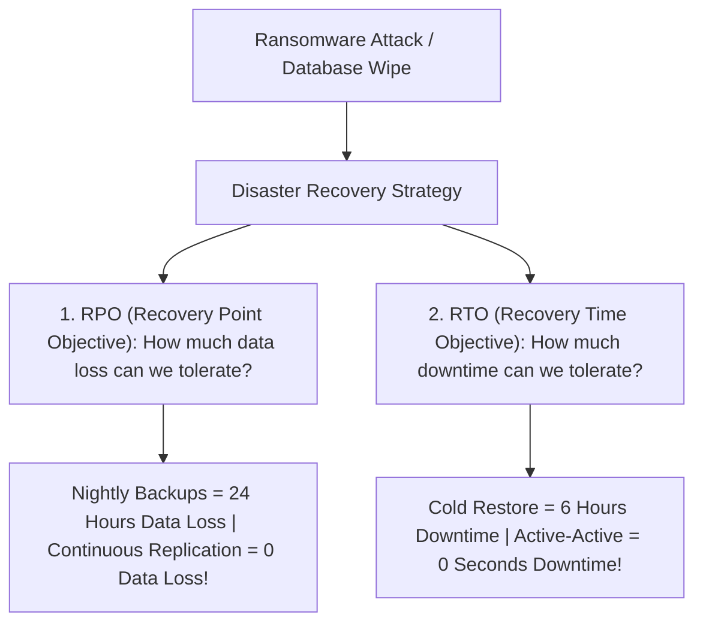

```ppt
# Slide 1: Disaster Recovery & Business Continuity
- **The Core Objective:** Ensuring your business survives ransomware attacks, accidental database wipes, or physical data center fires.
- **Key Metrics:** Recovery Time Objective (RTO) & Recovery Point Objective (RPO).
- **Author:** Pankaj Kumar | Associate Architect & Tech Leadership
<!-- slide -->
# Slide 2: The Bank Vault & Document Photocopy Analogy
- **Recovery Point Objective (RPO - Data Loss):** How often you photocopy important documents (If you photocopy every 24 hours, a fire destroys up to 24 hours of work).
- **Recovery Time Objective (RTO - Downtime):** How long it takes to unlock a backup vault and open a temporary bank branch (e.g. 2 hours).
<!-- slide -->
# Slide 3: Demystifying RTO vs RPO
- **1. RPO (How much data can we lose?):** Measures time back to the last clean database backup.
- **2. RTO (How long can we be down?):** Measures time taken from outage detection to full system restoration.
<!-- slide -->
# Slide 4: The 4 Classic Disaster Recovery Strategies
- **1. Backup & Restore (Cold - Cheap):** Nightly database backups to S3; takes hours/days to rebuild.
- **2. Pilot Light (Warm):** Database replicates live, but compute servers are kept off until a disaster hits.
- **3. Warm Standby:** Scaled-down compute servers running constantly in a 2nd region.
- **4. Multi-Site Active-Active (Hot - Expensive):** Full real-time dual-region traffic distribution with zero downtime!
<!-- slide -->
# Slide 5: The 3-2-1 Backup Rule
- **3 Copies of Data:** Primary production database + 2 separate backup copies.
- **2 Different Media Types:** Cloud storage + isolated offline cold storage.
- **1 Off-Site Location:** Backup stored in a completely separate geographical cloud region!
<!-- slide -->
# Slide 6: Testing Your DR Plan (GameDay Drills)
- **Chaos Engineering:** Intentionally pulling the plug on a production database during business hours to test automated failover!
- **Rule:** A disaster recovery plan that has never been tested is just a wish list!
<!-- slide -->
# Slide 7: Common Beginner Misconception
- **Myth:** "Cloud providers like AWS handle disaster recovery automatically for our app."
- **Fact:** AWS guarantees hardware infrastructure, but data backups and app failovers are 100% the customer's responsibility!
<!-- slide -->
# Slide 8: Summary for Beginners
- Define RTO and RPO targets with business executives, implement the 3-2-1 backup rule, and test DR plans regularly!
```

# Disaster Recovery & Business Continuity: RTO, RPO, and Backup Strategies

What happens when a disgruntled employee deletes your company's primary customer database, or a ransomware attack encrypts your cloud servers?

Without a tested **Disaster Recovery (DR) Plan**, catastrophic incidents can bankrupt a company within days!

Many business leaders assume: *"We are on Amazon Web Services (AWS), so cloud backups happen automatically."*

This is a dangerous misconception! Cloud providers operate on a **Shared Responsibility Model**: AWS manages physical data center security, but **YOU are 100% responsible for backing up your data and automating disaster failover!**

Let's demystify Disaster Recovery using **The Bank Vault Analogy**!

---

## 🏦 The Bank Vault & Document Photocopy Analogy

Imagine protecting a bank's financial records:



- **Recovery Point Objective (RPO - Document Photocopies):**  
  If the bank photocopies its deposit slips once every 24 hours at midnight, and a fire burns down the bank at 11:00 PM, **23 hours of customer transactions are permanently lost!**  
  - *Goal:* Lowering RPO (e.g., continuous database replication) minimizes data loss.

- **Recovery Time Objective (RTO - Unlocking the Backup Vault):**  
  After the fire, how many hours does it take for the bank manager to drive to an off-site vault, retrieve backup ledgers, and open a temporary mobile teller window?  
  - *Goal:* Lowering RTO minimizes business downtime.

---

## 📊 The 4 Disaster Recovery Strategies (Cost vs. Speed)

| DR Strategy | RTO (Downtime) | RPO (Data Loss) | Relative Cost |
| :--- | :--- | :--- | :--- |
| **1. Backup & Restore** | Hours to Days | Hours | 💲 (Lowest) |
| **2. Pilot Light** | 10 to 30 Mins | Minutes | 💲💲 |
| **3. Warm Standby** | Seconds to Mins | Seconds | 💲💲💲 |
| **4. Active-Active Hot** | 0 Seconds | 0 Seconds | 💲💲💲💲 (Highest) |

---

## 🛡️ The 3-2-1 Backup Rule for Enterprise Security

To protect against ransomware and region failures:
- **3** Copies of your data (1 Primary production + 2 Backups).
- **2** Different storage formats (Cloud Object Storage + Encrypted Vault).
- **1** Copy stored off-site in a completely separate geographical cloud region (e.g., Primary in US-East, Backup in EU-West).

---

## 💡 Summary for Beginners

- **RTO (Recovery Time Objective)** = Maximum tolerable downtime.
- **RPO (Recovery Point Objective)** = Maximum tolerable data loss.
- **CTO Rule** = *"A disaster recovery plan that has never been tested in a live drill is not a plan — it's just a wish!"*

---

*Written by **Pankaj Kumar** | Associate Architect & Tech Leadership.*
