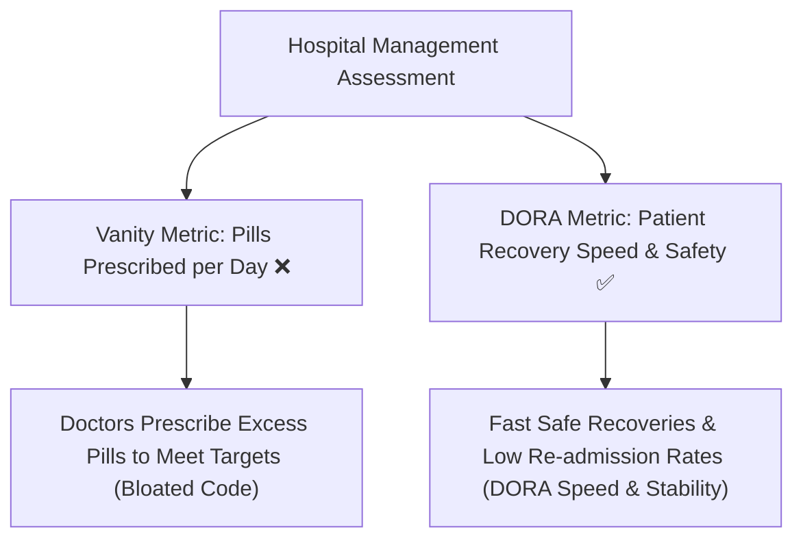

```ppt
# Slide 1: Engineering Metrics That Matter
- **The Management Challenge:** Measuring software team performance accurately without creating toxic gaming incentives.
- **Key Framework:** DORA Metrics (DevOps Research and Assessment) vs Misleading Vanity Metrics.
- **Author:** Pankaj Kumar | Associate Architect & Tech Leadership
<!-- slide -->
# Slide 2: The Hospital Patient Recovery Analogy
- **Vanity Metric (Pills Prescribed):** Counting how many pills a doctor prescribes per day (Encourages over-medication!).
- **DORA Metric (Patient Recovery Speed):** Measuring how quickly patients recover and leave the hospital safely!
<!-- slide -->
# Slide 3: The Danger of Vanity Metrics
- **Lines of Code (LOC):** Developers write verbose, bloated code to artificially pad metrics.
- **Velocity Points:** Teams inflate story point estimates to look faster on Jira charts.
- **Hours Worked:** Measures presence, not output quality or business impact.
<!-- slide -->
# Slide 4: The 4 Core DORA Metrics
- **1. Deployment Frequency:** How often does code land in production?
- **2. Lead Time for Changes:** Time taken from code commit to production deployment.
- **3. Change Failure Rate:** Percentage of deployments that cause production outages.
- **4. Mean Time to Restore (MTTR):** How fast can the team recover when an outage occurs?
<!-- slide -->
# Slide 5: High-Performing vs Low-Performing Benchmarks
- **Deployment Frequency:** Multiple times per day (Elite) vs Once every 3 months (Low).
- **Lead Time:** Less than 1 hour (Elite) vs 6 months (Low).
- **MTTR:** Less than 1 hour (Elite) vs 1 week (Low).
<!-- slide -->
# Slide 6: Goodhart's Law in Engineering
- *"When a measure becomes a target, it ceases to be a good measure."*
- **CTO Rule:** Use metrics to improve team workflows, never to rank or punish individual engineers!
<!-- slide -->
# Slide 7: Common Beginner Misconception
- **Myth:** "DORA metrics are just for DevOps engineers, not business executives."
- **Fact:** DORA metrics correlate directly with revenue growth, customer retention, and market agility!
<!-- slide -->
# Slide 8: Summary for Beginners
- Measure outcomes over output: Track DORA metrics to build fast, stable, and high-performing engineering teams!
```

# Engineering Metrics That Matter: DORA Metrics vs Vanity Metrics

How do non-technical executives know if their software engineering team is performing well?

In non-tech departments, metrics are straightforward: Sales teams track revenue generated; Marketing teams track leads generated.

However, in software engineering, non-tech managers often fall into the trap of measuring **Vanity Metrics** — like counting *Lines of Code (LOC)* written or *Jira Story Points* completed.

Measuring software teams by lines of code is like measuring a building's construction progress by the weight of the bricks used!

Modern technology leaders use **DORA Metrics** (DevOps Research & Assessment).

Let's break down **DORA Metrics vs Vanity Metrics** using **The Hospital Patient Recovery Analogy**!

---

## 🏥 The Hospital Patient Recovery Analogy

Imagine evaluating a hospital's performance:



- **Vanity Metric (Pills Prescribed per Day):**  
  If hospital management rewards doctors for prescribing 500 pills a day, doctors will prescribe unnecessary pills to meet targets. The metric goes up, but patient health collapses!
  - *Tech Equivalent:* Rewarding developers for writing 1,000 lines of code a day. Developers write bloated, unmaintainable code to hit targets.

- **DORA Metric (Patient Recovery Speed & Health):**  
  Measuring how fast patients recover safely and how rarely they suffer relapse complications.  
  - *Tech Equivalent:* Measuring how fast features reach users safely and how quickly the system recovers if a bug occurs!

---

## 📊 The 4 Core DORA Metrics

DORA metrics balance **Speed** with **Stability**:

| DORA Metric | Metric Type | What It Measures | Target for Elite Teams |
| :--- | :--- | :--- | :--- |
| **1. Deployment Frequency** | Speed | How often code is shipped to production | Multiple deploys per day |
| **2. Lead Time for Changes** | Speed | Time from code commit to live production | Under 1 hour |
| **3. Change Failure Rate** | Stability | % of deployments causing outages | 0% to 15% |
| **4. Mean Time to Restore (MTTR)** | Stability | Time taken to recover from a production outage | Under 1 hour |

---

## 💡 Summary for Beginners

- **Vanity Metrics** = Easy-to-measure output stats (Lines of Code, Hours Worked) that encourage bad developer habits.
- **DORA Metrics** = Industry-standard benchmarks evaluating speed (Deployment Frequency, Lead Time) and stability (Change Failure Rate, MTTR).
- **Goodhart's Law** = *"When a measure becomes a target, it ceases to be a good measure."*

---

*Written by **Pankaj Kumar** | Associate Architect & Tech Leadership.*
