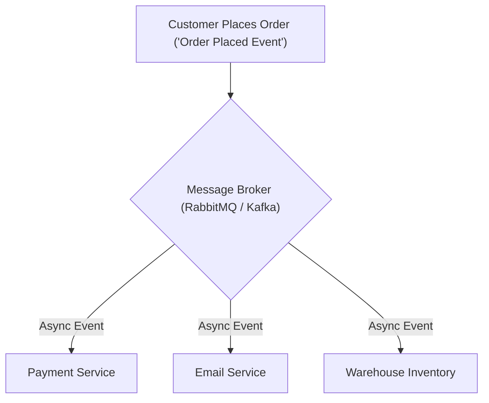

```ppt
# Slide 1: Event-Driven Architecture vs Request-Response
- **The Core Objective:** Decoupling microservices so slow background tasks (like sending emails or processing videos) don't block web application response times.
- **Key Technologies:** Apache Kafka, RabbitMQ, and Asynchronous Message Queues.
- **Author:** Pankaj Kumar | Associate Architect & Tech Leadership
<!-- slide -->
# Slide 2: The Fast Food Phone Order vs Restaurant Buzzer Analogy
- **Request-Response (Phone Order):** Holding on the phone line for 15 minutes while the chef chops onions, cooks the burger, and packs the bag (Caller is blocked).
- **Event-Driven (Restaurant Buzzer):** Placing your order at the counter, receiving a vibrating buzzer, and walking away. The buzzer vibrates only when your food is ready!
<!-- slide -->
# Slide 3: Request-Response Architecture (REST / gRPC)
- **Mechanism:** Client sends an HTTP request and blocks waiting for the server to reply.
- **Best For:** Synchronous user queries where an immediate response is required (e.g. User login validation, searching products).
- **Drawback:** If 1 downstream microservice is slow or offline, the entire request fails!
<!-- slide -->
# Slide 4: Event-Driven Architecture (EDA)
- **Mechanism:** Microservices publish "Events" (*"Order Placed"*) to a central Message Broker without waiting for consumers.
- **Best For:** Asynchronous background processing (e.g. Order fulfillment, email notifications, analytics).
- **Benefit:** Total fault isolation — if the email service goes down, messages sit safely in the queue until it restarts!
<!-- slide -->
# Slide 5: Message Brokers: Kafka vs RabbitMQ
- **RabbitMQ (Smart Broker, Dumb Consumer):** Message Queue — Delivers individual messages to workers and deletes them once acknowledged (Task Distribution).
- **Apache Kafka (Dumb Broker, Smart Consumer):** Event Streaming Log — Retains an immutable stream of event logs like a ledger (Real-Time Analytics & Data Pipelines).
<!-- slide -->
# Slide 6: Key Design Patterns in Event-Driven Systems
- **Publish-Subscribe (Pub/Sub):** 1 event published by the Checkout Service is consumed simultaneously by Email, Inventory, and Shipping services!
- **Dead Letter Queue (DLQ):** Quarantining corrupted messages that repeatedly fail processing to prevent queue blocking.
<!-- slide -->
# Slide 7: Common Beginner Misconception
- **Myth:** "Event-Driven Architecture should completely replace all REST APIs in our application."
- **Fact:** Modern architectures use REST for synchronous UI queries and EDA for asynchronous background workflows!
<!-- slide -->
# Slide 8: Summary for Beginners
- Use REST APIs for instant user requests and Event-Driven Queues (Kafka/RabbitMQ) for resilient, decoupled background processing!
```

# Event-Driven Architecture vs Request-Response: Kafka, RabbitMQ, and Async Queues

When building a modern web application, imagine what happens when a customer clicks *"Place Order"* on an e-commerce website:

The application needs to:
1. Charge the customer's credit card (1 second).
2. Generate an invoice PDF (2 seconds).
3. Send an order confirmation email (3 seconds).
4. Update warehouse inventory stock (1 second).
5. Send customer data to the analytics database (2 seconds).

If the system processes all 5 tasks sequentially while the user waits on the checkout page, **the page takes 9 full seconds to load!** Worse, if the email server crashes, the whole order fails!

Modern technology architectures solve this using **Event-Driven Architecture (EDA)** and **Message Queues**.

Let's demystify Event-Driven Systems using **The Restaurant Buzzer Analogy**!

---

## 🍔 The Fast Food Phone Order vs Restaurant Buzzer Analogy

Imagine ordering food at a restaurant:



- **Request-Response (Synchronous Phone Order):**  
  You call a restaurant on the phone. The cashier accepts your order, but keeps you holding on the line for 15 minutes while the chef chops onions, grills the steak, and packs the bag. You are trapped on the phone unable to do anything else!

- **Event-Driven Architecture (The Restaurant Buzzer):**  
  You walk up to the restaurant counter, place your order, and receive a small **Vibrating Buzzer (Event Token)**. You walk away, sit with friends, or check your phone.  
  - 10 minutes later, when the food is ready, the kitchen triggers an event: **The Buzzer Vibrates!** You pick up your food without ever waiting in line.

---

## 📊 Request-Response vs. Event-Driven Architecture

| Dimension | Request-Response (REST / gRPC) | Event-Driven Architecture (Pub/Sub) |
| :--- | :--- | :--- |
| **Communication Style** | Synchronous (Blocking) | Asynchronous (Non-blocking) |
| **Coupling** | Tightly Coupled | Loosely Decoupled |
| **System Availability** | Dependent on all downstream services | Independent (Tolerates service outages) |
| **Primary Use Cases** | Login, Search Queries, Live Telemetry | Order Processing, Video Transcoding, Emails |
| **Key Technologies** | HTTP/JSON, gRPC, GraphQL | Apache Kafka, RabbitMQ, AWS SQS |

---

## ⚔️ RabbitMQ vs. Apache Kafka

Engineers often debate between RabbitMQ and Kafka:

- **RabbitMQ (Message Queue):** Works like a **Post Office Box**. It delivers a message to a worker server, and once the worker finishes processing, the message is permanently deleted from the queue.  
  - *Best For:* Background task queues (e.g. Sending emails, resizing images).

- **Apache Kafka (Event Stream Log):** Works like an **Immutable Financial Audit Ledger**. Events are recorded sequentially in an append-only log file that never deletes messages immediately. Multiple different services can re-read historical event streams anytime!  
  - *Best For:* Real-time data analytics, event-sourcing, and enterprise data pipelines.

---

## 💡 Summary for Beginners

- **Synchronous (Request-Response)** = Client waits blocked for a server response.
- **Asynchronous (Event-Driven)** = Client publishes an event and continues immediately without blocking.
- **Message Broker** = Infrastructure software (Kafka / RabbitMQ) that buffers and routes event messages safely.
- **CTO Golden Rule** = *"Use Request-Response for user queries, and Event-Driven Queues for background processing!"*

---

*Written by **Pankaj Kumar** | Associate Architect & Tech Leadership.*
