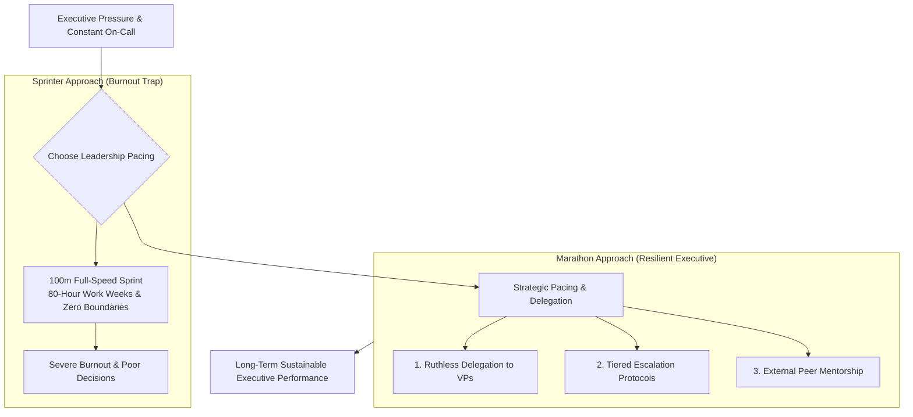

```ppt
# Slide 1: Executive Stress Management in C-Level Roles
- **The Hidden Challenge:** Managing constant cognitive pressure, midnight outage alerts, and executive responsibility without burning out.
- **Core Truth:** High-performing CTOs view executive leadership as a long-distance marathon, not a frantic 100-meter sprint!
- **Author:** Pankaj Kumar | Associate Architect & Tech Leadership
<!-- slide -->
# Slide 2: The Marathon Runner vs Sprinter Analogy
- **100m Sprinter:** Runs at 100% maximum heart rate for 10 seconds, holding their breath until they collapse across the finish line.
- **Marathon Runner (The Executive CTO):** Paces their oxygen, monitors heart rate zones, hydrates regularly, and maintains a steady rhythm for 42 kilometers!
<!-- slide -->
# Slide 3: Why CTOs Suffer High Burnout Rates
- **1. Always On-Call:** Midnight production outages, ransomware scares, and infrastructure alerts.
- **2. Dual Pressure:** Pushed by sales for fast feature delivery, pushed by engineering for technical stability.
- **3. Emotional Isolation:** Executives rarely have peers inside the company to vent or share anxiety with.
<!-- slide -->
# Slide 4: The 4 Pillars of Sustainable Executive Resilience
- **1. Ruthless Delegation:** Empowering VPs and Engineering Managers to own tactical decisions.
- **2. Boundary Setting:** Protecting deep work hours and enforcing non-negotiable sleep/exercise routines.
- **3. Executive Peer Circles:** Joining external peer networks (CTO Craft, Vistage) for trusted counsel.
- **4. Cognitive Offloading:** Documenting runbooks so production emergencies don't require your personal manual intervention.
<!-- slide -->
# Slide 5: Building On-Call Escalation Protocols
- **Level 1:** Automated alerting scripts (PagerDuty) alert Tier-1 On-Call Engineers.
- **Level 2:** Engineering Leads handle incident remediation.
- **Level 3 (CTO Escalation):** CTO is notified ONLY if an outage breaches SLA thresholds (> 30 mins)!
<!-- slide -->
# Slide 6: Promoting Psychological Health Across the Team
- **Model Healthy Habits:** Don't send Slack messages to developers at 2 AM unless it's a true P0 emergency.
- **Blameless Post-Mortems:** Focus on fixing broken processes rather than blaming individuals during outages.
<!-- slide -->
# Slide 7: Common Misconception
- **Myth:** "Working 80 hours a week proves you are a superior executive leader."
- **Fact:** Overworked executives make poor strategic decisions; sustainable pacing drives long-term company success!
<!-- slide -->
# Slide 8: Summary for Beginners
- Treat executive leadership like a marathon: pace your stamina, delegate tactical decisions, and protect your mental energy!
```

# Executive Stress Management: Preventing Burnout in C-Level Roles

Leading technology at the C-suite level is one of the most demanding jobs in modern business.

As Chief Technology Officer, you carry the constant weight of system availability, cybersecurity threats, cloud budgets, board expectations, and developer retention. 

When a production database crashes at 2 AM on a Sunday, or when a critical customer feature is delayed, the pressure lands directly on your shoulders.

Without intentional stress management, even the most talented technical leaders suffer severe **executive burnout**, leading to poor decision-making and health breakdowns.

Let's understand Executive Stress Management using **The Marathon Runner Analogy**!

---

## 🏃 The Marathon Runner Analogy

Imagine running a 42-kilometer Olympic marathon:



- **The Amateur Sprinter:**  
  Treats a 42-kilometer race like a series of frantic 100-meter sprints. They hold their breath, run at 100% capacity, and collapse from exhaustion at kilometer 5!

- **The Champion Marathoner (The Executive CTO):**  
  Monitors heart-rate zones, paces oxygen intake, drinks water at every hydration station, and maintains a sustainable cadence that carries them across the finish line with energy to spare!

---

## 📊 High-Burnout Habits vs. Resilient Executive Behaviors

| High-Burnout Habits (Avoid) | Resilient Executive Behaviors (Adopt) |
| :--- | :--- |
| **Micro-managing every technical incident** | Implement tiered incident escalation (PagerDuty ➔ Team Leads ➔ CTO only for P0) |
| **Replying to Slack & email at 2:00 AM** | Set non-negotiable sleep/family boundaries & schedule delayed email sends |
| **Internalizing all executive stress alone** | Join external peer networks (CTO Craft, Vistage) for confidential mentorship |
| **Measuring leadership by hours worked** | Measure leadership by strategic clarity, team velocity, and business outcomes |

---

## 💡 Summary for Beginners

- **Executive Stress Management** = The deliberate practice of pacing mental energy, delegating tactical work, and building personal resilience.
- **Tiered Escalation** = Protecting your cognitive bandwidth so you are fresh for critical strategic decisions.
- **CTO Golden Rule** = **"Pace your executive stamina like a marathon runner — an exhausted CTO who works 80 hours a week makes catastrophic architectural decisions!"**

---

*Written by **Pankaj Kumar** | Associate Architect & Tech Leadership.*
