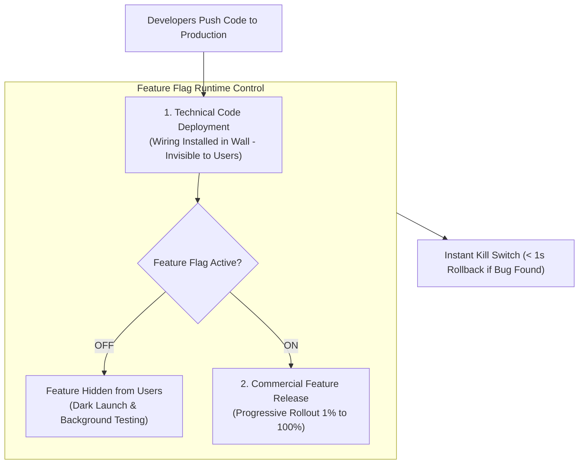

```ppt
# Slide 1: Feature Flags & Progressive Delivery
- **The Core Strategy:** Decoupling code deployment to production servers from commercial feature releases to users.
- **Executive Rule:** Never expose live customers to unverified code; toggle feature access safely at runtime!
- **Author:** Pankaj Kumar | Associate Architect & Tech Leadership
<!-- slide -->
# Slide 2: The Room Light Switch Analogy
- **Hardwired Wall Circuit (Legacy Deployment):** Every time you want to turn on a light, an electrician must cut through drywall, splice live wires, and rewire the electrical panel!
- **Modern Light Switch (Feature Flag):** Electricians install the electrical wiring in advance (*Code Deployment*). When you want light, you simply flip a clean wall switch ON or OFF at any time (*Feature Release*)!
<!-- slide -->
# Slide 3: Code Deployment vs Feature Release
- **Code Deployment (Technical Event):** Merging pull requests, compiling code, and pushing binaries to production servers (Zero user visibility).
- **Feature Release (Business Event):** Flipping a feature flag ON for target user segments, beta testers, or 100% of customers.
<!-- slide -->
# Slide 4: 4 Major Use Cases for Feature Flags
- **1. Dark Launching:** Shipping new backend code silently to production to test database load before launching UI.
- **2. Progressive Rollouts:** Releasing features gradually (1% ➔ 10% ➔ 50% ➔ 100% of user base).
- **3. Instant Kill Switches:** Toggling off a buggy feature in < 1 second without redeploying code.
- **4. Entitlement & Paywall Controls:** Enabling premium features exclusively for paying Enterprise subscribers.
<!-- slide -->
# Slide 5: The Feature Flag Lifecycle
- **Step 1 (Creation):** Define flag key in feature management platform (LaunchDarkly / Unleash).
- **Step 2 (Targeting):** Set rules (e.g. `User.role == 'BetaTester'`).
- **Step 3 (Evaluation):** Sub-millisecond evaluation in application runtime.
- **Step 4 (Cleanup):** Delete stale feature flag code after 100% successful rollout.
<!-- slide -->
# Slide 6: Managing Flag Debt & Governance
- **Flag Hygiene:** Stale feature flags accumulate "Flag Debt" if left in the codebase indefinitely.
- **Automated Alerts:** Flag platforms alert developers when a flag has been at 100% for over 30 days.
<!-- slide -->
# Slide 7: Common Misconception
- **Myth:** "Feature flags add unnecessary IF/ELSE complexity to application code."
- **Fact:** Feature flags eliminate midnight deployment panics, rollback outages, and deployment friction!
<!-- slide -->
# Slide 8: Summary for Beginners
- Decouple deployment from release: use feature flags to test silently in production, launch progressively, and kill bugs instantly!
```

# Feature Flags: Decoupling Code Deployment from Feature Release

For decades, software engineers operated under a high-risk assumption: **The moment code was deployed to a production server, it was instantly live and visible to all customers!**

This coupling created immense stress. If a newly deployed feature had a hidden bug, the entire engineering team panicked, scrambled to initiate a multi-hour git rollback, or stayed up all night patching production servers.

Modern software organizations solve this problem by **Decoupling Code Deployment from Feature Release using Feature Flags.**

Let's understand Feature Flags using **The Room Light Switch Analogy**!

---

## 💡 The Room Light Switch Analogy

Imagine installing lighting in a new home:



- **The Hardwired Electrical Panel (Legacy Deployment):**  
  Every time you want to turn a light on or off, you have to hire an electrician to rip open the drywall, cut live copper wires, and rewire the main breaker panel. A tiny wiring mistake short-circuits the whole house!

- **The Wall Light Switch (Feature Flag Strategy):**  
  Electricians install all the copper wiring and fixtures inside the wall in advance (**Code Deployment**). When you want light in a room, you simply flip the wall switch ON or OFF whenever you choose (**Feature Release**)!

---

## 📊 Code Deployment vs. Feature Release

| Dimension | Technical Code Deployment | Commercial Feature Release |
| :--- | :--- | :--- |
| **Primary Definition** | Moving compiled code binaries onto live production servers | Toggling a feature flag ON for targeted customer segments |
| **Triggered By** | CI/CD automated build pipelines | Product Managers, Marketers, or CTOs via Admin UI |
| **User Visibility** | **Zero Impact** (Code runs silently in background) | **Immediate Impact** (UI buttons and workflows appear) |
| **Risk Mitigation** | Staging validation & automated unit tests | Instant Kill Switch (< 1 sec) & Progressive 1% Rollouts |

---

## 💡 Summary for Beginners

- **Feature Flag** = A software switch (IF/ELSE condition) evaluated at runtime to enable or disable features dynamically.
- **Decoupling** = Deploying code to production first, then releasing the feature to users independently.
- **CTO Golden Rule** = **"Separate code deployment from feature release — use feature flags to test silently in production and kill bugs in less than 1 second!"**

---

*Written by **Pankaj Kumar** | Associate Architect & Tech Leadership.*
