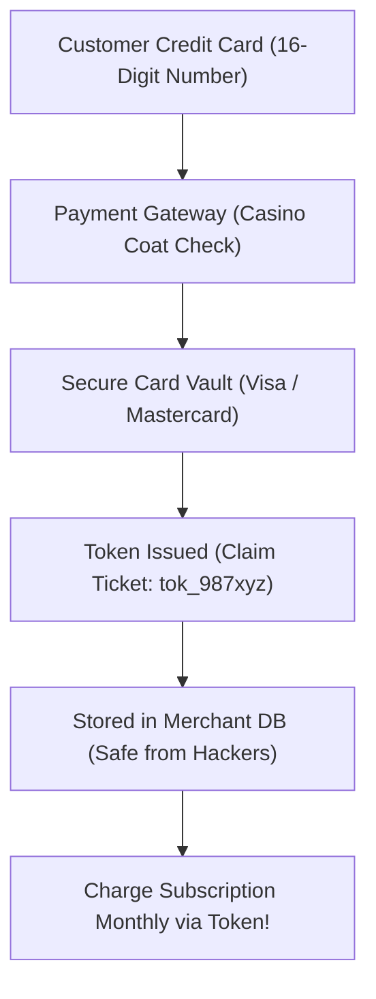

```ppt
# Slide 1: FinTech & Payments Architecture
- **The Core Objective:** Safely processing online payments without storing sensitive credit card numbers on your servers.
- **Key Concepts:** Payment Gateways, PCI-DSS Compliance, and Tokenization.
- **Author:** Pankaj Kumar | Associate Architect & Tech Leadership
<!-- slide -->
# Slide 2: The Casino Coat Check Analogy
- **Raw Credit Card Number:** Leaving your gold jewelry directly inside a coat pocket in an open hallway (Huge Security Risk).
- **Tokenization (Coat Check Claim Ticket):** Swapping raw card numbers for a harmless alphanumeric token code!
<!-- slide -->
# Slide 3: How Payment Processing Works
- **1. Payment Gateway (The Cash Register):** Captures customer payment details securely.
- **2. Payment Processor (The Armored Truck):** Transmits financial requests through Visa/Mastercard networks.
- **3. Acquiring Bank:** Receives funds from customer bank account and deposits into merchant account.
<!-- slide -->
# Slide 4: What is Tokenization?
- **The Process:** Replacing a 16-digit credit card number with a random string like `tok_1N8u2x4Z...`.
- **Security Benefit:** Even if hackers breach your database, tokens are completely useless outside Visa's vault!
<!-- slide -->
# Slide 5: Demystifying PCI-DSS Compliance
- **PCI-DSS Level 1:** Strict security standards required for storing card data ($100k+ annual audits).
- **The CTO Shortcut (SAQ-A):** Outsourcing card fields to Stripe/Adyen hosted iframes to achieve instant compliance with zero liability!
<!-- slide -->
# Slide 6: Real-World Architecture Best Practices
- Never allow raw 16-digit credit card numbers to touch your web application backend code or logs.
- Use webhook signatures to verify payment completion before granting user software access.
<!-- slide -->
# Slide 7: Common Beginner Misconception
- **Myth:** "If we process credit card payments, we must build a PCI-compliant vault."
- **Fact:** 99% of modern companies use tokenized hosted fields (Stripe Elements) so raw card data never touches their servers!
<!-- slide -->
# Slide 8: Summary for Beginners
- Use payment tokenization and hosted gateways to process millions safely with minimal compliance liability!
```

# FinTech & Payments Architecture: PCI-DSS, Payment Gateways, and Tokenization

Processing payments online seems simple on the surface: a customer enters a credit card number, clicks *"Pay Now"*, and money appears in your company's bank account.

However, behind that simple checkout button lies a complex web of financial networks, encryption standards, and legal compliance requirements known as **PCI-DSS (Payment Card Industry Data Security Standard)**.

Handling raw credit card numbers incorrectly can result in **$100,000 monthly fines** or catastrophic data breaches!

Let's demystify payment architecture using **The Casino Coat Check Analogy**!

---

## 🧥 The Casino Coat Check Analogy

Imagine visiting an expensive casino:



- **Raw Card Numbers (Gold Jewelry):** Walking into a casino carrying $50,000 in raw gold jewelry. If you drop it in the hallway (*Database Leak*), anyone can pick it up and spend it!
- **Tokenization (The Coat Check Ticket):** You hand your gold jewelry to the casino's high-security vault. In exchange, the vault hands you a small paper **Claim Ticket (Token)**.
  - You can display your claim ticket anywhere — if a thief steals the paper ticket, it is completely useless to them because only the casino vault can match it back to your gold!

---

## 📊 The 3 Core Components of Payment Systems

1. **💳 Tokenization:** Swapping a sensitive 16-digit credit card number (`4111 2222 3333 4444`) for a harmless string (`tok_1N8u2...`). The raw card number is stored exclusively in Visa or Stripe's PCI Level 1 vault.
2. **🚪 Payment Gateway:** The frontend interface (like Stripe Elements or Braintree) that captures customer card data inside an isolated HTML iframe so card numbers never touch your application code.
3. **📋 PCI-DSS Compliance:** The international security rulebook. By outsourcing card fields to a payment gateway, your company achieves **PCI SAQ-A Compliance** with zero security overhead!

---

## 💡 Summary for Beginners

- **Tokenization** = Replacing credit card data with safe reference tokens.
- **Payment Gateway** = The secure bridge between your website and banking networks.
- **The CTO's Payment Rule** = *"Never store, process, or log raw credit card numbers on your own servers!"*

---

*Written by **Pankaj Kumar** | Associate Architect & Tech Leadership.*
